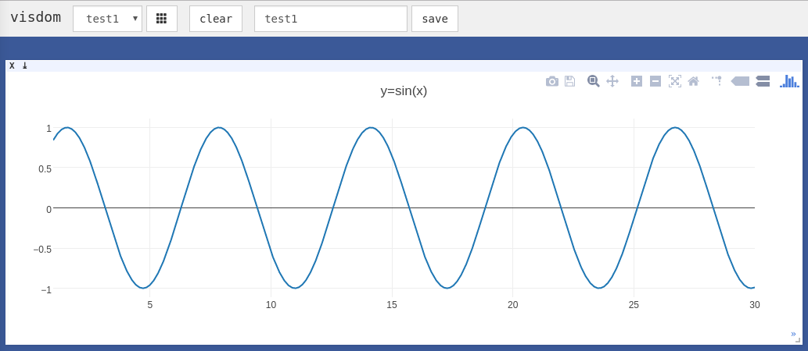
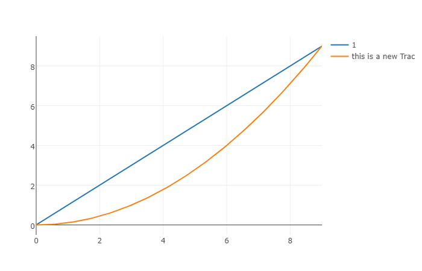
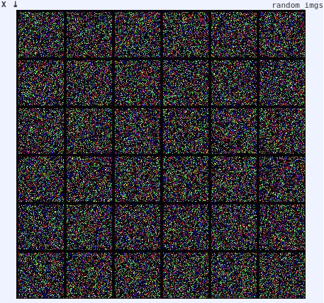

# PyTorch 中常用的工具

## 目录

- 数据处理
    - class DogCat 的简单实现
    - class DogCat 的实现 + transforms 图像变换
    - class DogCat 用 torchvision.datasets.ImageFolder 实现 + torch.utils.data.DataLoader 批处理
    - 读取异常处理
    - 采样函数
- 计算机视觉工具包：torchvision
- 可视化工具
    - TensorBoard
    - visdom
- 使用GPU加速：cuda
- 持久化

---

## 1.数据处理

### 1.1.class DogCat 的简单实现

在PyTorch中，数据加载可通过自定义的数据集对象。数据集对象被抽象为`Dataset`类，实现自定义的数据集需要继承Dataset，并实现两个Python魔法方法：

- `__getitem__`：返回一条数据，或一个样本。`obj[index]`等价于`obj.__getitem__(index)`
- `__len__`：返回样本的数量。`len(obj)`等价于`obj.__len__()`

```py
import torch as t
from torch.utils import data
import os
from PIL import Image
import numpy as np


class DogCat(data.Dataset):
    def __init__(self, root):
        imgs = os.listdir(root)
        self.imgs = [os.path.join(root, img) for img in imgs]

    def __getitem__(self, index):
        img_path = self.imgs[index]
        label = 1 if 'dog' in img_path.split('/')[-1] else 0
        pil_img = Image.open(img_path)
        array = np.asarray(pil_img)
        data = t.from_numpy(array)
        return data, label

    def __len__(self):
        return len(self.imgs)


dataset = DogCat('./utility_data/dogcat/')
img, label = dataset[0]
for img, label in dataset:
    print(img.size(), img.float().mean(), label)
```

OUTPUT

```bash
torch.Size([500, 497, 3]) tensor(106.4917) 0
torch.Size([499, 379, 3]) tensor(171.8088) 0
torch.Size([236, 289, 3]) tensor(130.3022) 0
torch.Size([374, 499, 3]) tensor(115.5157) 0
torch.Size([375, 499, 3]) tensor(116.8187) 1
torch.Size([375, 499, 3]) tensor(150.5086) 1
torch.Size([377, 499, 3]) tensor(151.7141) 1
torch.Size([400, 300, 3]) tensor(128.1548) 1
```

### 1.2.class DogCat 的实现 + transforms 图像变换

通过上面的代码，我们学习了如何自定义自己的数据集，并可以依次获取。但这里返回的数据不适合实际使用，因其具有如下两方面问题：
- 返回样本的形状不一，因每张图片的大小不一样，这对于需要取batch训练的神经网络来说很不友好
- 返回样本的数值较大，未归一化至[-1, 1]

针对上述问题，PyTorch 提供了torchvision https://github.com/pytorch/vision/ 。它是一个视觉工具包，提供了很多视觉图像处理的工具，其中 `transforms` 模块提供了对 PIL `Image` 对象和 `Tensor` 对象的常用操作。

对 PIL Image 的操作包括：
- `Scale`：调整图片尺寸，长宽比保持不变
- `CenterCrop`、`RandomCrop`、`RandomResizedCrop`： 裁剪图片
- `Pad`：填充
- `ToTensor`：将 PIL Image 对象转成 Tensor ，会自动将 [0, 255] 归一化至 [0, 1]

对 Tensor 的操作包括：
- `Normalize` ：标准化，即减均值，除以标准差
- `ToPILImage` ：将Tensor转为PIL Image对象

如果要对图片进行多个操作，可通过 `Compose` 函数将这些操作拼接起来，类似于 `nn.Sequential` 。注意，这些操作定义后是以函数的形式存在，真正使用时需调用它的`__call__` 方法，这点类似于 `nn.Module` 。例如要将图片调整为 $224 \times 224$ ，首先应构建这个操作 `trans = Resize((224, 224))` ，然后调用 `trans(img)` 。下面我们就用 transforms 的这些操作来优化上面实现的 dataset 。

```py
import torch as t
from torch.utils import data
import os
from PIL import Image
import numpy as np
from torchvision import transforms as T


transform = T.Compose([
    # length-width ratio is locked & shortest edge is 244;
    # Crop 244*244 from center;
    # Image->Tensor[0,1];
    # [(0-.5)/.5,(1-.5)/.5]=[-1,1]
    T.Resize(244),
    T.CenterCrop(244),
    T.ToTensor(),
    T.Normalize(mean=[.5, .5, .5], std=[.5, .5, .5])
])


class DogCat(data.Dataset):
    def __init__(self, root, transforms=None):
        imgs = os.listdir(root)
        self.imgs = [os.path.join(root, img) for img in imgs]
        self.transforms = transforms

    def __getitem__(self, index):
        img_path = self.imgs[index]
        label = 1 if 'dog' in img_path.split('/')[-1] else 0
        # pil_img = Image.open(img_path)
        # array = np.asarray(pil_img)
        # data = t.from_numpy(array)
        data = Image.open(img_path)
        if self.transforms:
            data = self.transforms(data)
        return data, label

    def __len__(self):
        return len(self.imgs)


dataset = DogCat('./utility_data/dogcat/', transforms=transform)
img, label = dataset[0]
for img, label in dataset:
    print(img.size(), img.float().mean(), label)
```

OUTPUT

```bash
torch.Size([3, 244, 244]) tensor(-0.1655) 0
torch.Size([3, 244, 244]) tensor(0.3908) 0
torch.Size([3, 244, 244]) tensor(0.0708) 0
torch.Size([3, 244, 244]) tensor(-0.0460) 0
torch.Size([3, 244, 244]) tensor(-0.0651) 1
torch.Size([3, 244, 244]) tensor(0.1177) 1
torch.Size([3, 244, 244]) tensor(0.2232) 1
torch.Size([3, 244, 244]) tensor(-0.0286) 1
```

除了上述操作之外，transforms还可通过`Lambda`封装自定义的转换策略。例如想对PIL Image进行随机旋转，则可写成这样`trans=T.Lambda(lambda img: img.rotate(random()*360))`。

### 1.3.class DogCat 用 torchvision.datasets.ImageFolder 实现 + torch.utils.data.DataLoader 批处理

torchvision已经预先实现了常用的Dataset，包括前面使用过的CIFAR-10，以及ImageNet、COCO、MNIST、LSUN等数据集，可通过诸如`torchvision.datasets.CIFAR10`来调用，具体使用方法请参看官方文档 http://pytorch.org/docs/master/torchvision/datasets.html 。在这里介绍一个会经常使用到的Dataset——`ImageFolder`，它的实现和上述的`DogCat`很相似。`ImageFolder`假设所有的文件按文件夹保存，每个文件夹下存储同一个类别的图片，文件夹名为类名，其构造函数如下：

```py
ImageFolder(root, transform=None, target_transform=None, loader=default_loader)
```

它主要有四个参数：

- `root`：在root指定的路径下寻找图片
- `transform`：对PIL Image进行的转换操作，transform的输入是使用loader读取图片的返回对象
- `target_transform`：对label的转换
- `loader`：给定路径后如何读取图片，默认读取为RGB格式的PIL Image对象

label是按照文件夹名顺序排序后存成字典，即{类名:类序号(从0开始)}，一般来说最好直接将文件夹命名为从0开始的数字，这样会和ImageFolder实际的label一致，如果不是这种命名规范，建议看看`self.class_to_idx`属性以了解label和文件夹名的映射关系。

`Dataset`只负责数据的抽象，一次调用`__getitem__`只返回一个样本。前面提到过，在训练神经网络时，最好是对一个batch的数据进行操作，同时还需要对数据进行shuffle和并行加速等。对此，PyTorch提供了`DataLoader`帮助我们实现这些功能。

DataLoader的函数定义如下： 

```py
DataLoader(dataset, batch_size=1, shuffle=False, sampler=None, num_workers=0, collate_fn=default_collate, pin_memory=False, drop_last=False)
```

- dataset：加载的数据集(Dataset对象)
- batch_size：batch size
- shuffle:：是否将数据打乱
- sampler： 样本抽样，后续会详细介绍
- num_workers：使用多进程加载的进程数，0代表不使用多进程
- collate_fn： 如何将多个样本数据拼接成一个batch，一般使用默认的拼接方式即可
- pin_memory：是否将数据保存在pin memory区，pin memory中的数据转到GPU会快一些
- drop_last：dataset中的数据个数可能不是batch_size的整数倍，drop_last为True会将多出来不足一个batch的数据丢弃

```py
import torch as t
from torch.utils import data
import os
from PIL import Image
import numpy as np
from torchvision import transforms as T
from torchvision.datasets import ImageFolder
from torch.utils.data import DataLoader


transform = T.Compose([
    T.RandomResizedCrop(244),
    T.RandomHorizontalFlip(),
    T.ToTensor(),
    T.Normalize(mean=[.4, .4, .4], std=[.2, .2, .2])
])


dataset = ImageFolder('./utility_data/dogcat_2/', transform=transform)
print(dataset.class_to_idx, dataset[0][0].size(), dataset[0][1])

to_img = T.ToPILImage()
img0 = to_img(dataset[0][0]*.2+.4)
img0.show()

dataloader = DataLoader(dataset, batch_size=3,
                        shuffle=True, num_workers=0, drop_last=False)
dataiter = iter(dataloader)
imgs, labers = next(dataiter)
print(imgs.size())
```

OUTPUT

```bash
{'cat': 0, 'dog': 1} torch.Size([3, 244, 244]) 0
torch.Size([3, 3, 244, 244])
```

dataloader是一个可迭代的对象，意味着我们可以像使用迭代器一样使用它，例如：

```py
for batch_datas, batch_labels in dataloader:
    train()
```

或

```py
dataiter = iter(dataloader)
batch_datas, batch_labesl = next(dataiter)
```

### 1.4.读取异常处理

在数据处理中，有时会出现某个样本无法读取等问题，比如某张图片损坏。这时在`__getitem__`函数中将出现异常，此时最好的解决方案即是将出错的样本剔除。如果实在是遇到这种情况无法处理，则可以返回None对象，然后在`Dataloader`中实现自定义的`collate_fn`，将空对象过滤掉。但要注意，在这种情况下dataloader返回的batch数目会少于batch_size。

2种解决方法：赋值None，随机抽取另外一张图像。

```py
import torch as t
from torch.utils import data
import os
from PIL import Image
import numpy as np
from torchvision import transforms as T
from torch.utils.data.dataloader import default_collate
from torch.utils.data import DataLoader
import random


transform = T.Compose([
    T.Resize(244),
    T.CenterCrop(244),
    T.ToTensor(),
    T.Normalize(mean=[.5, .5, .5], std=[.5, .5, .5])
])


class DogCat(data.Dataset):
    def __init__(self, root, transforms=None):
        imgs = os.listdir(root)
        self.imgs = [os.path.join(root, img) for img in imgs]
        self.transforms = transforms

    def __getitem__(self, index):
        img_path = self.imgs[index]
        label = 1 if 'dog' in img_path.split('/')[-1] else 0
        data = Image.open(img_path)
        if self.transforms:
            data = self.transforms(data)
        return data, label

    def __len__(self):
        return len(self.imgs)


class NewDogCat(DogCat):
    def __getitem__(self, index):
        try:
            return super(NewDogCat, self).__getitem__(index)
        except:
            return None, None
            # return self[random.randint(0, len(self)-1)]


def my_collate_fn(batch):
    # filter None then collate
    batch = list(filter(lambda x: x[0] is not None, batch))
    return default_collate(batch)


dataset = NewDogCat('./utility_data/dogcat_wrong/', transforms=transform)
print(dataset[8])
dataloader = DataLoader(dataset, 2, collate_fn=my_collate_fn, num_workers=0)
# dataloader = DataLoader(
#     dataset, 2, collate_fn=my_collate_fn, num_workers=0, drop_last=True)
print(dataloader)
for batch_datas, batch_labels in dataloader:
    print(batch_datas.size(), batch_labels.size())
```

OUTPUT1：缺失数据返回(None, None)

```
(None, None)
<torch.utils.data.dataloader.DataLoader object at 0x000002A2038D6D30>
torch.Size([2, 3, 244, 244]) torch.Size([2])
torch.Size([2, 3, 244, 244]) torch.Size([2])
torch.Size([2, 3, 244, 244]) torch.Size([2])
torch.Size([2, 3, 244, 244]) torch.Size([2])
Traceback (most recent call last):
  File "d:/test.py", line 57, in <module>
    for batch_datas, batch_labels in dataloader:
  File "E:\Program Files\Python\Python36\lib\site-packages\torch\utils\data\dataloader.py", line 435, in __next__
    data = self._next_data()
  File "E:\Program Files\Python\Python36\lib\site-packages\torch\utils\data\dataloader.py", line 475, in _next_data
    data = self._dataset_fetcher.fetch(index)  # may raise StopIteration
  File "E:\Program Files\Python\Python36\lib\site-packages\torch\utils\data\_utils\fetch.py", line 47, in fetch
    return self.collate_fn(data)
  File "d:/test.py", line 50, in my_collate_fn
    return default_collate(batch)
  File "E:\Program Files\Python\Python36\lib\site-packages\torch\utils\data\_utils\collate.py", line 45, in default_collate
    elem = batch[0]
IndexError: list index out of range
```

最后一个batch的数据会少于batch_szie，可通过指定`drop_last=True`来丢弃最后一个不足batch_size的batch。

```bash
(None, None)
<torch.utils.data.dataloader.DataLoader object at 0x000001CB43508D30>
torch.Size([2, 3, 244, 244]) torch.Size([2])
torch.Size([2, 3, 244, 244]) torch.Size([2])
torch.Size([2, 3, 244, 244]) torch.Size([2])
torch.Size([2, 3, 244, 244]) torch.Size([2])
```

OUTPUT2：缺失数据随机抽一个

```bash
(tensor([[[-0.3333, -0.3412, -0.3490,  ..., -0.1059, -0.0824, -0.0667],
         [-0.3255, -0.3412, -0.3490,  ..., -0.0902, -0.0353, -0.0196], 
         ...,
         [ 0.7020,  0.6941,  0.6941,  ...,  0.8039,  0.7882,  0.7804],
         [ 0.7098,  0.7020,  0.6941,  ...,  0.7961,  0.7961,  0.7961],
         [ 0.7333,  0.7176,  0.6941,  ...,  0.7725,  0.7804,  0.7804]],

        [[-0.3333, -0.3412, -0.3490,  ..., -0.2549, -0.2314, -0.2392],
         [-0.3255, -0.3412, -0.3490,  ..., -0.2392, -0.1843, -0.1843],
         [-0.3412, -0.3412, -0.3490,  ..., -0.1922, -0.1529, -0.1451],
         ...,
         [ 0.5294,  0.5216,  0.5216,  ...,  0.8431,  0.8275,  0.8196],
         [ 0.5216,  0.5216,  0.5059,  ...,  0.8431,  0.8431,  0.8431],
         [ 0.4745,  0.4588,  0.4431,  ...,  0.8196,  0.8275,  0.8275]],

        [[-0.3490, -0.3569, -0.3647,  ..., -0.2392, -0.2157, -0.2157],
         [-0.3412, -0.3569, -0.3647,  ..., -0.2314, -0.1765, -0.1686],
         [-0.3569, -0.3569, -0.3647,  ..., -0.2078, -0.1686, -0.1608],
         ...,
         [ 0.3804,  0.3647,  0.3490,  ...,  0.8431,  0.8275,  0.8275],
         [ 0.3725,  0.3569,  0.3412,  ...,  0.8431,  0.8431,  0.8431],
         [ 0.2784,  0.2627,  0.2392,  ...,  0.8196,  0.8275,  0.8275]]]), 0)
torch.Size([2, 3, 244, 244]) torch.Size([2])
torch.Size([2, 3, 244, 244]) torch.Size([2])
torch.Size([2, 3, 244, 244]) torch.Size([2])
torch.Size([2, 3, 244, 244]) torch.Size([2])
torch.Size([1, 3, 244, 244]) torch.Size([1])
```

### 1.5.采样函数

PyTorch中还单独提供了一个`sampler`模块，用来对数据进行采样。常用的有随机采样器：`RandomSampler`，当dataloader的`shuffle`参数为True时，系统会自动调用这个采样器，实现打乱数据。默认的是采用`SequentialSampler`，它会按顺序一个一个进行采样。这里介绍另外一个很有用的采样方法：
`WeightedRandomSampler`，它会根据每个样本的权重选取数据，在样本比例不均衡的问题中，可用它来进行重采样。

构建`WeightedRandomSampler`时需提供两个参数：每个样本的权重`weights`、共选取的样本总数`num_samples`，以及一个可选参数`replacement`。权重越大的样本被选中的概率越大，待选取的样本数目一般小于全部的样本数目。`replacement`用于指定是否可以重复选取某一个样本，默认为True，即允许在一个epoch中重复采样某一个数据。如果设为False，则当某一类的样本被全部选取完，但其样本数目仍未达到num_samples时，sampler将不会再从该类中选择数据，此时可能导致`weights`参数失效。下面举例说明。

```py
import torch as t
from torch.utils import data
import os
from PIL import Image
import numpy as np
from torchvision import transforms as T
from torch.utils.data import DataLoader
from torch.utils.data.sampler import WeightedRandomSampler


transform = T.Compose([
    T.Resize(244),
    T.CenterCrop(244),
    T.ToTensor(),
    T.Normalize(mean=[.5, .5, .5], std=[.5, .5, .5])
])


class DogCat(data.Dataset):
    def __init__(self, root, transforms=None):
        imgs = os.listdir(root)
        self.imgs = [os.path.join(root, img) for img in imgs]
        self.transforms = transforms

    def __getitem__(self, index):
        img_path = self.imgs[index]
        label = 1 if 'dog' in img_path.split('/')[-1] else 0
        data = Image.open(img_path)
        if self.transforms:
            data = self.transforms(data)
        return data, label

    def __len__(self):
        return len(self.imgs)


dataset = DogCat('./utility_data/dogcat/', transforms=transform)
weights = [2 if label == 1 else 1 for data, label in dataset]
print(weights)
sampler = WeightedRandomSampler(weights, num_samples=9, replacement=True)
dataloader = DataLoader(dataset, batch_size=3, sampler=sampler)
for datas, labels in dataloader:
    print(labels.tolist())
```

OUTPUT2：replacement=True

```bash
[1, 1, 1, 1, 2, 2, 2, 2]
[1, 0, 1]
[1, 1, 1]
[1, 0, 0]
```

采样基本比例是1:2

OUTPUT2：replacement=False

```bash
RuntimeError: cannot sample n_sample > prob_dist.size(-1) samples without replacement
```

`weights` 参数失效

---

## 2.计算机视觉工具包：torchvision

计算机视觉是深度学习中最重要的一类应用，为了方便研究者使用，PyTorch团队专门开发了一个视觉工具包`torchvion`，这个包独立于PyTorch，需通过`pip instal torchvision`安装。在之前的例子中我们已经见识到了它的部分功能，这里再做一个系统性的介绍。torchvision主要包含三部分：

- `models`：提供深度学习中各种经典网络的网络结构以及预训练好的模型，包括`AlexNet`、VGG系列、ResNet系列、Inception系列等。
- `datasets`： 提供常用的数据集加载，设计上都是继承`torhc.utils.data.Dataset`，主要包括`MNIST`、`CIFAR10/100`、`ImageNet`、`COCO`等。
- `transforms`：提供常用的数据预处理操作，主要包括对Tensor以及PIL Image对象的操作。

eg1

```py
from torch import nn
from torchvision import models

# 加载预训练好的模型，如果不存在会进行下载
# 预训练好的模型保存在 ~/.torch/models/下面
resnet34 = models.resnet34(pretrained=True, num_classes=1000)
# 修改最后的全连接层为10分类问题（默认是ImageNet上的1000分类）
resnet34.fc = nn.Linear(512, 10)
```

eg2

```py
from torchvision import datasets
# 指定数据集路径为data，如果数据集不存在则进行下载
# 通过train=False获取测试集
dataset = datasets.MNIST('data/', download=True,
                         train=False, transform=transform)
```

eg3

```py
import torch as t
from torchvision import transforms
to_pil = transforms.ToPILImage()
to_pil(t.randn(3, 64, 64))
```

--

torchvision 还提供了两个常用的函数。一个是 `make_grid` ，它能将多张图片拼接在一个网格中；另外一个是 `save_image` ，它能将 Tensor 保存成图片。

eg4

```py
from torch.utils.data import DataLoader
from torchvision.utils import make_grid, save_image
from PIL import Image

len(dataset) # 10000
dataloader = DataLoader(dataset, shuffle=True, batch_size=16)
dataiter = iter(dataloader)
img = make_grid(next(dataiter)[0], 4) # 拼接成4*4网格图片，且会转换成3通道
to_img(img)
save_image(img, 'a.png')
Image.open('a.png')
```

---

## 3.可视化工具

在训练神经网络时，我们希望能更直观地了解训练情况，包括损失曲线、输入图片、输出图片、卷积核的参数分布等信息。这些信息能帮助我们更好地监督网络的训练过程，并为参数优化提供方向和依据。最简单的办法就是打印输出，但其只能打印数值信息，不够直观，同时无法查看分布、图片、声音等。在本节，我们将介绍两个深度学习中常用的可视化工具： `Tensorboard` 和 `Visdom` 。

--

### 3.1.TensorBoard

Tensorboard最初是作为TensorFlow的可视化工具迅速流行开来。作为和TensorFlow深度集成的工具，Tensorboard能够展现你的TensorFlow网络计算图，绘制图像生成的定量指标图以及附加数据。但同时Tensorboard也是一个相对独立的工具，只要用户保存的数据遵循相应的格式，tensorboard就能读取这些数据并进行可视化。这里我们将主要介绍如何在PyTorch中使用 `tensorboardX`(https://github.com/lanpa/tensorboardX) 进行训练损失的可视化。TensorboardX是将Tensorboard的功能抽取出来，使得非TensorFlow用户也能使用它进行可视化，几乎支持原生TensorBoard的全部功能。

tensorboard的安装主要分为以下3步：

- 安装TensorFlow：如果电脑中已经安装完TensorFlow可以跳过这一步；如果电脑中尚未安装，建议安装CPU-Only的版本，具体安装教程参见TensorFlow官网，或使用pip直接安装，推荐使用清华的软件源，`pip install tensorflow`。
- 安装tensorboard: `pip install tensorboard`
- 安装tensorboardX：可通过`pip install tensorboardX`命令直接安装。

tensorboardX的使用非常简单。首先用如下命令启动tensorboard：

```bash
tensorboard --logdir <your/running/dir> --port <your_bind_port>
```

打开浏览器输入`http://localhost:6006`（其中6006应改成你的tensorboard所绑定的端口），即可看到如下图所示的结果。


下面举例说明的使用。

```py
from tensorboardX import SummaryWriter
# 构建logger对象，logdir用来指定log文件的保存路径
# flush_secs用来指定刷新同步间隔
logger = SummaryWriter(log_dir='experimient_cnn', flush_secs=2)
for ii in range(100):
    logger.add_scalar('data/loss', 10-ii**0.5)
    logger.add_scalar('data/accuracy', ii**0.5/10)
```

左侧的Horizontal Axis下有三个选项，分别是：

- Step：根据步长来记录，log_value时如果有步长，则将其作为x轴坐标描点画线。
- Relative：用前后相对顺序描点画线，可认为logger自己维护了一个`step`属性，每调用一次log_value就自动加1。
- Wall：按时间排序描点画线。

左侧的Smoothing条可以左右拖动，用来调节平滑的幅度。点击右上角的刷新按钮可立即刷新结果，默认是每30s自动刷新数据。可见tensorboard_logger的使用十分简单，但它只能统计简单的数值信息，不支持其它功能。

可以从github项目主页 https://github.com/lanpa/tensorboardX 获取更多信息，本节将把更多的内容留给另一个可视化工具：Visdom。

--

### 3.2.visdom

visdom[https://github.com/facebookresearch/visdom]是Facebook专门为PyTorch开发的一款可视化工具，其开源于2017年3月。Visdom十分轻量级，但却支持非常丰富的功能，能胜任大多数的科学运算可视化任务。

Visdom可以创造、组织和共享多种数据的可视化，包括数值、图像、文本，甚至是视频，其支持PyTorch、Torch及Numpy。用户可通过编程组织可视化空间，或通过用户接口为生动数据打造仪表板，检查实验结果或调试代码。

Visdom中有两个重要概念：

- `env` ：环境。不同环境的可视化结果相互隔离，互不影响，在使用时如果不指定env，默认使用`main`。不同用户、不同程序一般使用不同的env。
- `pane` ：窗格。窗格可用于可视化图像、数值或打印文本等，其可以拖动、缩放、保存和关闭。一个程序中可使用同一个env中的不同pane，每个pane可视化或记录某一信息。

例如，当前env共有两个pane，一个用于打印log，另一个用于记录损失函数的变化。点击clear按钮可以清空当前env的所有pane，点击save按钮可将当前env保存成json文件，保存路径位于`~/.visdom/`目录下。也可修改env的名字后点击fork，保存当前env的状态至更名后的env。

Visdom的安装可通过命令 `pip install visdom` 。安装完成后，需通过 `python -m visdom.server` 命令启动visdom服务，或通过 `nohup python -m visdom.server &` 命令将服务放至后台运行。Visdom服务是一个web server服务，默认绑定8097端口，客户端与服务器间通过tornado进行非阻塞交互。

Visdom的使用有两点需要注意的地方：

- 需手动指定保存env，可在web界面点击save按钮或在程序中调用save方法，否则visdom服务重启后，env等信息会丢失。
- 客户端与服务器之间的交互采用tornado异步框架，可视化操作不会阻塞当前程序，网络异常也不会导致程序退出。

Visdom以Plotly为基础，支持丰富的可视化操作，下面举例说明一些最常用的操作。

```ps
python -m visdom.server
```

```py
import visdom
import torch as t


# 新建一个连接客户端
# # 指定env = u'test1'，默认端口为8097，host是'localhost'
vis = visdom.Visdom(env=u'test1')
x = t.arange(1, 30, .01)
y = t.sin(x)
vis.line(X=x, Y=y, win='sinx', opts={'title': 'y=sin(x)'})
```



下面逐一分析这几行代码：

- vis = visdom.Visdom(env=u'test1')，用于构建一个客户端，客户端除指定env之外，还可以指定host、port等参数。
- vis作为一个客户端对象，可以使用常见的画图函数，包括：
    - line：类似Matlab中的`plot`操作，用于记录某些标量的变化，如损失、准确率等
    - image：可视化图片，可以是输入的图片，也可以是GAN生成的图片，还可以是卷积核的信息
    - text：用于记录日志等文字信息，支持html格式
    - histgram：可视化分布，主要是查看数据、参数的分布
    - scatter：绘制散点图
    - bar：绘制柱状图
    - pie：绘制饼状图
    - 更多操作可参考visdom的github主页 https://github.com/facebookresearch/visdom
    
这里主要介绍深度学习中常见的line、image和text操作。

Visdom同时支持PyTorch的tensor和Numpy的ndarray两种数据结构，但不支持Python的int、float等类型，因此每次传入时都需先将数据转成ndarray或tensor。上述操作的参数一般不同，但有两个参数是绝大多数操作都具备的：

- `win` ：用于指定pane的名字，如果不指定，visdom将自动分配一个新的pane。如果两次操作指定的win名字一样，新的操作将覆盖当前pane的内容，因此建议每次操作都重新指定win。
- `opts` ：选项，接收一个字典，常见的option包括`title`、`xlabel`、`ylabel`、`width`等，主要用于设置pane的显示格式。

之前提到过，每次操作都会覆盖之前的数值，但往往我们在训练网络的过程中需不断更新数值，如损失值等，这时就需要指定参数`update='append'`来避免覆盖之前的数值。而除了使用update参数以外，还可以使用`vis.updateTrace`方法来更新图，但`updateTrace`不仅能在指定pane上新增一个和已有数据相互独立的Trace，还能像`update='append'`那样在同一条trace上追加数据。

```py
import visdom
vis = visdom.Visdom(env=u'test1')

# append 追加数据
for ii in range(0, 10):
    # y = x
    x = t.Tensor([ii])
    y = x
    vis.line(X=x, Y=y, win='polynomial', update='append' if ii>0 else None)
    
# updateTrace 新增一条线
x = t.arange(0, 9, 0.1)
y = (x ** 2) / 9
vis.line(X=x, Y=y, win='polynomial', name='this is a new Trace',update='new')
# 或者 vis.updateTrace(X=x, Y=y, win='polynomial', name='this is a new Trace')
```

OUTPUT:




image的画图功能可分为如下两类：
- `image` 接收一个二维或三维向量， $H\times W$ 或 $3\times H\times W$，前者是黑白图像，后者是彩色图像。
- `images` 接收一个四维向量 $N\times C\times H\times W$ ， $C$ 可以是1或3，分别代表黑白和彩色图像。可实现类似torchvision中make_grid的功能，将多张图片拼接在一起。`images`也可以接收一个二维或三维的向量，此时它所实现的功能与image一致。

`vis.text`用于可视化文本，支持所有的html标签，同时也遵循着html的语法标准。例如，换行需使用`<br>`标签，`\r\n`无法实现换行。下面举例说明。

eg.image

```py
import visdom
vis = visdom.Visdom(env=u'test1')

# 可视化一个随机的黑白图片
vis.image(t.randn(64, 64).numpy())

# 随机可视化一张彩色图片
vis.image(t.randn(3, 64, 64).numpy(), win='random2')

# 可视化36张随机的彩色图片，每一行6张
vis.images(t.randn(36, 3, 64, 64).numpy(), nrow=6, win='random3', opts={'title':'random_imgs'})
```

eg:text

```py
import visdom
vis = visdom.Visdom(env=u'test1')
vis.text(u'''<h1>Hello Visdom</h1><br>Visdom是Facebook专门为<b>PyTorch</b>开发的一个可视化工具，在内部使用了很久，在2017年3月份开源了它。Visdom十分轻量级，但是却有十分强大的功能，支持几乎所有的科学运算可视化任务''',
         win='visdom',
         opts={'title': u'visdom简介'}
         )
```




---

## 4.使用GPU加速：cuda

如下命令可以查看 GPU 信息

```ps
nvidia-smi
```

在PyTorch中以下数据结构分为CPU和GPU两个版本：

- Tensor
- Variable（包括 Parameter ）
- nn.Module（包括常用的layer、loss function，以及容器Sequential等）

它们都带有一个`.cuda`方法，调用此方法即可将其转为对应的GPU对象。注意，`tensor.cuda` 和 `variable.cuda` 会返回一个新对象，这个新对象的数据已转移至GPU，而之前的tensor/variable还在原来的设备上（CPU）。而`module.cuda`则会将所有的数据都迁移至GPU，并返回自己。所以`module = module.cuda()`和`module.cuda()`所起的作用一致。

Variable 和 nn.Module在GPU与CPU之间的转换，本质上还是利用了Tensor在GPU和CPU之间的转换。Variable.cuda操作实际上是将 variable.data 转移至指定的GPU。`nn.Module`的cuda方法是将nn.Module下的所有parameter（包括子module的parameter）都转移至GPU，而Parameter本质上也是Variable。

P.S. 为什么将数据转移至GPU的方法叫做 `.cuda` 而不是 `.gpu` ，就像将数据转移至CPU调用的方法是 `.cpu` ？这是因为GPU的编程接口采用CUDA，而目前并不是所有的GPU都支持CUDA，只有部分Nvidia的GPU才支持。PyTorch未来可能会支持AMD的GPU，而AMD GPU的编程接口采用OpenCL，因此PyTorch还预留着 `.cl` 方法，用于以后支持AMD等的GPU。

```py
import torch as t

tensor = t.Tensor(3, 4)
tensor1 = tensor.cuda(0)
print(tensor.is_cuda)
print(tensor1.is_cuda)
```

```bash
False
True
```

关于使用GPU的一些建议：

- GPU运算很快，但对于很小的运算量来说，并不能体现出它的优势，因此对于一些简单的操作可直接利用CPU完成
- 数据在CPU和GPU之间，以及GPU与GPU之间的传递会比较耗时，应当尽量避免
- 在进行低精度的计算时，可以考虑`HalfTensor`，它相比于`FloatTensor`能节省一半的显存，但需千万注意数值溢出的情况。

P.S. 另外这里需要专门提一下，大部分的损失函数也都属于`nn.Moudle`，但在使用GPU时，很多时候我们都忘记使用它的`.cuda`方法，这在大多数情况下不会报错，因为损失函数本身没有可学习的参数（learnable parameters）。但在某些情况下会出现问题，为了保险起见同时也为了代码更规范，应记得调用`criterion.cuda`。

--

而除了调用对象的`.cuda`方法之外，还可以使用 `torch.cuda.device` ，来指定默认使用哪一块GPU，或使用 `torch.set_default_tensor_type` 使程序默认使用GPU，不需要手动调用cuda。

如果服务器具有多个GPU， `tensor.cuda()` 方法会将tensor保存到第一块GPU上，等价于`tensor.cuda(0)`。此时如果想使用第二块GPU，需手动指定`tensor.cuda(1)`，而这需要修改大量代码，很是繁琐。这里有两种替代方法：

- 一种是先调用`t.cuda.set_device(1)`指定使用第二块GPU，后续的`.cuda()`都无需更改，切换GPU只需修改这一行代码。
- 更推荐的方法是设置环境变量`CUDA_VISIBLE_DEVICES`，例如当`export CUDA_VISIBLE_DEVICE=1`（下标是从0开始，1代表第二块GPU），只使用第二块物理GPU，但在程序中这块GPU会被看成是第一块逻辑GPU，因此此时调用`tensor.cuda()`会将Tensor转移至第二块物理GPU。`CUDA_VISIBLE_DEVICES`还可以指定多个GPU，如`export CUDA_VISIBLE_DEVICES=0,2,3`，那么第一、三、四块物理GPU会被映射成第一、二、三块逻辑GPU，`tensor.cuda(1)`会将Tensor转移到第三块物理GPU上。

设置`CUDA_VISIBLE_DEVICES`有两种方法
- 一种是在命令行中`CUDA_VISIBLE_DEVICES=0,1 python main.py`
- 一种是在程序中`import os;os.environ[\"CUDA_VISIBLE_DEVICES\"] = \"2\"`。如果使用IPython或者Jupyter notebook，还可以使用`%env CUDA_VISIBLE_DEVICES=1,2`来设置环境变量。

从 0.4 版本开始，pytorch新增了`tensor.to(device)`方法，能够实现设备透明，便于实现CPU/GPU兼容。

从PyTorch 0.2版本中，PyTorch新增分布式GPU支持。分布式是指有多个GPU在多台服务器上，而并行一般指的是一台服务器上的多个GPU。分布式涉及到了服务器之间的通信，因此比较复杂，PyTorch封装了相应的接口，可以用几句简单的代码实现分布式训练。分布式对普通用户来说比较遥远，因为搭建一个分布式集群的代价十分大，使用也比较复杂。相比之下一机多卡更加现实。对于分布式训练，这里不做太多的介绍，感兴趣的读者可参考文档[http://pytorch.org/docs/distributed.html]。

--

单机多卡并行

要实现模型单机多卡十分容易，直接使用 `new_module = nn.DataParallel(module, device_ids)`, 默认会把模型分布到所有的卡上。多卡并行的机制如下：
- 将模型（module）复制到每一张卡上
- 将形状为（N,C,H,W）的输入均等分为 n份（假设有n张卡），每一份形状是（N/n, C,H,W）,然后在每张卡前向传播，反向传播，梯度求平均。要求batch-size 大于等于卡的个数(N>=n)
 
在绝大多数情况下，new_module的用法和module一致，除了极其特殊的情况下（RNN中的PackedSequence）。另外想要获取原始的单卡模型，需要通过`new_module.module`访问。

---

## 5.持久化


在PyTorch中，以下对象可以持久化到硬盘，并能通过相应的方法加载到内存中：

- Tensor
- Variable
- nn.Module
- Optimizer

本质上上述这些信息最终都是保存成Tensor。Tensor的保存和加载十分的简单，使用`t.save`和`t.load`即可完成相应的功能。在save/load时可指定使用的pickle模块，在load时还可将GPU tensor映射到CPU或其它GPU上。

我们可以通过`t.save(obj, file_name)`等方法保存任意可序列化的对象，然后通过`obj = t.load(file_name)`方法加载保存的数据。对于`Module`和`Optimizer`对象，这里建议保存对应的`state_dict`，而不是直接保存整个`Module/Optimizer`对象。`Optimizer`对象保存的主要是参数，以及动量信息，通过加载之前的动量信息，能够有效地减少模型震荡，下面举例说明。

```py
a = t.Tensor(3, 4)
if t.cuda.is_available():
        a = a.cuda(1) # 把a转为GPU1上的tensor,
        t.save(a,'a.pth')
        
        # 加载为b, 存储于GPU1上(因为保存时tensor就在GPU1上)
        b = t.load('a.pth')
        
        # 加载为c, 存储于CPU
        c = t.load('a.pth', map_location=lambda storage, loc: storage)
        
        # 加载为d, 存储于GPU0上
        d = t.load('a.pth', map_location={'cuda:1':'cuda:0'})


t.set_default_tensor_type('torch.FloatTensor')
from torchvision.models import SqueezeNet
model = SqueezeNet()
# module的state_dict是一个字典
model.state_dict().keys()


# Module对象的保存与加载
t.save(model.state_dict(), 'squeezenet.pth')
model.load_state_dict(t.load('squeezenet.pth'))


optimizer = t.optim.Adam(model.parameters(), lr=0.1)


t.save(optimizer.state_dict(), 'optimizer.pth')
optimizer.load_state_dict(t.load('optimizer.pth'))


all_data = dict(
    optimizer = optimizer.state_dict(),
    model = model.state_dict(),
    info = u'模型和优化器的所有参数'
)
t.save(all_data, 'all.pth')


all_data = t.load('all.pth')
all_data.keys()
```