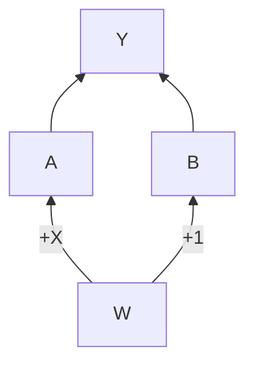

# PyTorch 个人学习小结

>尽量覆盖全部关键知识点！学习参考：
>- [《深度学习框架PyTorch入门与实践》](https://book.douban.com/subject/27624483/)——[代码](https://github.com/chenyuntc/pytorch-book)
>- 公众号【机器学习炼丹术】专题 [#小白学PyTorch](https://mp.weixin.qq.com/mp/appmsgalbum?__biz=MzI4NzE4NTM3OQ==&action=getalbum&album_id=1409557046126854147)——[代码](https://github.com/YixinChen-AI/pytorch-learner)

---

## 目录

- [0.TensorVSVariable](#0TensorVSVariable)
    - [0.1.Tensor](#01Tensor)
        - [(1)分类](#1分类)
        - [(2)创建Tensor](#2创建Tensor)
        - [(3)常用Tensor操作](#3常用Tensor操作)
        - [(4)索引操作](#4索引操作)
        - [(5)高级索引](#5高级索引)
        - [(6)Tensor类型](#6Tensor类型)
        - [(7)逐元素操作](#7逐元素操作)
        - [(8)归并](#8归并)
        - [(9)比较](#9比较)
        - [(10)线性代数](#10线性代数)
    - [0.2.Variable](#02Variable)
- [1.动态图与静态图](#1动态图与静态图)
    - [1.1.动态图求导](#11动态图求导)
    - [1.2.动态图叶子节点](#12动态图叶子节点)
    - [1.3.grad_fn](#13grad_fn)
    - [1.4.静态图](#14静态图)
- [2.tensor基本运算](#2tensor基本运算)
    - [2.1.矩阵与标量运算](#21矩阵与标量运算)
    - [2.2.元素积](#22元素积)
    - [2.3.矩阵乘法](#23矩阵乘法)
    - [2.4.幂与开方](#24幂与开方)
    - [2.5.对数运算](#25对数运算)
    - [2.6.近似值运算](#26近似值运算)
    - [2.7.剪裁运算](#27剪裁运算)
- [3.torch.nn](#3torchnn)
    - [3.1.构建模型及权重初始化(nn.Module,nn.init)](#31构建模型及权重初始化nnModulenninit)
        - [3.1.1.模型三要素](#311模型三要素)
        - [3.1.2.参数初始化](#312参数初始化)
        - [3.1.3.完整运行代码](#313完整运行代码)
        - [3.1.4.尺寸计算与参数计算](#314尺寸计算与参数计算)
    - [3.2.模型构建函数和遍历模型结构及模型保存加载](#32模型构建函数和遍历模型结构及模型保存加载)
        - [3.2.1.模型构建函数](#321模型构建函数)
            - add_module
            - Sequential
            - ModuleList
        - [3.2.2.遍历模型结构](#322遍历模型结构)
            - modules()
            - named_modules()
            - parameters()
            - named_parameters()
        - [3.2.3.保存与载入](#323保存与载入)
    - [3.3.nn.functional](#33nnfunctional)
- [4.torch.utils](#4torchutils)
    - [浅谈Dataset和Dataloader](#浅谈Dataset和Dataloader)
        - [Dataset基类](#Dataset基类)
        - [Dataset子类](#Dataset子类)
        - [DataLoader](#DataLoader)
- [5.torch.optim](#5torchoptim)
    - [5.1.optimizer](#51optimizer)
    - [5.2.损失函数](#52损失函数)
- [6.torchvision](#6torchvison)
    - [6.1.torchvision.datssets](#61torchvision.datssets)
    - [6.2.torchvision.models](#62torchvision.models)
    - [6.3.torchvision.transforms](#63torchvision.transforms)
        - [6.3.1.基本函数](#631基本函数)
        - [6.3.2.PIL上的操作](#632PIL上的操作)
        - [6.3.3.Tensor上的操作](#633Tensor上的操作)
        - [6.3.4.PIL，Tensor转换函数](#634PILTensor转换函数)
        - [6.3.5.代码举例串烧](#635代码举例串烧)
- [7.tensorboardX可视化](#7tensorboardX可视化)
- [8.几个网络实践](#8几个网络实践)
    - MNIST小试牛刀
    - MobileNet详解及PyTorch实现
    - SENet详解及PyTorch实现
    - EfficientNet详解及PyTorch实现

---

## 0.TensorVSVariable

### 0.1.Tensor

#### (1)分类

从接口角度讲，对 tensor 的操作分为两类

- torch.function, eg: torch.save
- tensor.function, eg: tensor.view

torch.sum(a, b) <=> a.sum(b)

从存储角度讲，对 tensor 的操作分为两类

- 不会修改自身，eg: a.add(b)
- 会修改自身，eg: a.add_(b)

#### (2)创建Tensor

函数|功能
-|-
Tensor(*sizes)|基础构造函数
ones(*sizes)|全1Tensor
zeros(*sizes)|全0Tensor
eye(*sizes)|对角全1，其余为0（单位矩阵，不要求行列一致）
arange(s,e,step)|从s到e，步长为step
linspace(s,e,steps)|从s到e，均匀切分成steps份
rand/randn(*sizes)|[0,1]均匀分布/从标准正态分布（均值为0，方差为1，即高斯白噪声）中抽取的一组随机数
normal(mean,std)/uniform(from,to)|正态分布/均匀分布
randperm(m)|长度m随机排列

#### (3)常用Tensor操作

```py
tensor.view           # 前后大小一样。某一维度-1，这一维度自动计算
tensor.resize         # 新>旧，新分配内存；新<旧，之前数据依然会保留
tensor.squeeze        # ()把所有维度为'1'的压缩
tensor.unsqueeze      # 1在第1维（下标从0开始）加'1'；-2倒数第二维
```

#### (4)索引操作

类似于numpy

eg
```py
import torch as t
a = t.randn(3,4)
a[0]
a[:,0]
a[0][2]
a[0, 2]
...
a[a>1] # <=> a.masked_select(a>1), 输出1,0，选择结果与原tensor不共享内存
a[t.LongTensor([0, 1])] # 第0,1行
```

常用选择函数

函数|功能
-|-
index_select(input, dim, index)|在指定维度dim上选取，例如某些行、列
masked_select(input, mask)|使用 ByteTensor 进行选取
non_zero(input)|非0元素的下标
gather(input, dim, index)|根据index，在dim维度上选取数据，输出的size与index一样
scatter(input1, dim, index, input2)|根据index，在dim维度上将inputs2数据放到inputs1

eg

```py
# Get diagonal/inverse diagonal elements of the matrix
import torch as t

# ATTENTION: arrange generate dtype is int, translate to float, or run error
a = t.arange(0, 16).float().view(4, 4)
print(a)

# 0: according to column
index = t.LongTensor([[0, 1, 2, 3]])
b = a.gather(0, index)
print(b)

# 1: according to row
index = t.LongTensor([[0, 1, 2, 3]]).t()
b = a.gather(1, index)
print(b)

index = t.LongTensor([[3, 2, 1, 0]])
b = a.gather(0, index)
print(b)

index = t.LongTensor([[3, 2, 1, 0]]).t()
b = a.gather(1, index)
print(b)

index1 = t.LongTensor([[0, 1, 2, 3], [3, 2, 1, 0]])
b1 = a.gather(0, index1)
print(b1)

index2 = t.LongTensor([[0, 1, 2, 3], [3, 2, 1, 0]]).t()
b2 = a.gather(1, index2)
print(b2)

c = t.zeros(4, 4)
d1 = c.scatter(0, index1, b1)
print(d1)
d2 = c.scatter(1, index2, b2)
print(d2)
```

OUTPUT

```bash
tensor([[ 0.,  1.,  2.,  3.],
        [ 4.,  5.,  6.,  7.],
        [ 8.,  9., 10., 11.],
        [12., 13., 14., 15.]])
tensor([[ 0.,  5., 10., 15.]])
tensor([[ 0.],
        [ 5.],
        [10.],
        [15.]])
tensor([[12.,  9.,  6.,  3.]])
tensor([[ 3.],
        [ 6.],
        [ 9.],
        [12.]])
tensor([[ 0.,  5., 10., 15.],
        [12.,  9.,  6.,  3.]])
tensor([[ 0.,  3.],
        [ 5.,  6.],
        [10.,  9.],
        [15., 12.]])
tensor([[ 0.,  0.,  0.,  3.],
        [ 0.,  5.,  6.,  0.],
        [ 0.,  9., 10.,  0.],
        [12.,  0.,  0., 15.]])
tensor([[ 0.,  0.,  0.,  3.],
        [ 0.,  5.,  6.,  0.],
        [ 0.,  9., 10.,  0.],
        [12.,  0.,  0., 15.]])
```

#### (5)高级索引

```py
import torch as t

x = t.arange(0, 27).view(3, 3, 3)
print(x)

# <=>x[1,1,2],x[2,2,0]
print(x[[1, 2], [1, 2], [2, 0]])
# <=>x[2,0,1],x[1,0,1],x[0,0,1]
print(x[[2, 1, 0], [0], [1]])
# <=>x[0],x[2]
print(x[[0, 2], ...])
# <=>x[:,0,:],x[:,2,:]
print(x[:, [0, 2], :])
# <=>x[:,:,0],x[:,:,2]
print(x[..., [0, 2]])
print(x[..., [0, 2], ...])
```

OUTPUT

```bash
tensor([[[ 0,  1,  2],  
         [ 3,  4,  5],  
         [ 6,  7,  8]], 

        [[ 9, 10, 11],  
         [12, 13, 14],  
         [15, 16, 17]],

        [[18, 19, 20],
         [21, 22, 23],
         [24, 25, 26]]])
tensor([14, 24])
tensor([19, 10,  1])
tensor([[[ 0,  1,  2],
         [ 3,  4,  5],
         [ 6,  7,  8]],

        [[18, 19, 20],
         [21, 22, 23],
         [24, 25, 26]]])
tensor([[[ 0,  1,  2],
         [ 6,  7,  8]],

        [[ 9, 10, 11],
         [15, 16, 17]],

        [[18, 19, 20],
         [24, 25, 26]]])
tensor([[[ 0,  2],
         [ 3,  5],
         [ 6,  8]],

        [[ 9, 11],
         [12, 14],
         [15, 17]],

        [[18, 20],
         [21, 23],
         [24, 26]]])
tensor([[[ 0,  2],
         [ 3,  5],
         [ 6,  8]],

        [[ 9, 11],
         [12, 14],
         [15, 17]],

        [[18, 20],
         [21, 23],
         [24, 26]]])
```

#### (6)Tensor类型

数据类型|CPU Tensor|GPUTensor
-|-|-
32bit 浮点|torch.FloatTensor|torch.cuda.FloatTensor
64bit 浮点|torch.DoubleTensor|torch.cuda.DoubleTensor
16bit 半精度浮点|N/A|torch.cuda.HalfTensor
8bit 无符号整型(0~255)|torch.ByteTensor|torch.cuda.ByteTensor
8bit 有符号整型(-128~127)|torch.CharTensor|torch.cuda.CharTensor
16bit 有符号整型|torch.ShortTensor|torch.cuda.ShortTensor
32bit 有符号整型|torch.IntTensor|torch.cuda.IntTensor
64bit 有符号整型|torch.LongTensor|torch.cuda.LongTensor

```py
import torch as t
# t.set_default_tensor_type('tensor.IntTensor')
# TypeError: only floating-point types are supported as the default type
# So we set DoubleTensor
t.set_default_tensor_type('torch.DoubleTensor')
a = t.Tensor(2, 3)
b = a.float()
c = a.type_as(b)
d = a.new(2, 3)
t.set_default_tensor_type('torch.FloatTensor')
print(a, '\n', b, '\n', c, '\n', d, '\n', a.dtype,
      '\n', b.dtype, '\n', c.dtype, '\n', d.dtype)
```

OUTPUT

```bash
tensor([[0., 0., 0.],
        [0., 0., 0.]], dtype=torch.float64)
 tensor([[0., 0., 0.],
        [0., 0., 0.]])
 tensor([[0., 0., 0.],
        [0., 0., 0.]])
 tensor([[0., 0., 0.],
        [0., 0., 0.]], dtype=torch.float64)
 torch.float64
 torch.float32
 torch.float32
 torch.float64
 ```

#### (7)逐元素操作

该部分操作会对 tensor 的每个元素（point-wise，又名 element-wise）进行操作，输入输出形状一致。

<center>常用的逐元素操作函数</center>

函数|功能
-|-
abs/sqrt/div/exp/fmod/log/pow...|绝对值/平方根/除法/指数/求余/求幂...
cos/sin/asin/atan2/cosh|三角函数
ceil/round/floor/trunc|上取整/四舍五入/下取整/只保留整数部分
clamp(input, min, max)|超过 min 和 max 的部分截断
sigmoid/tanh|激活函数

a ** 2 <=> t.pow(a, 2)

a % 3 <=> t.fmod(a, 3)

...

#### (8)归并

<center>常用的归并操作函数</center>

函数|功能
-|-
mean/sum/median/mode|均值/和/中位数/众数
norm/dist|范数/距离
std/var|标准差/方差
cumsum/cumprod|累加/累乘

以上函数大多有个参数 dim <=> Numpy 的 axis：

Input|dim|keepdim|Output
-|-|-|-
(m,n,k)|dim=0|keepdim=True|(1,n,k)
(m,n,k)|dim=0|keepdim=False|(n,k)
(m,n,k)|dim=1|keepdim=True|(m,1,k)
(m,n,k)|dim=1|keepdim=False|(m,k)
(m,n,k)|dim=2|keepdim=True|(m,n,1)
(m,n,k)|dim=2|keepdim=False|(m,n)

```py
import torch as t
# special case: size is still 2*3
a = t.arange(0, 6).view(2, 3)
print(a)
print(a.cumsum(dim=1))
```

OUTPUT

```bash
tensor([[0, 1, 2],
        [3, 4, 5]])
tensor([[ 0,  1,  3],
        [ 3,  7, 12]])
```

#### (9)比较

<center>常用的比较操作函数</center>

函数|功能
-|-
gt/lt/ge/le/eq/ne|大于/小于/大于等于/小于等于/等于/不等
topk|最大的k个数
sort|排序
max/min|比较两个 tensor 的最大值/最小值

说明：

第一行已实现函数重载，返回结果是一个 ByteTensor

max/min较特殊，有如下三种情况：

- `t.max(tensor)`: 返回tensor中最大的一个元素
- `t.max(tensor, dim)`: 指定维数上的最大数，返回 tensor 和下标
- `t.max(tensor1, tensor2)`: 比较，返回各个位置两者较大的元素

#### (10)线性代数

<center>常用的线性代数函数</center>

函数|功能
-|-
trace|对角元素之和（矩阵的迹）
diag|对角线元素
triu/tril|矩阵的上三角/下三角，可指定偏移量
mm/bmm|矩阵乘法，batch的矩阵乘法
addmm/addbmm/addmv|β×mat+α(mat1@mat2)<br>β×mat+α(∑_(i=0)^(b−1)batch1_i@batch2_i)<br>β×mat+α(mat@vec)
t|转置
dot/cross|内积/外积
inverse|矩阵求逆
svd|奇异值分解

### 0.2.Variable

`torch.autograd` 的 `Variable` 简单封装了 Tensor，并记录对 tensor 的操作记录用来构建计算图。Variable 主要包含三个属性：

- data：保存 Variable 所包含的 tensor。
- grad：保存 data 对应的梯度，grad 也是 Variable，而非 tensor，它与 data 形状一致。
- grad_fn：指向一个 Function，记录 Variable 的操作历史，即它是什么操作的输出，用来构建计算图。如果某一个变量是用户创建的，则它为叶子节点，对应的 grad_fn 等于 None。

Variable 的构造函数需要传入 tensor，同时有两个可选参数：

- requires_grad(bool)：是否需要对该 Variable 求导。
- volatile(bool)：意为“挥发”，设置为True，构建在该 Variable 之上的图都不会求导，专门为推理阶段设计。

若想要计算各个 Variable 的梯度，只需调用根节点 variable 的 backward 方法，autograd 会自动沿着计算图反向传播，计算每一个叶子节点的梯度。

`variable.backward(grad_variables=None, retain_graph=None, create_graph=None)` 主要有如下参数：

- `grad_variables` ：形状与 variable 一致，对于 y.backward()， grad_variables 相当于链式法则 $\frac{\partial z}{\partial x} = \frac{\partial z}{\partial y} × \frac{\partial y}{\partial x}$ 中的 $\frac{\partial z}{\partial y}$ 。grad_variables 也可以是 tensor 或者序列。
- `retain_graph` ：反向传播需要缓存一些中间结果，反向传播后，这些缓存就被清空，可通过制定这个参数不清空缓存，用来多次反向传播。
- `create_graph` ：对反向传播过程再次构建计算图，可通过 backward of backward 实现求高阶导数。

eg. 自动求导与手动求到的对比

$$
y = x^2e^{x}
$$
$$
\frac{\partial y}{\partial x} = 2xe^{x} + x^2e^{x}
$$

```py
import torch as t
from torch.autograd import Variable as V


def f(x):
    y = x ** 2 * t.exp(x)
    return y


def gradf(x):
    dx = 2 * x * t.exp(x) + x ** 2 * t.exp(x)
    return dx


x = V(t.randn(3, 4), requires_grad=True)
y = f(x)
print(x, '\n', y)
y.backward(t.ones(y.size()))
print(x.grad)
print(gradf(x))
```

OUTPUT

```bash
tensor([[-0.9896, -1.8309, -1.7555,  0.5094],
        [ 0.6992, -0.9861, -0.6529,  0.1136],
        [ 2.2123,  2.1677, -0.7240,  0.5284]], requires_grad=True)
tensor([[3.6403e-01, 5.3725e-01, 5.3259e-01, 4.3180e-01],
        [9.8378e-01, 3.6274e-01, 2.2191e-01, 1.4446e-02],
        [4.4716e+01, 4.1059e+01, 2.5410e-01, 4.7366e-01]],
       grad_fn=<MulBackward0>)
tensor([[-3.7169e-01, -4.9625e-02, -7.4184e-02,  2.1272e+00],
        [ 3.7977e+00, -3.7294e-01, -4.5782e-01,  2.6888e-01],
        [ 8.5141e+01,  7.8942e+01, -4.4789e-01,  2.2664e+00]])
tensor([[-3.7169e-01, -4.9625e-02, -7.4184e-02,  2.1272e+00],
        [ 3.7977e+00, -3.7294e-01, -4.5782e-01,  2.6888e-01],
        [ 8.5141e+01,  7.8942e+01, -4.4789e-01,  2.2664e+00]],
       grad_fn=<AddBackward0>)
```
---

## 1.动态图与静态图

### 1.1.动态图求导

- 计算图是用来描述运算的有向无环图
- 计算图有两个主要元素：结点（Node）和边（Edge）；
- 结点表示数据 ，如向量、矩阵、张量;
- 边表示运算 ，如加减乘除卷积等；



y = (w + x) * (w + 1) = a * b

$\frac{\partial y}{\partial w} = \frac{\partial y}{\partial a}b + a\frac{\partial y}{\partial b} = b + a = 2w + x + 1$

$\frac{\partial y}{\partial x} = w + 1$

let w = 1, x = 2

$\frac{\partial y}{\partial w} = 2w + x + 1 = 2*1+2+1 = 5$

$\frac{\partial y}{\partial x} = w + 1 = 1+1 = 2$

```py
import torch
w = torch.tensor([1.],requires_grad = True)
x = torch.tensor([2.],requires_grad = True)

a = w+x
b = w+1
y = a*b

y.backward()
print(w.grad)
print(x.grad)
```

```bash
tensor([5.])
tensor([2.])
```

### 1.2.动态图叶子节点

- 动态图叶子节点`.backward()`后保留梯度
- 动态图非叶子节点`.backward()`后不保留梯度（但是可以通过`tensor.retain_grad()`方法保留）

```py
import torch
w = torch.tensor([1.], requires_grad=True)
x = torch.tensor([2.], requires_grad=True)

a = w+x
b = w+1
y = a*b

y.backward()
print(w.is_leaf, x.is_leaf, a.is_leaf, b.is_leaf, y.is_leaf)
print(w.grad, x.grad, a.grad, b.grad, y.grad)
```

```bash
True True False False False
tensor([5.]) tensor([2.]) None None None
```

```py
import torch
w = torch.tensor([1.], requires_grad=True)
x = torch.tensor([2.], requires_grad=True)

a = w + x
a.retain_grad()
b = w+1
y = a*b

y.backward()
print(w.is_leaf, x.is_leaf, a.is_leaf, b.is_leaf, y.is_leaf)
print(w.grad, x.grad, a.grad, b.grad, y.grad)
```

```bash
True True False False False
tensor([5.]) tensor([2.]) tensor([2.]) None None
```

### 1.3.grad_fn

`torch.tensor`有一个属性`grad_fn`，grad_fn的作用是记录创建该张量时所用的函数，这个属性反向传播的时候会用到。

- 叶子节点w,x的`.grad_fn` 是None。
- `a.grad_fn=AddBackward0`, `b.grad_fn=AddBackward0` 表示a,b是通过加法得到的，求导时用加法的求导法则。
- `y.grad_fn=MulBackward0` 表示y是通过乘法得到的，求导时用乘法的求导法则。

```py
import torch
w = torch.tensor([1.], requires_grad=True)
x = torch.tensor([2.], requires_grad=True)

a = w + x
b = w+1
y = a*b

y.backward()
print(w.grad_fn, x.grad_fn, a.grad_fn, b.grad_fn, y.grad_fn)
```

```bash
None None <AddBackward0 object at 0x000001D1053495F8> <AddBackward0 object at 0x000001D105349588> <MulBackward0 object at 0x000001D105349630>
```

### 1.4.静态图

TensorFlow 使用 静态图。两者的区别用一句话概括就是：

- 动态图：pytorch使用的，运算与搭建同时进行；灵活，易调节。
- 静态图：老tensorflow使用的，先搭建图，后运算；高效，不灵活。

---

## 2.tensor基本运算

### 2.1.矩阵与标量运算

矩阵（张量）每一个元素与标量进行操作。

```py
import torch
a = torch.tensor([1,2])
print(a+1)
>>> tensor([2, 3])
```

### 2.2.元素积

这个就是两个相同尺寸的张量相乘，然后对应元素的相乘就是这个哈达玛积，也称为 `element wise product`。

```py
a = torch.tensor([1,2])
b = torch.tensor([2,3])
print(a*b)
print(torch.mul(a,b))
>>> tensor([2, 6])
>>> tensor([2, 6])
```

torch.mul() <=> * 

torch.div() <=> /

torch.add <=> +

torch.sub() <=> -

### 2.3.矩阵乘法

这样的操作有三个写法:

- `torch.mm()`
- `torch.matmul()`
- `@`

```py
import torch
a = torch.tensor([1., 2.]).view(2, 1)
b = torch.tensor([2., 3.]).view(1, 2)
print(torch.mm(a, b))
print(torch.matmul(a, b))
print(a @ b)
```

```bash
tensor([[2., 3.],
        [4., 6.]])
tensor([[2., 3.],
        [4., 6.]])
tensor([[2., 3.],
        [4., 6.]])
```

这是对二维矩阵而言的，假如参与运算的是一个多维张量，那么只有 `torch.matmul()`, `@` 可以使用。在多维张量中，参与矩阵运算的其实只有**后两个维度**，前面的维度其实就像是索引一样，举个例子：

```py
import torch
a = torch.rand((1, 2, 64, 32))
b = torch.rand((1, 2, 32, 64))
print(torch.matmul(a, b).shape)
```

```bash
torch.Size([1, 2, 64, 64])
```

前面几维不同这样也是可以相乘的，因为这里涉及一个自动传播Broadcasting机制，如果这种情况下，会把某一维度较小的b的该维度复制，然后变成和a一样的尺寸，进行矩阵相乘，举个例子：

```py
import torch
a = torch.rand((3, 2, 64, 32))
b = torch.rand((1, 2, 32, 64))
print((a@b).shape)
```

```bash
torch.Size([3, 2, 64, 64])
```

### 2.4.幂与开方

```py
import torch
a = torch.tensor([1., 2.])
b = torch.tensor([2., 3.])
c = torch.tensor([4., 9.])
d1 = a ** b
d2 = torch.pow(a, b)
e1 = c ** .5
e2 = torch.pow(c, .5)
e3 = torch.sqrt(c)
print(d1, d2, e1, e2, e3)
>>> tensor([1., 8.]) tensor([1., 8.]) tensor([2., 3.]) tensor([2., 3.]) tensor([2., 3.])
```

### 2.5.对数运算

- `t.log2(a)` <=> $log_2(a)$
- `t.log(a)` <=> $ln(a)$
- `t.log10(a)` <=> $lg(a)$

```py
import torch as t
import numpy as np
a = t.tensor([2, np.e, 10])
print(t.log2(a))
print(t.log(a))
print(t.log10(a))
>>>tensor([1.0000, 1.4427, 3.3219])
>>>tensor([0.6931, 1.0000, 2.3026])
>>>tensor([0.3010, 0.4343, 1.0000])
```

### 2.6.近似值运算

- `.ceil()` 向上取整
- `.floor()` 向下取整
- `.trunc()` 取整数部分
- `.frac()` 取小数部分
- `.round()` 四舍五入

```py
a = torch.tensor(1.2345)
print(a.ceil())
>>>tensor(2.)
print(a.floor())
>>> tensor(1.)
print(a.trunc())
>>> tensor(1.)
print(a.frac())
>>> tensor(0.2345)
print(a.round())
>>> tensor(1.)
```

### 2.7.剪裁运算

这个是让一个数，限制在你自己设置的一个范围内[min,max],小于min的话就被设置为min，大于max的话就被设置为max。这个操作在一些对抗生成网络中，好像是WGAN-GP,通过强行限制模型的参数的值。

```py
a = torch.rand(5)
print(a)
print(a.clamp(0.3,0.7))
>>>tensor([0.9685, 0.3176, 0.9000, 0.0716, 0.3981])
>>>tensor([0.7000, 0.3176, 0.7000, 0.3000, 0.3981])
```

---

## 3.torch.nn

### 3.1.构建模型及权重初始化(nn.Module,nn.init)

#### 3.1.1.模型三要素

模型三要素其实很简单

- 必须要继承`nn.Module`这个类，要让PyTorch知道这个类是一个Module
- 在`__init__(self)`中设置好需要的组件，比如conv，pooling，Linear，BatchNorm等等
- 最后在`forward(self,x)`中用定义好的组件进行组装，就像搭积木，把网络结构搭建出来，这样一个模型就定义好了

我们来看一个例子的一部分：

```py
import torch as t
import torch.nn as nn
import torch.nn.functional as F


class LeNet(nn.Module):
    def __init__(self):
        # <=> `nn.Module.__init__(self)`
        super(LeNet, self).__init__()
        self.conv1 = nn.Conv2d(3, 6, 5)
        self.pool1 = nn.MaxPool2d(2, 2)
        self.conv2 = nn.Conv2d(6, 16, 5)
        self.pool2 = nn.MaxPool2d(2, 2)
        self.fc1 = nn.Linear(16*5*5, 120)
        self.fc2 = nn.Linear(120, 84)
        self.fc3 = nn.Linear(84, 10)

    def forward(self, x):
        x = self.pool1(F.relu(self.conv1(x)))
        x = self.pool2(F.relu(self.conv2(x)))
        x = x.view(-1, 16*5*5)
        x = F.relu(self.fc1(x))
        x = F.relu(self.fc2(x))
        x = self.fc3(x)
        return x

net = LeNet()
outputs = net(inputs)
```

先定义`__init__(self)`函数

初始化中定义了一系列组件，就是一般图片处理的"卷积模块"，"池化层"，"全连接层"等等。

定义完这些定义`forward`函数

x -> conv1 -> F.relu -> pool1 -> conv2 -> F.relu -> pool2 -> reshape -> fc1 -> F.relu -> fc2 -> F.relu -> fc3

至此，对一个模型的定义完毕，如何使用呢？

其实`net(inputs)`,就是类似于使用了`net.forward(inputs)`这个函数。

#### 3.1.2.参数初始化

简单地说就是设定什么层用什么初始方法，初始化的方法会在`torch.nn.init`中

话不多说，看一个案例：

```py
    # 定义权值初始化
    def initialize_weights(self):
        for m in self.modules():
            if isinstance(m, nn.Conv2d):
                torch.nn.init.xavier_normal_(m.weight.data)
                if m.bias is not None:
                    m.bias.data.zero_()
            elif isinstance(m, nn.BatchNorm2d):
                m.weight.data.fill_(1)
                m.bias.data.zero_()
            elif isinstance(m, nn.Linear):
                torch.nn.init.normal_(m.weight.data, 0, 0.01)
                # m.weight.data.normal_(0,0.01)
                m.bias.data.zero_()
```

这段代码的基本流程就是，先从`self.modules()`中遍历每一层，然后判断更曾属于什么类型，是否是`Conv2d`，是否是`BatchNorm2d`，是否是`Linear`的，然后根据不同类型的层，设定不同的权值初始化方法，例如`Xavier`，`kaiming`，`normal_`等等。kaiming也是MSRA初始化，是何恺明大佬在微软亚洲研究院的时候，因此得名。

上面代码中用到了`self.modules()`，这个是什么东西呢？

```py
# self.modules的源码
def modules(self):
    for name, module in self.named_modules():
        yield module
```

功能就是：能依次返回模型中的各层，yield是让一个函数可以像迭代器一样可以用for循环不断从里面遍历。

#### 3.1.3.完整运行代码

```py
import torch as t
import torch.nn as nn
import torch.nn.functional as F


class LeNet(nn.Module):
    def __init__(self):
        # <=> `nn.Module.__init__(self)`
        super(LeNet, self).__init__()
        self.conv1 = nn.Conv2d(3, 6, 5)
        self.pool1 = nn.MaxPool2d(2, 2)
        self.conv2 = nn.Conv2d(6, 16, 5)
        self.pool2 = nn.MaxPool2d(2, 2)
        self.fc1 = nn.Linear(16*5*5, 120)
        self.fc2 = nn.Linear(120, 84)
        self.fc3 = nn.Linear(84, 10)

    def forward(self, x):
        x = self.pool1(F.relu(self.conv1(x)))
        x = self.pool2(F.relu(self.conv2(x)))
        x = x.view(-1, 16*5*5)
        x = F.relu(self.fc1(x))
        x = F.relu(self.fc2(x))
        x = self.fc3(x)
        return x

    def initialize_weights(self):
        for m in self.modules():
            if isinstance(m, nn.Conv2d):
                nn.init.xavier_normal_(m.weight.data)
                if m.bias is not None:
                    m.bias.data.zero_()
            elif isinstance(m, nn.BatchNorm2d):
                m.weight.data.fill_(1)
                m.bias.data.zero_()
            elif isinstance(m, nn.Linear):
                nn.init.normal_(m.weight.data, 0, 0.01)
                # m.weight.data.normal_(0,0.01)
                m.bias.data.zero_()


net = LeNet()
net.initialize_weights()
print(net.modules())
for m in net.modules():
    print(m)
```

```bash
<generator object Module.modules at 0x000001F7B86AA150>
LeNet(
  (conv1): Conv2d(3, 6, kernel_size=(5, 5), stride=(1, 1))
  (pool1): MaxPool2d(kernel_size=2, stride=2, padding=0, dilation=1, ceil_mode=False)
  (conv2): Conv2d(6, 16, kernel_size=(5, 5), stride=(1, 1))
  (pool2): MaxPool2d(kernel_size=2, stride=2, padding=0, dilation=1, ceil_mode=False)
  (fc1): Linear(in_features=400, out_features=120, bias=True)
  (fc2): Linear(in_features=120, out_features=84, bias=True)
  (fc3): Linear(in_features=84, out_features=10, bias=True)
)
Conv2d(3, 6, kernel_size=(5, 5), stride=(1, 1))
MaxPool2d(kernel_size=2, stride=2, padding=0, dilation=1, ceil_mode=False)
Conv2d(6, 16, kernel_size=(5, 5), stride=(1, 1))
MaxPool2d(kernel_size=2, stride=2, padding=0, dilation=1, ceil_mode=False)
Linear(in_features=400, out_features=120, bias=True)
Linear(in_features=120, out_features=84, bias=True)
Linear(in_features=84, out_features=10, bias=True)
```

#### 3.1.4.尺寸计算与参数计算

我们把上面的主函数部分改成：

```py
net = LeNet()
net.initialize_weights()
layers = {}
for m in net.modules():
    if isinstance(m,nn.Conv2d):
        print(m)
        break
```

这里的输出m就是：

```bash
Conv2d(3, 6, kernel_size=(5, 5), stride=(1, 1))
```

这个卷积层，就是我们设置的第一个卷积层，含义就是：输入3通道，输出6通道，卷积核5*5，步长1，padding=0。

【问题1：输入特征图和输出特征图的尺寸计算】

$$
output = \frac{input + 2 * padding - kernel}{stride} + 1
$$

用代码来验证一下这个公式：

```py
net = LeNet()
net.initialize_weights()
input = t.ones((16, 3, 10, 10))
output = net.conv1(input)
print(input.shape)
print(output.shape)
```

输出结果：

```bash
torch.Size([16, 3, 10, 10])
torch.Size([16, 6, 6, 6])
```

第一个维度是 `batch` ，第二个是通道 `channel` ，第三个和第四个是图片（特征图）的尺寸。

$$
\begin{aligned}
    output & = \frac{input + 2 * padding - kernel}{stride} + 1 \\
    & = \frac{10 + 2 * 0 - 5}{1} + 1 \\
    & = 6
\end{aligned}
$$

算出来的结果没毛病。

【问题2：这个卷积层中有多少的参数？】

输入通道是`3`通道的，输出是`6`通道的，卷积核是`5*5`的，所以理解为`6`个`3*5*5`的卷积核，所以不考虑bias的话，参数量是`6*3*5*5=450`，考虑bais的话，就每一个卷积核再增加一个偏置值，这里共加`6`个。（这是一个一般人会忽略的知识点欸）

下面用代码来验证：

```py
net = LeNet()
net.initialize_weights()
for m in net.modules():
    if isinstance(m, nn.Conv2d):
        print(m)
        print(m.weight.shape)
        print(m.bias.shape)
        break
```

输出结果是：

```bash
Conv2d(3, 6, kernel_size=(5, 5), stride=(1, 1))
torch.Size([6, 3, 5, 5])
torch.Size([6])
```

都和预料中一样。

### 3.2.模型构建函数和遍历模型结构及模型保存加载

#### 3.2.1.模型构建函数

`torch.nn.Module` 是所有网络的基类，在PyTorch实现模型的类中都要继承这个类。在构建Module中，Module是一个包含其他的Module的，类似于，你可以先定义一个小的网络模块，然后把这个小模块作为另外一个网络的组件。因此网络结构是呈现树状结构。

我们先简单定义一个网络：

**(1) `self.name = layer`**

```py
import torch.nn as nn
import torch


class MyNet(nn.Module):
    def __init__(self):
        super(MyNet, self).__init__()
        self.conv1 = nn.Conv2d(3, 64, 3)
        self.conv2 = nn.Conv2d(64, 64, 3)

    def forward(self, x):
        x = self.conv1(x)
        x = self.conv2(x)
        return x


net = MyNet()
print(net)
```

输出结果：

```bash
MyNet(
  (conv1): Conv2d(3, 64, kernel_size=(3, 3), stride=(1, 1))
  (conv2): Conv2d(64, 64, kernel_size=(3, 3), stride=(1, 1))
)
```

**(2) `add_module(name, layer)`**

```py
class MyNet(nn.Module):
    def __init__(self):
        super(MyNet,self).__init__()
        self.add_module('conv1',nn.Conv2d(3,64,3))
        self.add_module('conv2',nn.Conv2d(64,64,3))

    def forward(self,x):
        x = self.conv1(x)
        x = self.conv2(x)
        return x
```

其实`add_module(name, layer)`和`self.name = layer`实现了相同的功能。

两种方法都是一层一层的添加layer，如果网络复杂的话，那就需要写很多重复的代码了。因此接下来来讲解一下网络模块的构建，`torch.nn.ModuleList` 和 `torch.nn.Sequential` 。

**(3)`torch.nn.Sequential`**

```py
import torch.nn as nn
import torch
from collections import OrderedDict


class MyNet1(nn.Module):
    def __init__(self):
        super(MyNet1, self).__init__()
        self.conv = nn.Sequential(
            nn.Conv2d(3, 64, 3),
            nn.Conv2d(64, 64, 3)
        )

    def forward(self, x):
        x = self.conv(x)
        return x


class MyNet2(nn.Module):
    def __init__(self):
        super(MyNet2, self).__init__()
        self.conv = nn.Sequential(OrderedDict([
            ('conv1', nn.Conv2d(3, 64, 3)),
            ('conv2', nn.Conv2d(64, 64, 3))
        ]))

    def forward(self, x):
        x = self.conv(x)
        return x


net1 = MyNet1()
net2 = MyNet2()
print(net1)
print(net2)
```

```bash
MyNet1(
  (conv): Sequential(
    (0): Conv2d(3, 64, kernel_size=(3, 3), stride=(1, 1))
    (1): Conv2d(64, 64, kernel_size=(3, 3), stride=(1, 1))
  )
)
MyNet2(
  (conv): Sequential(
    (conv1): Conv2d(3, 64, kernel_size=(3, 3), stride=(1, 1))
    (conv2): Conv2d(64, 64, kernel_size=(3, 3), stride=(1, 1))
  )
)
```

**(4)`torch.nn.ModuleList`**

ModuleList按照字面意思是用list的形式保存网络层的。这样就可以先将网络需要的layer构建好，保存到一个list，然后通过ModuleList方法添加到网络中。

```py
import torch.nn as nn
import torch
from collections import OrderedDict


vgg_cfg = [64, 64, 'M', 128, 128, 'M', 256, 256, 256, 'C', 512, 512, 512, 'M',
           512, 512, 512, 'M']


def vgg(cfg, i, batch_norm=False):
    layers = []
    in_channels = i
    for v in cfg:
        if v == 'M':
            layers += [nn.MaxPool2d(kernel_size=2, stride=2)]
        elif v == 'C':
            layers += [nn.MaxPool2d(kernel_size=2, stride=2, ceil_mode=True)]
        else:
            conv2d = nn.Conv2d(in_channels, v, kernel_size=3, padding=1)
            if batch_norm:
                layers += [conv2d, nn.BatchNorm2d(v), nn.ReLU(inplace=True)]
            else:
                layers += [conv2d, nn.ReLU(inplace=True)]
            in_channels = v
    return layers


class Model1(nn.Module):
    def __init__(self):
        super(Model1, self).__init__()

        self.vgg = nn.ModuleList(vgg(vgg_cfg, 3))

    def forward(self, x):
        for l in self.vgg:
            x = l(x)


m1 = Model1()
print(m1)
```

<details open>
<summary>输出如下</summary>

```bash
Model1(
  (vgg): ModuleList(
    (0): Conv2d(3, 64, kernel_size=(3, 3), stride=(1, 1), padding=(1, 1))
    (1): ReLU(inplace=True)
    (2): Conv2d(64, 64, kernel_size=(3, 3), stride=(1, 1), padding=(1, 1))
    (3): ReLU(inplace=True)
    (4): MaxPool2d(kernel_size=2, stride=2, padding=0, dilation=1, ceil_mode=False)
    (5): Conv2d(64, 128, kernel_size=(3, 3), stride=(1, 1), padding=(1, 1))
    (6): ReLU(inplace=True)
    (7): Conv2d(128, 128, kernel_size=(3, 3), stride=(1, 1), padding=(1, 1))
    (8): ReLU(inplace=True)
    (9): MaxPool2d(kernel_size=2, stride=2, padding=0, dilation=1, ceil_mode=False)
    (10): Conv2d(128, 256, kernel_size=(3, 3), stride=(1, 1), padding=(1, 1))
    (11): ReLU(inplace=True)
    (12): Conv2d(256, 256, kernel_size=(3, 3), stride=(1, 1), padding=(1, 1))
    (13): ReLU(inplace=True)
    (14): Conv2d(256, 256, kernel_size=(3, 3), stride=(1, 1), padding=(1, 1))
    (15): ReLU(inplace=True)
    (16): MaxPool2d(kernel_size=2, stride=2, padding=0, dilation=1, ceil_mode=True)
    (17): Conv2d(256, 512, kernel_size=(3, 3), stride=(1, 1), padding=(1, 1))
    (18): ReLU(inplace=True)
    (19): Conv2d(512, 512, kernel_size=(3, 3), stride=(1, 1), padding=(1, 1))
    (20): ReLU(inplace=True)
    (21): Conv2d(512, 512, kernel_size=(3, 3), stride=(1, 1), padding=(1, 1))
    (22): ReLU(inplace=True)
    (23): MaxPool2d(kernel_size=2, stride=2, padding=0, dilation=1, ceil_mode=False)
    (24): Conv2d(512, 512, kernel_size=(3, 3), stride=(1, 1), padding=(1, 1))
    (25): ReLU(inplace=True)
    (26): Conv2d(512, 512, kernel_size=(3, 3), stride=(1, 1), padding=(1, 1))
    (27): ReLU(inplace=True)
    (28): Conv2d(512, 512, kernel_size=(3, 3), stride=(1, 1), padding=(1, 1))
    (29): ReLU(inplace=True)
    (30): MaxPool2d(kernel_size=2, stride=2, padding=0, dilation=1, ceil_mode=False)
  )
)
```

</details>

##### 小节

- 单独增加一个网络层或者子模块，可以用add_module或者直接赋予属性；
- `Sequential` 按照顺序产生一个Module模块。这里推荐习惯使用OrderedDict的方法进行构建。对网络层加上规范的名称，这样有助于后续查找与遍历；
- `ModuleList` 可以将一个Module的List增加到网络中，自由度较高。

#### 3.2.2.遍历模型结构

每个模型 module 由许多层 layer 组成，每个 layer 可以是一种运算，也可以是一个 module 。简单写个网络：

- `net.modules()`
- `net.named_modules()`
- `net.parameters()`
- `net.named_parameters()`
- . . .

```py
import torch.nn as nn
import torch
from collections import OrderedDict


class MyNet(nn.Module):
    def __init__(self):
        super(MyNet, self).__init__()
        self.conv1 = nn.Conv2d(in_channels=3, out_channels=64, kernel_size=3)
        self.conv2 = nn.Conv2d(64, 64, 3)
        self.maxpool1 = nn.MaxPool2d(2, 2)

        self.features = nn.Sequential(OrderedDict([
            ('conv3', nn.Conv2d(64, 128, 3)),
            ('conv4', nn.Conv2d(128, 128, 3)),
            ('relu1', nn.ReLU())
        ]))

    def forward(self, x):
        x = self.conv1(x)
        x = self.conv2(x)
        x = self.maxpool1(x)
        x = self.features(x)

        return x


net = MyNet()
print(net)
print('————————————————————————————————————')
for idx, m in enumerate(net.modules()):
    print(idx, "-", m)
print('————————————————————————————————————')
for idx, (name, m) in enumerate(net.named_modules()):
    print(idx, "-", name)
print('————————————————————————————————————')
for p in net.parameters():
    print(type(p.data), p.size())
print('————————————————————————————————————')
for idx, (name, m) in enumerate(net.named_modules()):
    if isinstance(m, nn.Conv2d):
        print(m.weight.shape)
        print(m.bias.shape)
```

<details open>
<summary>详情</summary>

```bash
MyNet(
  (conv1): Conv2d(3, 64, kernel_size=(3, 3), stride=(1, 1))
  (conv2): Conv2d(64, 64, kernel_size=(3, 3), stride=(1, 1))
  (maxpool1): MaxPool2d(kernel_size=2, stride=2, padding=0, dilation=1, ceil_mode=False)
  (features): Sequential(
    (conv3): Conv2d(64, 128, kernel_size=(3, 3), stride=(1, 1))
    (conv4): Conv2d(128, 128, kernel_size=(3, 3), stride=(1, 1))
    (relu1): ReLU()
  )
)
————————————————————————————————————
0 - MyNet(
  (conv1): Conv2d(3, 64, kernel_size=(3, 3), stride=(1, 1))
  (conv2): Conv2d(64, 64, kernel_size=(3, 3), stride=(1, 1))
  (maxpool1): MaxPool2d(kernel_size=2, stride=2, padding=0, dilation=1, ceil_mode=False)
  (features): Sequential(
    (conv3): Conv2d(64, 128, kernel_size=(3, 3), stride=(1, 1))
    (conv4): Conv2d(128, 128, kernel_size=(3, 3), stride=(1, 1))
    (relu1): ReLU()
  )
)
1 - Conv2d(3, 64, kernel_size=(3, 3), stride=(1, 1))
2 - Conv2d(64, 64, kernel_size=(3, 3), stride=(1, 1))
3 - MaxPool2d(kernel_size=2, stride=2, padding=0, dilation=1, ceil_mode=False)
4 - Sequential(
  (conv3): Conv2d(64, 128, kernel_size=(3, 3), stride=(1, 1))
  (conv4): Conv2d(128, 128, kernel_size=(3, 3), stride=(1, 1))
  (relu1): ReLU()
)
5 - Conv2d(64, 128, kernel_size=(3, 3), stride=(1, 1))
6 - Conv2d(128, 128, kernel_size=(3, 3), stride=(1, 1))
7 - ReLU()
————————————————————————————————————
0 -
1 - conv1
2 - conv2
3 - maxpool1
4 - features
5 - features.conv3
6 - features.conv4
7 - features.relu1
————————————————————————————————————
<class 'torch.Tensor'> torch.Size([64, 3, 3, 3])
<class 'torch.Tensor'> torch.Size([64])
<class 'torch.Tensor'> torch.Size([64, 64, 3, 3])
<class 'torch.Tensor'> torch.Size([64])
<class 'torch.Tensor'> torch.Size([128, 64, 3, 3])
<class 'torch.Tensor'> torch.Size([128])
<class 'torch.Tensor'> torch.Size([128, 128, 3, 3])
<class 'torch.Tensor'> torch.Size([128])
————————————————————————————————————
torch.Size([64, 3, 3, 3])
torch.Size([64])
torch.Size([64, 64, 3, 3])
torch.Size([64])
torch.Size([128, 64, 3, 3])
torch.Size([128])
torch.Size([128, 128, 3, 3])
torch.Size([128])
```

</details>

#### 3.2.3.保存与载入

PyTorch使用`torch.save`和`torch.load`方法来保存和加载网络，而且网络结构和参数可以分开的保存和加载。

```py
torch.save(model, 'model.pth')    # 保存模型（结构+参数）
model = torch.load('model.pth')   # 加载模型（结构+参数）
```

pytorch中网络结构和模型参数是可以分开保存的。上面的方法是两者同时保存到了.pth文件中，当然，也可以仅仅保存网络的参数来减小存储文件的大小。注意：如果仅仅保存模型参数，那么在载入的时候，是需要通过运行代码来初始化模型的结构的。

```py
torch.save(model.state_dict(), 'model.pth')  # 保存参数
model = MyNet()                              # 代码中创建网络结构
params = torch.load('model.pth')             # 加载参数
model.load_state_dict(params)                # 应用到网络结构中
```

### 3.3.nn.functional

`nn.functional` 中的函数和 `nn.Module` 的主要区别在于：

- 用 `nn.Module` 实现的 `layers` 是一个特殊的类，都是由 `class Layer(nn.Module)` 定义，会自动提取可学习的参数；
- 而 `nn.functional` 中的函数更像是纯函数，由 `def function(input)` 定义。

下面举例说明二者不同：

```py
import torch as t
from torch.autograd import Variable as V
import torch.nn as nn
from torch import optim

input = V(t.randn(2, 3))
model = nn.Linear(3, 4)
output1 = model(input)
output2 = nn.functional.linear(input, model.weight, model.bias)
print(output1)
print(output2)

b1 = nn.functional.relu(input)
b2 = nn.ReLU()(input)
print(b1)
print(b2)
```

OUTPUT

```bash
tensor([[ 0.7299, -0.2246, -0.7104,  0.9022],
        [ 1.5820,  0.5451, -2.2354, -0.0169]], grad_fn=<AddmmBackward>)
tensor([[ 0.7299, -0.2246, -0.7104,  0.9022],
        [ 1.5820,  0.5451, -2.2354, -0.0169]], grad_fn=<AddmmBackward>)
tensor([[0.0000, 0.0000, 0.0000],
        [0.0000, 2.0410, 2.1813]])
tensor([[0.0000, 0.0000, 0.0000],
        [0.0000, 2.0410, 2.1813]])
```

采用那种方式呢？

- 由于激活函数（`ReLU`、`sigmoid`、`tanh`）、池化（`MaxPool`）等层没有可学习的参数，可以使用 `functional` 函数代替
- 而在卷积（`Conv2d`）、全连接（`Linear`）等具有可学习参数的网络使用 `nn.Module` 较好
-  另外 `dropout` 虽然没有可学习的参数，但是训练测试两个阶段的行为有差异，建议使用 `nn.Module` ， `model.eval` 操作可以加以区分
- 有可学参数的函数也可以用 `functional` 实现，不过要手动定义参数 `parameter` ，例如全连接层的 `weight` 和 `bias` 要单独拿出来，在构造函数中初始化为 `parameter` 

eg1:`LeNet`

```py
import torch.nn as nn
import torch.nn.functional as F


# Define LetNet
class LeNet(nn.Module):
    def __init__(self):
        super(LeNet, self).__init__()
        # Convolution layer: input-channels, output, kernel 5*5
        self.conv1 = nn.Conv2d(3, 6, 5)
        self.conv2 = nn.Conv2d(6, 16, 5)
        # Full connection layer：y = Wx + b
        self.fc1 = nn.Linear(16 * 5 * 5, 120)
        self.fc2 = nn.Linear(120, 84)
        self.fc3 = nn.Linear(84, 10)

    def forward(self, x):
        # (convolution -> activation -> pooling/subsampling) * 2
        x = F.max_pool(F.relu(self.conv1(x)), 2)
        x = F.max_pool(F.relu(self.conv2(x)), 2)
        x = x.view(-1, 16 * 5 * 5)
        # (full connection -> activation) * 2 -> full connection
        x = F.relu(self.fc1(x))
        x = F.relu(self.fc2(x))
        x = self.fc3(x)
        return x
```

eg2:`MyLinear`

```py
import torch as t
import torch.nn as nn
import torch.nn.functional as F


class MyLinear(nn.Module):
    def __init__(self):
        super(MyLinear, self).__init__()
        self.weight = nn.Parameter(t.randn(3, 4))
        self.bias = nn.Parameter(t.zeros(3))

    def forward(self):
        return F.linear(input, self.weight, self.bias)
```

---

## 4.torch.utils

### 浅谈Dataset和Dataloader

`from torch.utils.data import Dataset, DataLoader`

#### Dataset基类

>class Dataset()
>An abstract class representing a :class:Dataset.
>
>All datasets that represent a map from keys to data samples should subclass it. All subclasses should overwrite :meth:`__getitem__`, supporting fetching a data sample for a given key. Subclasses could also optionally overwrite :meth:`__len__`, which is expected to return the size of the dataset by many [torch.utils.data.Sampler](https://pytorch.org/docs/stable/data.html?highlight=dataset#torch.utils.data.Sampler) implementations and the default options of [torch.utils.data.DataLoader](https://pytorch.org/docs/stable/data.html?highlight=dataset#torch.utils.data.DataLoader).
>
>[torch.utils.data.DataLoader](https://pytorch.org/docs/stable/data.html?highlight=dataset#torch.utils.data.DataLoader) by default constructs a index sampler that yields integral indices.  To make it work with a map-style dataset with non-integral indices/keys, a custom sampler must be provided.

这里有一个__getitem__函数，__getitem__函数接收一个index，然后返回图片数据和标签，这个index通常是指一个list的index，这个list的每个元素就包含了图片数据的路径和标签信息。

#### Dataset子类

```py
import torch 
from torch.utils.data import Dataset, DataLoader

class MyDataset(Dataset):
    def __init__(self):
        self.data = torch.tensor([[1,2,3],[2,3,4],[3,4,5],[4,5,6]])
        self.label = torch.LongTensor([1,1,0,0])

    def __getitem__(self,index):
        return self.data[index], self.label[index]

    def __len__(self):
        return len(self.data)
```

- `init` 初始化中，一般是把数据直接保存在这个类的属性中。像是 `self.data` , `self.label`
- `getitem` 根据索引 index 返回数据 `self.data[index]` , `self.label[index]`

#### DataLoader

```py
import torch
from torch.utils.data import Dataset, DataLoader


class MyDataset(Dataset):
    def __init__(self):
        self.data = torch.tensor([[1, 2, 3], [2, 3, 4], [3, 4, 5], [4, 5, 6]])
        self.label = torch.LongTensor([1, 1, 0, 0])

    def __getitem__(self, index):
        return self.data[index], self.label[index]

    def __len__(self):
        return len(self.data)


mydataset = MyDataset()

mydataloader = DataLoader(dataset=mydataset,
                          batch_size=1)
for i, (data, label) in enumerate(mydataloader):
    print(data, label)


mydataloader = DataLoader(dataset=mydataset,
                          batch_size=2,
                          shuffle=True)
for i, (data, label) in enumerate(mydataloader):
    print(data, label)
```

```bash
tensor([[1, 2, 3]]) tensor([1])
tensor([[2, 3, 4]]) tensor([1])
tensor([[3, 4, 5]]) tensor([0])
tensor([[4, 5, 6]]) tensor([0])
tensor([[3, 4, 5],
        [2, 3, 4]]) tensor([0, 1])
tensor([[4, 5, 6],
        [1, 2, 3]]) tensor([0, 1])
```

`DataLoader(dataset, batch_size, shuffle)`是批量运算工具， `shuffle=True`则打乱顺序。

更多 torch.utils 参考 [4utility.md](./4utility.md) , https://pytorch.org/docs/stable/data.html?highlight=torch%20utils%20data#module-torch.utils.data

---

## 5.torch.optim

### 5.1.optimizer

详见：https://pytorch.org/docs/stable/optim.html?highlight=optim#module-torch.optim

- 优化器可以和损失函数配合使用
- 构造优化器：需要更新的变量参数，学习率 learning rate，权重衰减 weight decay，等 
- 预设参数
- 执行优化

eg

```py
optimizer = optim.SGD(model.parameters(), lr=0.01, momentum=0.9)
optimizer = optim.Adam([var1, var2], lr=0.0001)
```

```py
optim.SGD([
            {'params': model.base.parameters()},
            {'params': model.classifier.parameters(), 'lr': 1e-3}
        ], lr=1e-2, momentum=0.9)
```

```py
for input, target in dataset:
    optimizer.zero_grad()
    output = model(input)
    loss = loss_fn(output, target)
    loss.backward()
    optimizer.step()
```

`optimizer.step(closure)`

Some optimization algorithms such as Conjugate Gradient and LBFGS need to reevaluate the function multiple times, so you have to pass in a closure that allows them to recompute your model. The closure should clear the gradients, compute the loss, and return it.

Example:

```py
for input, target in dataset:
    def closure():
        optimizer.zero_grad()
        output = model(input)
        loss = loss_fn(output, target)
        loss.backward()
        return loss
    optimizer.step(closure)
```

`PyTorch` 将深度学习中常见的优化方法全部封装在 `torch.optim` 中，所有优化方法都是继承基类 `optim.Optimizer` ，并实现了自己的优化步骤。下面以随机梯度下降(`SGD`)举例说明。

```py
import torch as t
from torch.autograd import Variable as V
import torch.nn as nn
from torch import optim


class Net(nn.Module):
    def __init__(self):
        spuer(Net, self).__init__()
        self.features = nn.Sequential(
            nn.Conv2d(3, 6, 5),
            nn.ReLU(),
            nn.MaxPool2d(2, 2),
            nn.Conv2d(6, 16, 5),
            nn.ReLU(),
            nn.MaxPool2d(2, 2)
        )
        self.classifier = nn.Sequential(
            nn.Linear(16 * 5 * 5, 120),
            nn.ReLU(),
            nn.Linear(120, 84),
            nn.ReLU(),
            nn.Linear(84, 10)
        )

    def forward(self, x):
        x = self.features(x)
        x = x.view(-1, 16 * 5 * 5)
        x = self.classifier(x)
        return x


net = Net()

optimizer = optim.SGD(params=net.parameters(), lr=1)
# Method 1 of setting different lr
optimizer = optim.SGD([
    {'params': net.features.parameters()},
    {'params': net.classifier.parameters(), 'lr': 1e-2}
], lr=1e-5)
# Method 2 of setting different lr
special_layers = nn.ModuleList([net.classifier[0], net.classifier[2]])
special_layers_params = list(map(id, special_layers.parameters()))
base_params = filter(lambda p: id(
    p) not in special_layers_params, net.parameters())
optimizer = optim.SGD([
    {'base_params': net.features.parameters()},
    {'special_layers_params': net.classifier.parameters(), 'lr': 0.01}
], lr=0.001)
# Method 3 of setting different lr
old_lr = 0.1
optimizer = optim.SGD([
    {'params': net.features.parameters()},
    {'params': net.classifier.parameters(), 'lr': old_lr*0.1}
], lr=1e-5)
# Reset grad
optimizer.zero_grad()

input = V.(t.randn(1, 3, 32, 32))
output = net(input)
output.backward(output)
optimizer.step()
```

### 5.2.损失函数

损失函数 `Loss Function` 可以看作是特殊的 `layer` 。 `PyTorch` 也将这些损失函数实现为 `nn.Module` 的子类。详见官方文档：https://pytorch.org/docs/stable/nn.functional.html#loss-functions 。下面举例交叉熵损失 (`CrossEntropyloss`)

```py
import torch as t
from torch.autograd import Variable as V
import torch.nn as nn


# batch_size=3, class=2, their_label=[1, 0, 1]
score = V(t.randn(3, 2))
label = V(t.Tensor([1, 0, 1])).long()
criterion = nn.CrossEntropyLoss()
loss = criterion(score, label)
print(loss)
```

OUTPUT

```bash
tensor(1.6507)
```

---

## 6.torchvison

>The [`torchvision`](https://pytorch.org/docs/stable/torchvision/index.html?highlight=torchvision#module-torchvision "torchvision") package consists of popular datasets, model architectures, and common image transformations for computer vision.

`torchvision` 包含 常见的数据集、模型结构、常见的图像转换。

Package Reference

*   [torchvision.datasets](https://pytorch.org/docs/stable/torchvision/datasets.html)
    *   [CelebA](https://pytorch.org/docs/stable/torchvision/datasets.html#celeba)
    *   [CIFAR](https://pytorch.org/docs/stable/torchvision/datasets.html#cifar)
    *   [Cityscapes](https://pytorch.org/docs/stable/torchvision/datasets.html#cityscapes)
    *   [COCO](https://pytorch.org/docs/stable/torchvision/datasets.html#coco)
    *   [DatasetFolder](https://pytorch.org/docs/stable/torchvision/datasets.html#datasetfolder)
    *   [EMNIST](https://pytorch.org/docs/stable/torchvision/datasets.html#emnist)
    *   [FakeData](https://pytorch.org/docs/stable/torchvision/datasets.html#fakedata)
    *   [Fashion-MNIST](https://pytorch.org/docs/stable/torchvision/datasets.html#fashion-mnist)
    *   [Flickr](https://pytorch.org/docs/stable/torchvision/datasets.html#flickr)
    *   [HMDB51](https://pytorch.org/docs/stable/torchvision/datasets.html#hmdb51)
    *   [ImageFolder](https://pytorch.org/docs/stable/torchvision/datasets.html#imagefolder)
    *   [ImageNet](https://pytorch.org/docs/stable/torchvision/datasets.html#imagenet)
    *   [Kinetics-400](https://pytorch.org/docs/stable/torchvision/datasets.html#kinetics-400)
    *   [KMNIST](https://pytorch.org/docs/stable/torchvision/datasets.html#kmnist)
    *   [LSUN](https://pytorch.org/docs/stable/torchvision/datasets.html#lsun)
    *   [MNIST](https://pytorch.org/docs/stable/torchvision/datasets.html#mnist)
    *   [Omniglot](https://pytorch.org/docs/stable/torchvision/datasets.html#omniglot)
    *   [PhotoTour](https://pytorch.org/docs/stable/torchvision/datasets.html#phototour)
    *   [Places365](https://pytorch.org/docs/stable/torchvision/datasets.html#places365)
    *   [QMNIST](https://pytorch.org/docs/stable/torchvision/datasets.html#qmnist)
    *   [SBD](https://pytorch.org/docs/stable/torchvision/datasets.html#sbd)
    *   [SBU](https://pytorch.org/docs/stable/torchvision/datasets.html#sbu)
    *   [STL10](https://pytorch.org/docs/stable/torchvision/datasets.html#stl10)
    *   [SVHN](https://pytorch.org/docs/stable/torchvision/datasets.html#svhn)
    *   [UCF101](https://pytorch.org/docs/stable/torchvision/datasets.html#ucf101)
    *   [USPS](https://pytorch.org/docs/stable/torchvision/datasets.html#usps)
    *   [VOC](https://pytorch.org/docs/stable/torchvision/datasets.html#voc)
*   [torchvision.io](https://pytorch.org/docs/stable/torchvision/io.html)
    *   [Video](https://pytorch.org/docs/stable/torchvision/io.html#video)
    *   [Fine-grained video API](https://pytorch.org/docs/stable/torchvision/io.html#fine-grained-video-api)
    *   [Image](https://pytorch.org/docs/stable/torchvision/io.html#image)
*   [torchvision.models](https://pytorch.org/docs/stable/torchvision/models.html)
    *   [Classification](https://pytorch.org/docs/stable/torchvision/models.html#classification)
    *   [Semantic Segmentation](https://pytorch.org/docs/stable/torchvision/models.html#semantic-segmentation)
    *   [Object Detection, Instance Segmentation and Person Keypoint Detection](https://pytorch.org/docs/stable/torchvision/models.html#object-detection-instance-segmentation-and-person-keypoint-detection)
    *   [Video classification](https://pytorch.org/docs/stable/torchvision/models.html#video-classification)
*   [torchvision.ops](https://pytorch.org/docs/stable/torchvision/ops.html)
*   [torchvision.transforms](https://pytorch.org/docs/stable/torchvision/transforms.html)
    *   [Scriptable transforms](https://pytorch.org/docs/stable/torchvision/transforms.html#scriptable-transforms)
    *   [Compositions of transforms](https://pytorch.org/docs/stable/torchvision/transforms.html#compositions-of-transforms)
    *   [Transforms on PIL Image and torch.*Tensor](https://pytorch.org/docs/stable/torchvision/transforms.html#transforms-on-pil-image-and-torch-tensor)
    *   [Transforms on PIL Image only](https://pytorch.org/docs/stable/torchvision/transforms.html#transforms-on-pil-image-only)
    *   [Transforms on torch.*Tensor only](https://pytorch.org/docs/stable/torchvision/transforms.html#transforms-on-torch-tensor-only)
    *   [Conversion Transforms](https://pytorch.org/docs/stable/torchvision/transforms.html#conversion-transforms)
    *   [Generic Transforms](https://pytorch.org/docs/stable/torchvision/transforms.html#generic-transforms)
    *   [Functional Transforms](https://pytorch.org/docs/stable/torchvision/transforms.html#functional-transforms)
*   [torchvision.utils](https://pytorch.org/docs/stable/torchvision/utils.html)

--

这个torchvision中主要有包组成：

- torchvision.datasets
- torchvision.models
- torchvision.transforms

### 6.1.torchvision.datssets

>All datasets are subclasses of [`torch.utils.data.Dataset`](https://pytorch.org/docs/stable/data.html#torch.utils.data.Dataset) i.e, they have `__getitem__` and `__len__` methods implemented. Hence, they can all be passed to a [`torch.utils.data.DataLoader`](https://pytorch.org/docs/stable/data.html#torch.utils.data.DataLoader) which can load multiple samples parallelly using torch.multiprocessing workers. For example:

```py
imagenet_data = torchvision.datasets.ImageNet('path/to/imagenet_root/')
data_loader = torch.utils.data.DataLoader(imagenet_data,
                                          batch_size=4,
                                          shuffle=True,
                                          num_workers=args.nThreads)
```

>All the datasets have almost similar API. They all have two common arguments: `transform` and `target_transform` to transform the input and target respectively.

其中一个数据集 eg

CelebA

 
>CLASS torchvision.datasets.CelebA(root: str, split: str = 'train', target_type: Union[List[str], str] = 'attr', transform: Optional[Callable] = None, target_transform: Optional[Callable] = None, download: bool = False)

Parameters

>- `root` (string) – Root directory where images are downloaded to.
>- `split` (string) – One of {‘train’, ‘valid’, ‘test’, ‘all’}. Accordingly dataset is selected.
>- `target_type` (string or list, optional) –
>
>    Type of target to use, `attr`, `identity`, `bbox`, or `landmarks`. Can also be a list to output a tuple with all specified target types. The targets represent:
>
>    - `attr` (np.array shape=(40,) dtype=int): binary (0, 1) labels for attributes 
>    - `identity` (int): label for each person (data points with the same identity are the same person) 
>    - `bbox` (np.array shape=(4,) dtype=int): bounding box (x, y, width, height) 
>    - `landmarks` (np.array shape=(10,) dtype=int): landmark points (lefteye_x, lefteye_y, righteye_x,righteye_y, nose_x, nose_y, leftmouth_x, leftmouth_y, rightmouth_x, rightmouth_y)
>
>    Defaults to `attr`. If empty, `None` will be returned as target.
>
>- `transform` (callable, optional) – A function/transform that takes in an PIL image and returns a transformed version. E.g, transforms.ToTensor
>- `target_transform` (callable, optional) – A function/transform that takes in the target and transforms it.
>- `download` (bool, optional) – If true, downloads the dataset from the internet and puts it in root directory. If dataset is already downloaded, it is not downloaded again.

代码使用 eg

```py
from torch.utils.data import Dataset, DataLoader
import torchvision
mydataset = torchvision.datasets.MNIST(root='./',
                                      train=True,        
                                      transform=torchvision.transforms.ToTensor(),
                                      target_transform=None,
                                      download=True)
myloader = DataLoader(dataset=mydataset,
                     batch_size=16)
for i,(data,label) in enumerate(myloader):
    print(data.shape)
    print(label.shape)
    break
```

&clubs; transform 将 PIL 格式的图片转化成 tensor 才可以

```bash
torch.Tensor([16, 1, 28, 28])
torch.Tensor([16])
```

结果中，16表示一个batch有16个样本，1表示这是单通道的灰度图片，28表示MNIST数据集图片是的大小，然后每一个图片有一个label。

### 6.2.torchvision.models

大体分为四类：分类模型、语义分割模型、目标检测实例分割人物关键点检测模型、视频分类模型。

*   [Classification](https://pytorch.org/docs/stable/torchvision/models.html#classification)
*   [Semantic Segmentation](https://pytorch.org/docs/stable/torchvision/models.html#semantic-segmentation)
*   [Object Detection, Instance Segmentation and Person Keypoint Detection](https://pytorch.org/docs/stable/torchvision/models.html#object-detection-instance-segmentation-and-person-keypoint-detection)
*   [Video classification](https://pytorch.org/docs/stable/torchvision/models.html#video-classification)

就分类模型来说：

The models subpackage contains definitions for the following model architectures for image classification:

*   [AlexNet](https://arxiv.org/abs/1404.5997)
*   [VGG](https://arxiv.org/abs/1409.1556)
*   [ResNet](https://arxiv.org/abs/1512.03385)
*   [SqueezeNet](https://arxiv.org/abs/1602.07360)
*   [DenseNet](https://arxiv.org/abs/1608.06993)
*   [Inception](https://arxiv.org/abs/1512.00567) v3
*   [GoogLeNet](https://arxiv.org/abs/1409.4842)
*   [ShuffleNet](https://arxiv.org/abs/1807.11164) v2
*   [MobileNet](https://arxiv.org/abs/1801.04381) v2
*   [ResNeXt](https://arxiv.org/abs/1611.05431)
*   [Wide ResNet](https://pytorch.org/docs/stable/torchvision/models.html#wide-resnet)
*   [MNASNet](https://arxiv.org/abs/1807.11626)

You can construct a model with random weights by calling its constructor:

```py
import torchvision.models as models
resnet18 = models.resnet18()
alexnet = models.alexnet()
vgg16 = models.vgg16()
squeezenet = models.squeezenet1_0()
densenet = models.densenet161()
inception = models.inception_v3()
googlenet = models.googlenet()
shufflenet = models.shufflenet_v2_x1_0()
mobilenet = models.mobilenet_v2()
resnext50_32x4d = models.resnext50_32x4d()
wide_resnet50_2 = models.wide_resnet50_2()
mnasnet = models.mnasnet1_0()
```

We provide pre-trained models, using the PyTorch [`torch.utils.model_zoo`](https://pytorch.org/docs/stable/model_zoo.html#module-torch.utils.model_zoo "torch.utils.model_zoo"). These can be constructed by passing `pretrained=True`:

```py
import torchvision.models as models
resnet18 = models.resnet18(pretrained=True)
alexnet = models.alexnet(pretrained=True)
squeezenet = models.squeezenet1_0(pretrained=True)
vgg16 = models.vgg16(pretrained=True)
densenet = models.densenet161(pretrained=True)
inception = models.inception_v3(pretrained=True)
googlenet = models.googlenet(pretrained=True)
shufflenet = models.shufflenet_v2_x1_0(pretrained=True)
mobilenet = models.mobilenet_v2(pretrained=True)
resnext50_32x4d = models.resnext50_32x4d(pretrained=True)
wide_resnet50_2 = models.wide_resnet50_2(pretrained=True)
mnasnet = models.mnasnet1_0(pretrained=True)
```

Instancing a pre-trained model will download its weights to a cache directory. This directory can be set using the <cite style="box-sizing: border-box;">TORCH_MODEL_ZOO</cite> environment variable. See [`torch.utils.model_zoo.load_url()`](https://pytorch.org/docs/stable/model_zoo.html#torch.utils.model_zoo.load_url "torch.utils.model_zoo.load_url") for details.

Some models use modules which have different training and evaluation behavior, such as batch normalization. To switch between these modes, use `model.train()` or `model.eval()` as appropriate. See [`train()`](https://pytorch.org/docs/stable/generated/torch.nn.Module.html#torch.nn.Module.train "torch.nn.Module.train") or [`eval()`](https://pytorch.org/docs/stable/generated/torch.nn.Module.html#torch.nn.Module.eval "torch.nn.Module.eval") for details.

All pre-trained models expect input images normalized in the same way, i.e. mini-batches of 3-channel RGB images of shape (3 x H x W), where H and W are expected to be at least 224\. The images have to be loaded in to a range of [0, 1] and then normalized using `mean = [0.485, 0.456, 0.406]` and `std = [0.229, 0.224, 0.225]`. You can use the following transform to normalize:

```py
normalize = transforms.Normalize(mean=[0.485, 0.456, 0.406],
                                 std=[0.229, 0.224, 0.225])
```

An example of such normalization can be found in the imagenet example [here](https://github.com/pytorch/examples/blob/42e5b996718797e45c46a25c55b031e6768f8440/imagenet/main.py#L89-L103)

The process for obtaining the values of <cite style="box-sizing: border-box;">mean</cite> and <cite style="box-sizing: border-box;">std</cite> is roughly equivalent to:

```py
import torch
from torchvision import datasets, transforms as T

transform = T.Compose([T.Resize(256), T.CenterCrop(224), T.ToTensor()])
dataset = datasets.ImageNet(".", split="train", transform=transform)

means = []
stds = []
for img in subset(dataset):
    means.append(torch.mean(img))
    stds.append(torch.std(img))

mean = torch.mean(torch.tensor(means))
std = torch.mean(torch.tensor(stds))
```

Unfortunately, the concrete <cite style="box-sizing: border-box;">subset</cite> that was used is lost. For more information see [this discussion](https://github.com/pytorch/vision/issues/1439) or [these experiments](https://github.com/pytorch/vision/pull/1965).

ImageNet 1-crop error rates (224x224)

Network|Top-1 error|Top-5 error
-|-|-
AlexNet|43.45|20.91
VGG-11|30.98|11.37
VGG-13|30.07|10.75
VGG-16|28.41|9.62
VGG-19|27.62|9.12
VGG-11 with batch normalization|29.62|10.19
VGG-13 with batch normalization|28.45|9.63
VGG-16 with batch normalization|26.63|8.50
VGG-19 with batch normalization|25.76|8.15
ResNet-18|30.24|10.92
ResNet-34|26.70|8.58
ResNet-50|23.85|7.13
ResNet-101|22.63|6.44
ResNet-152|21.69|5.94
SqueezeNet 1.0|41.90|19.58
SqueezeNet 1.1|41.81|19.38
Densenet-121|25.35|7.83
Densenet-169|24.00|7.00
Densenet-201|22.80|6.43
Densenet-161|22.35|6.20
Inception v3|22.55|6.44
GoogleNet|30.22|10.47
ShuffleNet V2|30.64|11.68
MobileNet V2|28.12|9.71
ResNeXt-50-32x4d|22.38|6.30
ResNeXt-101-32x8d|20.69|5.47
Wide ResNet-50-2|21.49|5.91
Wide ResNet-101-2|21.16|5.72
MNASNet 1.0|26.49|8.456

整体来看，还是Resnet残差网络效果好。不过EfficientNet效果更好，不过这个模型在Torchvision中没有提供，后面实例有讲：[EfficientNet详解及PyTorch实现](https://mp.weixin.qq.com/s?__biz=MzI4NzE4NTM3OQ==&mid=2247487050&idx=1&sn=ff5d27a03c98b2e2a6bfe0a65c57cf51&chksm=ebd0cec6dca747d031f451fb424275bfc498480dc19aacea6ac3645baa6ecc7ebdb126c80ef0&scene=21#wechat_redirect)。

### 6.3.torchvision.transforms

>Transforms are common image transformations. They can be chained together using [`Compose`](https://pytorch.org/docs/stable/torchvision/transforms.html#torchvision.transforms.Compose). Additionally, there is the [`torchvision.transforms.functional`](https://pytorch.org/docs/stable/torchvision/transforms.html#module-torchvision.transforms.functional) module. Functional transforms give fine-grained control over the transformations. This is useful if you have to build a more complex transformation pipeline (e.g. in the case of segmentation tasks).
>
>All transformations accept PIL Image, Tensor Image or batch of Tensor Images as input. Tensor Image is a tensor with (C, H, W) shape, where C is a number of channels, H and W are image height and width. Batch of Tensor Images is a tensor of (B, C, H, W) shape, where B is a number of images in the batch. Deterministic or random transformations applied on the batch of Tensor Images identically transform all the images of the batch.

#### 6.3.1.基本函数

**1.torch.nn.Sequential**

Scriptable transforms

In order to script the transformations, please use torch.nn.Sequential instead of Compose.

```py
transforms = torch.nn.Sequential(
    transforms.CenterCrop(10),
    transforms.Normalize((0.485, 0.456, 0.406), (0.229, 0.224, 0.225)),
)
scripted_transforms = torch.jit.script(transforms)
```

Make sure to use only scriptable transformations, i.e. that work with torch.Tensor and does not require lambda functions or PIL.Image.

For any custom transformations to be used with torch.jit.script, they should be derived from torch.nn.Module.

**2.Compose**

Compositions of transforms


>CLASS torchvision.transforms.Compose(transforms)
>
>Composes several transforms together. This transform does not support torchscript.

Parameters

>transforms (list of Transform objects) – list of transforms to compose.

Example

```py
torchvision.transforms.Compose([
    transforms.CenterCrop(10),
    transforms.ToTensor(),
])
```

**3.RandomChoice**

【代码】

```
torchvision.transforms.RandomChoice(transforms)
```

【介绍】

用法和Compose相同，是在transforms的list中随机选择1个transform进行执行。

**4.RandomOrder**

【代码】

```
torchvision.transforms.RandomOrder(transforms)
```

【介绍】

用法和Compose相同，将transforms的list乱序。

#### 6.3.2.PIL上的操作

**1.中心切割CenterCrop**

【代码】
```
torchvision.transforms.CenterCrop(size)
```
【介绍】

以PIL图片中心为中心，进行图片切割。比较常用

【参数】

`size` (sequence or int) – 想要切割出多大的图片。如果size是一个整数，那么就切割一个正方形；如果是一个（height,width）的tuple，那么就切割一个矩形。

【代码举例】
```
transforms.Compose([
     transforms.CenterCrop(10),
     transforms.ToTensor(),
])
```

**2.随机切割RandomCrop**

【代码】
```
torchvision.transforms.RandomCrop(size, padding=None, pad_if_needed=False, fill=0, padding_mode='constant')
```
【介绍】

和CenterCrop类似，但是是随机选取中心进行切割的

【参数】

- `size` 也是可以是int可以是tuple（height，width）
- `padding` 就是是否对图片进行填充，你可以输入2元组，表示左右填充和上下填充，也可以输入四元组，表示左上右下的填充；
- `pad_if_needed` 是boolean，一般是True。随机选取如果选取的比较边缘，超出了边界，那么是否进行填充
- `fill` （int），你选择填充的是0（黑色），还是255（白色）呢？这个尽在padding_mode='constant'时有效
- `padding_mode` 表示填充的方法。有四种：'`constant`', '`edge`', '`reflect`' or '`symmetric`' . 
    - 默认是constant常数填充；
    - edge是填充边缘的那个像素值，一般效果比constant强一些，自己做的项目中；
    - reflect和symmetric都是表示以边界为轴进行镜像的填充，区别在于：
        - reflect:[1,2,3,4,5]进行padding=2的时候，那么就是[3,2,1,2,3,4,5,4,3]
        - symmetric:[1,2,3,4,5]进行padding=2的时候，那么就是[2,1,1,2,3,4,5,5,4]
    
        区别是否重复边界的哪一个元素。两种方法差别不大。

**3.随机比例切割**

【代码】
```
torchvision.transforms.RandomResizedCrop(size, scale=(0.08, 1.0), ratio=(0.75, 1.3333), interpolation=2)
```
【介绍】

这个比较有意思，随机大小切割图片，然后再resize到设置的size大小。

- `size` (int or sequence) 输出图像各边的尺寸
- `scale`(tuple of python:float) 控制切割图片的大小是原图的比例
- `ratio`(tuple of python:float) 控制切割图片的高宽比（纵横比），默认是从 3/4 到 4/3。切割完成后再 resize 到设置的 size 大小。这个方法一般用在训练 inception 网络。
- `interpolation` (int) - Desired interpolation enum defined by filters. Default is `PIL.Image.BILINEAR`. If input is Tensor, only `PIL.Image.NEAREST`, `PIL.Image.BILINEAR` and `PIL.Image.BICUBIC` are supported.

**4.颜色震颤ColorJitter**

【代码】
```
torchvision.transforms.ColorJitter(brightness=0, contrast=0, saturation=0, hue=0)
```
【介绍】

随机修改亮度 `brightness`, 对比度 `contrast`, 饱和度 `saturation`, 色相 `hue`

【参数】

- `brightness` (float or tuple (min, max)) – 如果输入是一个float，那么建议在选取一个小于1的浮点数。亮度系数会从区间 [max(0,1-brightness),1+brightness] 均匀选取，如果我使用这个，我设置brightness是0.1的话，那么这个系数就是[0.9,1.1]之间随机选取。如果输入时一个tuple的话，那么就是在[min, max]中选取。
- `contrast` (float or tuple (min, max)) – 和上面一样，也是一个系数的选取。
- `saturation` (float or tuple (min, max)) – 和上面一样，也是一个系数的选取。
- `hue` (float or tuple (min, max)) – hue是色相。这里色相的取值应该小于0.5。如果输入时一个float，那么取值应该，系数在 选取；如果是tuple，那么就是

**5.随机旋转RandomRotation**

【代码】
```
torchvision.transforms.RandomRotation(degrees, resample=False, expand=False, center=None, fill=None)
```
【介绍】

就是随机的按照角度旋转图片

【参数】

- `degrees` （int or tuple (min,max)) – 老规矩了，整数旋转角度就是[-int,int],tuple就是[min,max]
- `expand` (bool, optional) – True就是让扩大图片，让图片可以包括所有内容（图片旋转的话，四个角的信息其实是旋转到了图片的外面，这个是扩大图片的像素尺寸，如果True在后面还要接一个resize的transforms）; 默认是False，旋转后的图片和输入图片是同样的尺寸。
- `center` (2-tuple, optional) – 可以设置成非图片中心的旋转
- `fill` (n-tuple or int or float) – 设置填充像素值的，默认是0，一般也会选取0.

**6.灰度化Grayscale**

【代码】
```
torchvision.transforms.Grayscale(num_output_channels=1)
```
【介绍】

这个函数虽然不重要，但是会用的话可以提高变成速度哈哈。就是把图片转换成灰度的。

【参数】

`num_output_channels` (int)  – 正常情况下灰度图片是单通道的，但是这里你可以设置成3，这样的话，会输出3个通道的灰度图片（三个通道的特征值相同），这样的话，你就不用修改torchvision的预训练模型中的输入接口了。（因为之前提到的，预训练模型使用ImageNet训练的，输入都是三通道彩色图）

**7.size**

【代码】
```
torchvision.transforms.Resize(size, interpolation=2)
```
【介绍】

把PIL图片resize成指定大小

【参数】

`size` (tuple(height,width) or int) – tuple的话就直接resize成指定大小；int的话，就按照比例，让图片的短边长度变成int大小。
interpolation (int, optional) – 插值方法，一般都使用默认的PIL.Image.BILINEAR双重线性插值。

**8.概率随机（常用）**

图像增强有：变成灰度，镜像，翻转，平移，旋转等。

【代码】
```py
# 变成灰度，输入输出通道数默认相同
torchvision.transforms.RandomGrayscale(p=0.1)
# 随机水平翻转
torchvision.transforms.RandomHorizontalFlip(p=0.5)
# 随机竖直翻转
torchvision.transforms.RandomVerticalFlip(p=0.5)
```
【参数】

`p`：表示执行这个transform的概率


#### 6.3.3.Tensor上的操作

**1.标准化Normalize**

【代码】
```
torchvision.transforms.Normalize(mean, std, inplace=False)
```
【参数】

`mean` 和 `std` 都是 list，[mean_1,...,mean_n]和[std_1,...,std_n], n为通道数。每一个通道都应该有一个 mean 和 std 。计算的方法是如下：

$$
output[channel] = \frac{input[channel] - mean[channel]}{std[channel]}
$$

#### 6.3.4.PIL，Tensor转换函数

**1.ToPILImage**

```
torchvision.transforms.ToPILImage(mode=None)
```

【参数】

`mode` (PIL.Image mode) – color space and pixel depth of input data (optional). If mode is None (default) there are some assumptions made about the input data: - If the input has 4 channels, the mode is assumed to be RGBA. - If the input has 3 channels, the mode is assumed to be RGB. - If the input has 2 channels, the mode is assumed to be LA. - If the input has 1 channel, the mode is determined by the data type (i.e int, float, short).

【介绍】

把一个tensor或者np的array转换成PIL。值得注意的是：

- 如果输入时Tensor，那么维度应该是 C x H x W 
- 如果是numpy的话，是 H x W x C

（这是一个一般不会出现，但是一旦出现很难想到的问题。）

**2.ToTensor**

```
torchvision.transforms.ToTensor()
```

【介绍】

把PIL或者numpy转换成Tensor。PIL和Numpy （格式H x W x C，范围[0,255]）,转换成Tensor（格式C x H x W，范围[0，1]）

>Converts a PIL Image or numpy.ndarray (H x W x C) in the range [0, 255] to a torch.FloatTensor of shape (C x H x W) in the range [0.0, 1.0] if the PIL Image belongs to one of the modes (L, LA, P, I, F, RGB, YCbCr, RGBA, CMYK, 1) or if the numpy.ndarray has dtype = np.uint8

#### 6.3.5.代码举例串烧

```py
from PIL import Image
from torchvision import transforms
import requests
from io import BytesIO

tempdata = requests.get(
    "https://mmbiz.qpic.cn/mmbiz_png/pliaVxL72M97QyCIq7YrM79joNH24TjcLXvBPzl301sS1c8Iibb2qOSkcSRRnlJibnwLTHa7asMsBUdz0zuIXbt2Q/640?wx_fmt=png&tp=webp&wxfrom=5&wx_lazy=1&wx_co=1")
tempIm = BytesIO(tempdata.content)


def loadImage():
    # 读取图片
    im = Image.open(tempIm)
    im = im.convert("RGB")
    im.show()
    return im


im = loadImage()
```


```py
# 从中心裁剪一个600*600的图像
output = transforms.CenterCrop(600)(im)
output.show()
```

```py
# 从中心裁一个长为600，宽为800的图像
output = transforms.CenterCrop((600, 800))(im)
output.show()
```

```py
# 随机裁剪一个600*600的图像
output = transforms.RandomCrop(600)(im)
output.show()
```

```py
# 随机裁剪一个600*800的图像
output = transforms.RandomCrop((600,800))(im)
output.show()
```

```py
# 从上、下、左、右、中心各裁一个300*300的图像
outputs = transforms.FiveCrop(300)(im)
outputs[4].show()
```

```py
# p默认为0.5，这里设成1，那么就肯定会水平翻转
output = transforms.RandomHorizontalFlip(p=1.0)(im)
output.show()
```

```py
# 垂直翻转
output = transforms.RandomVerticalFlip(p=1)(im)
output.show()
```

```py
# 在（-30,30）之间选择一个角度进行旋转
output = transforms.RandomRotation(30)(im)
output.show()
```

```py
#在60-90之间选择一个角度进行旋转
output = transforms.RandomRotation((60,90))(im)
output.show()
```

```py
output = transforms.Resize((400,500))(im)
output.show()
```

```py
# 组合两个变换，中心裁剪+随机旋转
trans = transforms.Compose([
    transforms.CenterCrop(300),
    transforms.RandomRotation(30),
])
output = trans(im)
output.show()
```


---

## 7.tensorboardX可视化

https://mp.weixin.qq.com/s?__biz=MzI4NzE4NTM3OQ==&mid=2247487177&idx=1&sn=188b7d413b5147115b150c07c60271d8&chksm=ebd0ce45dca74753f191dbd5163755d2d54b7b0821a5902a5f992679ccbae4ce054d366d8c4f&scene=178&cur_album_id=1409557046126854147#rd

参考目录：

- 1 安装
- 2 标量可视化
- 3 权重直方图
- 4 特征图可视化
- 5 模型图的可视化
- 6 卷积核的可视化

其实 tensorboard 一开始是给 tensorflow 使用的可视化工具， PyTorch 框架自己的可视化工具是 **`Visdom`** ，但是这个API需要设置的参数过于复杂，而且功能不太方便也不强大，所以有人写了一个库函数 **`TensorboardX`** 来让 PyTorch 也可以使用 tensorboard ，可以从github项目主页 https://github.com/lanpa/tensorboardX 获取更多信息。

---

## 8.几个网络实践

- [MNIST小试牛刀](https://mp.weixin.qq.com/s?__biz=MzI4NzE4NTM3OQ==&mid=2247486838&idx=1&sn=022e02b46f3b44dc72c675e9dc5d747f&chksm=ebd0cdfadca744ec111ecade5a4bf3c9ff62461de8f79af337428eaba532692fe225a8c3fc3a&scene=178&cur_album_id=1409557046126854147#rd)

- [MobileNet详解及PyTorch实现](https://mp.weixin.qq.com/s?__biz=MzI4NzE4NTM3OQ==&mid=2247486918&idx=1&sn=e5e484e40be9f37311598b1721cd4b93&chksm=ebd0cd4adca7445c3c652ad95353efe2d382201d78717ab0488752b8a16d4cb9528fd42c7ff9&scene=21#wechat_redirect)

- [SENet详解及PyTorch实现](https://mp.weixin.qq.com/s?__biz=MzI4NzE4NTM3OQ==&mid=2247487024&idx=1&sn=168276c2b74ee010f3296442fe47febc&chksm=ebd0cebcdca747aab85d3db1955d7646cc35e95fc78421feeb953f48bc0911a8f6af482b5094&scene=21#wechat_redirect)

- [EfficientNet详解及PyTorch实现](https://mp.weixin.qq.com/s?__biz=MzI4NzE4NTM3OQ==&mid=2247487050&idx=1&sn=ff5d27a03c98b2e2a6bfe0a65c57cf51&chksm=ebd0cec6dca747d031f451fb424275bfc498480dc19aacea6ac3645baa6ecc7ebdb126c80ef0&scene=21#wechat_redirect)