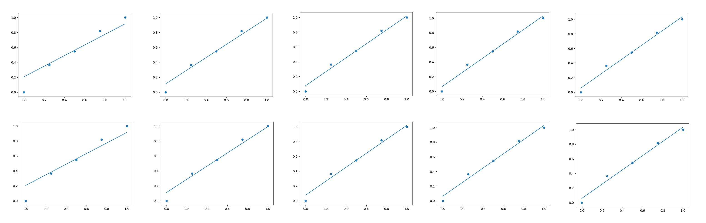

# TensorFlow 学习笔记

>学习参考1《简单粗暴TensorFlow》
>
>Github仓库地址：https://github.com/snowkylin/TensorFlow-cn
>
>百度云盘：链接：https://pan.baidu.com/s/10ppRjetGWkoaR26Csh2oVQ 提取码：lubz 

>学习参考2 https://github.com/instillai/TensorFlow-Course
---

## 目录

- [1.安装](#1安装)
- [2.简单应用-线性回归](#2简单应用-线性回归)
- [3.Tensors](#3Tensors)
    - [3.1.Tensor_Defination](#31Tensor_Defination)
    - [3.2.Tensor_Operations](#32Tensor_Operations)
    - [3.3.Muti_dimentional_Tensors](#33Muti_dimentional_Tensors)
    - [3.4.Indexing](#34Indexing)
    - [3.5.Data_types](#35Data_types)
- [4.Automatic_Differentiation](#4Automatic_Differentiation)
- [5.Introduction_to_Graphs](#5Introduction_to_Graphs)
- [6.TensorFlow_Models](#6TensorFlow_Models)
    - [6.1.Layer](#61Layer)
    - [6.2.Model](#62Model)
    - [6.3.Keras_Models](#63Keras_Models)
    - [6.4.多层感知机(MLP)](#64多层感知机(MLP))
    - [6.5.卷积神经网络(CNN)](#65卷积神经网络(CNN))
    - [6.6.循环神经网络(RNN)](#66循环神经网络(RNN))
- [7.Others](#7Others)
    - [7.1.模型的保存和加载](#71模型的保存和加载)
    - [7.2.TensorBoard-训练过程可视化](#72TensorBoard-训练过程可视化)
    - [7.3.GPU的使用与分配](#73GPU的使用与分配)

---

## 1.安装

```bash
# install CPU versionn
pip install tensorflow
```

```bash
# install GPU version
pip install tensorflow-gpu
```
---

## 2.简单应用-线性回归

年份|2013|2014|2015|2016|2017
-|-|-|-|-|-
房价|12000|14000|15000|16500|17500

```py
import numpy as np
import tensorflow as tf
import matplotlib.pyplot as plt

# Normalization
X_raw = np.array([2013, 2014, 2015, 2016, 2017])
y_raw = np.array([12000, 14000, 15000, 16500, 17500])
X = (X_raw - X_raw.min()) / (X_raw.max() - X_raw.min())
y = (y_raw - y_raw.min()) / (y_raw.max() - y_raw.min())
print(X, y)

# 1.Calculate Gradient Manually
a, b = 0, 0
num_epoch = 10000
lr = 1e-3
for e in range(num_epoch):
    y_pred = a * X + b
    da, db = (y_pred - y).dot(X), (y_pred - y).sum()
    a -= (lr * da)
    b -= (lr * db)
    if (e+1) % 2000 == 0:
        print(a, b)
        plt.figure()
        plt.scatter(X, y)
        y_pred = a * X + b
        plt.plot(X, y_pred)
        plt.show()

# 2.Calculate Gradient with TensorFlow
a = tf.Variable(initial_value=0, dtype=tf.float32, shape=[])
b = tf.Variable(initial_value=0, dtype=tf.float32, shape=[])
# a = tf.Variable('a', dtype=tf.float32, shape=[],
#                 initializer=tf.zeros_initializer)
# b = tf.Variable('b', dtype=tf.float32, shape=[],
#                 initializer=tf.zeros_initializer)
variables = [a, b]
num_epoch = 10000
optimizer = tf.compat.v1.train.GradientDescentOptimizer(learning_rate=1e-3)
for e in range(num_epoch):
    with tf.GradientTape() as tape:
        y_pred = a * X + b
        loss = .5 * tf.reduce_sum(tf.square(y_pred - y))
    # TensorFlow 自动计算损失函数关于自变量（模型参数）的梯度
    grads = tape.gradient(loss, variables)
    # TensorFlow 自动根据梯度更新参数
    optimizer.apply_gradients(grads_and_vars=zip(grads, variables))
    if (e+1) % 2000 == 0:
        print(a, b)
        plt.figure()
        plt.scatter(X, y)
        y_pred = a * X + b
        plt.plot(X, y_pred.numpy())
        plt.show()
```

```bash
[0.   0.25 0.5  0.75 1.  ] [0.         0.36363636 0.54545455 0.81818182 1.        ]
0.7083318589309758 0.20612297109653083
0.8790734359406849 0.11149148762084761
0.9432184104732177 0.0759392867761134
0.9673167848349497 0.062582819621969
0.9763702087567374 0.05756498076575413
<tf.Variable 'Variable:0' shape=() dtype=float32, numpy=0.7083319> <tf.Variable 'Variable:0' shape=() dtype=float32, numpy=0.20612301>
<tf.Variable 'Variable:0' shape=() dtype=float32, numpy=0.87907386> <tf.Variable 'Variable:0' shape=() dtype=float32, numpy=0.11149131>
<tf.Variable 'Variable:0' shape=() dtype=float32, numpy=0.94321895> <tf.Variable 'Variable:0' shape=() dtype=float32, numpy=0.075939015>
<tf.Variable 'Variable:0' shape=() dtype=float32, numpy=0.967317> <tf.Variable 'Variable:0' shape=() dtype=float32, numpy=0.0625827>
<tf.Variable 'Variable:0' shape=() dtype=float32, numpy=0.97637> <tf.Variable 'Variable:0' shape=() dtype=float32, numpy=0.057565063>
```



第一行图像是手动实现梯度计算和参数梯度下降的，第二行图像是TensorFlow的优化器自动实现的。每列分别是第2k，4k，6k，8k，10k次循环后的结果。

---

## 3.Tensors

Tensor are multi-dimensitonal arrays that are used in Tensorflow.

```py
# Import necessary libraries
import tensorflow as tf
import numpy as np
```

We use the following definition:

Rank: The number of dimensions that a vector has.

Below, we will define different kinds of tensors and show their rank using tf.rank function.

### 3.1.Tensor_Defination

```py
tensor = tf.constant(0)
print("Print constant tensor {} of rank {}".format(tensor, tf.rank(tensor)))
print("Show full tensor:", tensor)
```
```bash
Print constant tensor 0 of rank 0
Show full tensor: tf.Tensor(0, shape=(), dtype=int32)
```

```py
# NOTE: We use .numpy() to transform tf.tensor to numpy
tensor = tf.constant([1,2,3])
print("Tensor:", tensor)
print("Rank:", tf.rank(tensor).numpy())
```
```bash
Tensor: tf.Tensor([1 2 3], shape=(3,), dtype=int32)
Rank: 1
```

```py
tensor = tf.constant([[1, 2, 3],
                      [4, 5, 6]])
print("Tensor:", tensor)
print("Rank:", tf.rank(tensor).numpy())
```
```bash
Tensor: tf.Tensor(
[[1 2 3]
 [4 5 6]], shape=(2, 3), dtype=int32)
Rank: 2
```

### 3.2.Tensor_Operations

```py
x = tf.constant([[1, 1],
                 [1, 1]])
y = tf.constant([[2, 4],
                 [6, 8]])

# Add two tensors
print(tf.add(x, y), "\n")

# Mat-Multiply two tensors
print(tf.matmul(x, y), "\n")
```
```bash
tf.Tensor(
[[3 5]
 [7 9]], shape=(2, 2), dtype=int32) 

tf.Tensor(
[[ 8 12]
 [ 8 12]], shape=(2, 2), dtype=int32) 
```

### 3.3.Muti_dimentional_Tensors

This part is not much different compared to what we learned so far. However, it would be nice to try extracting as much information as we can from a multi-dimentional tensor.

Let's use `tf.ones` for our purpose here. It creates an all-one tensor.

```py
# We set the shape of the tensor and the desired data type.
tensor = tf.ones(shape = [2, 3, 6], dtype = tf.float32)
print('Tensor:', tensor)
```
```
Tensor: tf.Tensor(
[[[1. 1. 1. 1. 1. 1.]
  [1. 1. 1. 1. 1. 1.]
  [1. 1. 1. 1. 1. 1.]]

 [[1. 1. 1. 1. 1. 1.]
  [1. 1. 1. 1. 1. 1.]
  [1. 1. 1. 1. 1. 1.]]], shape=(2, 3, 6), dtype=float32)
```

```py
print("Tensor Rank: ", tf.rank(tensor).numpy())
print("Shape: ", tensor.shape)
print("Elements' type", tensor.dtype)
print("The size of the second axis:", tensor.shape[1])
print("The size of the last axis:", tensor.shape[-1])
print("Total number of elements: ", tf.size(tensor).numpy())
print("How many dimensions? ", tensor.ndim)
```
```
Tensor Rank:  3
Shape:  (2, 3, 6)
Elements' type <dtype: 'float32'>
The size of the second axis: 3
The size of the last axis: 6
Total number of elements:  36
How many dimensions?  3
```

### 3.4.Indexing

TensorFlow indexing is aligned with Python indexing. See the following examples.

```py
x = tf.constant([[1, 2, 3],
                 [4, 5, 6],
                 [7, 8, 9]])
# All elements
print(x[:].numpy())
```
```
[[1 2 3]
 [4 5 6]
 [7 8 9]]
```

```py
# All elements of the first row
print(x[0,:].numpy())
```
```
[1 2 3]
```

```py
# First row and last column
print(x[0,-1].numpy())
```
```
3
```

```py
# From second row to last and from third column to last
print(x[1:,2:].numpy)
```
```
<bound method _EagerTensorBase.numpy of <tf.Tensor: shape=(2, 1), dtype=int32, numpy=
array([[6],
       [9]])>>
```

### 3.5.Data_types

You can change the data type of the tesnorflow tensors for your purpose. This will be done easily by [`tf.cast`](https://www.tensorflow.org/api_docs/python/tf/cast).

```py
original_tensor = tf.constant([1, 2, 3, 4], dtype=tf.int32)
print('Original tensor: ', original_tensor)
print("Tensor type before casting: ", original_tensor.dtype)

# Casting to change dtype
casted_tensor = tf.cast(original_tensor, dtype=tf.float32)
print('New tensor: ', casted_tensor)
print("Tensor type after casting: ", casted_tensor.dtype)
```
```
Original tensor:  tf.Tensor([1 2 3 4], shape=(4,), dtype=int32)
Tensor type before casting:  <dtype: 'int32'>
New tensor:  tf.Tensor([1. 2. 3. 4.], shape=(4,), dtype=float32)
Tensor type after casting:  <dtype: 'float32'>
```

---

## 4.Automatic_Differentiation

### 4.1.Automatic Differentiation

The [automatic differentiation](https://en.wikipedia.org/wiki/Automatic_differentiation) is to calculate derivative of functions which is useful for algorithms such as [stochastic gradient descent](https://en.wikipedia.org/wiki/Stochastic_gradient_descent).

It's is particularly useful when we implement neural networks and desire to calculate differentiation of the output with respect to an input that are connected with a chain of functions:

$$L(x)=f(g(h(x)))$$

The differentiation is as below:

$$\frac{dL}{dx} = \frac{df}{dg}\frac{dg}{dh}\frac{dh}{dx}$$

The above rule is called the [chain rule](https://en.wikipedia.org/wiki/Chain_rule)(链式法则).

So the [gradients](https://en.wikipedia.org/wiki/Gradient) needs to be calculated for ultimate derivative calculations.

Let's see how TensorFlow does it!

```py
# Loading necessary libraries
import tensorflow as tf
import numpy as np
```

### 4.2.Introduction

Some general information are useful to be addressed here:

- To compute gradients, TensorFlow uses [`tf.GradientTape`](https://www.tensorflow.org/api_docs/python/tf/GradientTape) which records the operation for later being used for gradient computation.

Let's have three similar example:

(1)

```py
x = tf.constant([2.0])

with tf.GradientTape(persistent=False, watch_accessed_variables=True) as grad:
  f = x ** 2

# Print gradient output
print('The gradient df/dx where f=(x^2):\n', grad.gradient(f, x))
```
```
The gradient df/dx where f=(x^2):
 None
```

(2)

```py
x = tf.constant([2.0])
x = tf.Variable(x)

with tf.GradientTape(persistent=False, watch_accessed_variables=True) as grad:
  f = x ** 2

# Print gradient output
print('The gradient df/dx where f=(x^2):\n', grad.gradient(f, x))
```
```
The gradient df/dx where f=(x^2):
 tf.Tensor([4.], shape=(1,), dtype=float32)
```

(3)

```py
x = tf.constant([2.0])

with tf.GradientTape(persistent=False, watch_accessed_variables=True) as grad:
  grad.watch(x)
  f = x ** 2

# Print gradient output
print('The gradient df/dx where f=(x^2):\n', grad.gradient(f, x))
```
```
The gradient df/dx where f=(x^2):
 tf.Tensor([4.], shape=(1,), dtype=float32)
```

What's the difference between above examples?

- Using [`tf.Variable`](https://www.tensorflow.org/guide/variable) on top of the tensor to transform it into a `tf.Variable`.
- Using [`.watch()`](https://www.tensorflow.org/api_docs/python/tf/GradientTape#watch) operation.

The `tf.Variable` turn tensor to a variable tensor which is the recommended approach by TensorFlow. The `.watch()` method ensures the variable is being tracked by the `tf.GradientTape()`.

You can see if we use neither, we get **NONE** as the gradient which means gradients were not being tracked!

**NOTE**: In general it's always safe to work with variable as well as using `.watch()` to ensure tracking gradients.

We used default arguments as:

- `persistent=False`: It says, any variable that is hold with `tf.GradientTape()`, after one calling of gradient will be released.
- `watch_accessed_variables=True`: By default watching variables. So if we have a variable, we do not need to use `.watch()` with this default setting.

Let's have an example with `persistent=True`:

```py
x = tf.constant([2.0])
x = tf.Variable(x)

# For practice, turn persistent to False to see what happens.
with tf.GradientTape(persistent=True, watch_accessed_variables=True) as grad:
  f = x ** 2
  h = x ** 3

# Print gradient output
print('The gradient df/dx where f=(x^2):\n', grad.gradient(f, x))
print('The gradient dh/dx where h=(x^3):\n', grad.gradient(h, x))
```
```
The gradient df/dx where f=(x^2):
 tf.Tensor([4.], shape=(1,), dtype=float32)
The gradient dh/dx where h=(x^3):
 tf.Tensor([12.], shape=(1,), dtype=float32)
```

---

## 5.Introduction_to_Graphs

For long, the big complaint about TensorFlow was "*It's not flexible for debugging!*" With the advent of TensorFlow 2.0, that changed drastically.

Now TensorFlow allows you to run the oprations **eagerly**. That means, you can run TensorFlow operations by Python and return the outputs to Python again. That creates a lot of flexibility, especially for debugging.

But there are some merits in NOT using the eagerly option. You can run operations on TensorFlow graphs that in some scenarios leads to significant speed up. According to TensorFlow:

>Graphs are data structures that contain a set of [`tf.Operation`](https://www.tensorflow.org/api_docs/python/tf/Operation) objects, which represent units of computation; and [`tf.Tensor`](https://www.tensorflow.org/api_docs/python/tf/Tensor) objects, which represent the units of data that flow between operations. They are defined in a [`tf.Graph`](https://www.tensorflow.org/api_docs/python/tf/Graph) context. Since these graphs are data structures, they can be saved, run, and restored all without the original Python code.

Let's have some example for transforming functions to graphs!

```py
# Loading necessary libraries
import tensorflow as tf
import numpy as np
import timeit
```

### 5.1.Operation

We can take a Python function on graph with [`@tf.function`](https://www.tensorflow.org/api_docs/python/tf/function) decorator.

```py
@tf.function
def multiply_fn(a, b):
  return tf.matmul(a, b)

# Create some tensors
a = tf.constant([[0.5, 0.5]])
b = tf.constant([[10.0], [1.0]])

# Check function
print('Multiple a of shape {} with b of shape {}'.format(a.shape, b.shape))
print(multiply_fn(a, b).numpy())
```
```
Multiple a of shape (1, 2) with b of shape (2, 1)
[[5.5]]
```

```py
# Function without neing take to graph, i.e., with eager execution.
def add_fn(a, b):
  return tf.add(a, b)

# Create some tensors
a = tf.constant([[0.5, 0.5]])
b = tf.constant([[10.0], [1.0]])

# Check function
print('Add a of shape {} with b of shape {}'.format(a.shape, b.shape))
print(add_fn(a, b).numpy())
```
```
Add a of shape (1, 2) with b of shape (2, 1)
[[10.5 10.5]
 [ 1.5  1.5]]
```

### 5.2.Speedup

Now let's define a custom model and run it:

- 1.eagerly
- 2.on graph

To check how to define models refer to: https://www.tensorflow.org/api_docs/python/tf/keras/Model

这里的 Model 定义结构和 PyTorch 的类似。先在 `__init__` 继承父类，定义要用到函数（或者说模块）；再在 `call` 函数（PyTorch是 `forward` 函数），调用上面的函数，进行顺序运算，构建出网络架构。

```py
class ModelShallow(tf.keras.Model):

  def __init__(self):
    super(ModelShallow, self).__init__()
    self.dense1 = tf.keras.layers.Dense(10, activation=tf.nn.relu)
    self.dense2 = tf.keras.layers.Dense(20, activation=tf.nn.relu)
    self.dense3 = tf.keras.layers.Dense(30, activation=tf.nn.softmax)
    self.dropout = tf.keras.layers.Dropout(0.5)

  def call(self, inputs, training=False):
    x = self.dense1(inputs)
    if training:
      x = self.dropout(x, training=training)
    x = self.dense2(x)
    out = self.dense3(x)
    return out

class ModelDeep(tf.keras.Model):

  def __init__(self):
    super(ModelDeep, self).__init__()
    self.dense1 = tf.keras.layers.Dense(1000, activation=tf.nn.relu)
    self.dense2 = tf.keras.layers.Dense(2000, activation=tf.nn.relu)
    self.dense3 = tf.keras.layers.Dense(3000, activation=tf.nn.softmax)
    self.dropout = tf.keras.layers.Dropout(0.5)

  def call(self, inputs, training=False):
    x = self.dense1(inputs)
    if training:
      x = self.dropout(x, training=training)
    x = self.dense2(x)
    out = self.dense3(x)
    return out

# Create the model with eager esxecution by default
model_shallow_with_eager = ModelShallow()

# Take model to graph. 
# NOTE: Instead of using decorators, we can ditectly operate `tf.function` on the model.
model_shallow_on_graph = tf.function(ModelShallow())

# Model deep
model_deep_with_eager = ModelDeep()
model_deep_on_graph = tf.function(ModelDeep())

# sample input
sample_input = tf.random.uniform([60, 28, 28])

# Check time for shallow model
print("Shallow Model - Eager execution time:", timeit.timeit(lambda: model_shallow_with_eager(sample_input), number=1000))
print("Shallow Model - Graph-based execution time:", timeit.timeit(lambda: model_shallow_on_graph(sample_input), number=1000))

# Check time for deep model
print("Deep Model - Eager execution time:", timeit.timeit(lambda: model_deep_with_eager(sample_input), number=1000))
print("Deep Model - Graph-based execution time:", timeit.timeit(lambda: model_deep_on_graph(sample_input), number=1000))
```
```
Shallow Model - Eager execution time: 3.4040738
Shallow Model - Graph-based execution time: 1.7038606
Deep Model - Eager execution time: 159.0177738
Deep Model - Graph-based execution time: 146.53833920000002
```

---

## 6.TensorFlow_Models

In TensorFlow, you always need to define models to train a machine learning model. A model consists of layers that conduct operations and can be reused in the model's structure. Let's get started.

```py
# Loading necessary libraries
import tensorflow as tf
import numpy as np
```

### 6.1.Layer

In TensorFlow, we can implement layers using the high-level [tf.Module](https://www.tensorflow.org/api_docs/python/tf/Module) class.

```py
class SampleLayer(tf.Module):
    """
    We define the layer with a class that inherited the structure of tf.Module class.
    """

    def __init__(self, name=None):
        super().__init__(name=name)

        # Define a trainable variable
        self.x = tf.Variable([[1.0, 3.0]], name="x_trainable")

        # Define a non-trainable variable
        self.y = tf.Variable(2.0, trainable=False, name="y_non_trainable")

    def __call__(self, input):
        return self.x * input + self.y


# Initialize the layer
# Here, __call__ function will not be called
simple_layer = SampleLayer(name="my_layer")

# Call the layer and extract some information
output = simple_layer(tf.constant(1.0))
print("Output:", output)
print("Layer name:", simple_layer.name)
print("Trainable variables:", simple_layer.trainable_variables)
```
```
Output: tf.Tensor([[3. 5.]], shape=(1, 2), dtype=float32)
Layer name: my_layer
Trainable variables: (<tf.Variable 'x_trainable:0' shape=(1, 2) dtype=float32, numpy=array([[1., 3.]], dtype=float32)>,)
```

### 6.2.Model

Now. let's define a model. A model consists of multiple layers.

```py
class Model(tf.Module):
    def __init__(self, name=None):
        super().__init__(name=name)

        self.layer_1 = SampleLayer('layer_1')
        self.layer_2 = SampleLayer('layer_2')

    def __call__(self, x):
        x = self.layer_1(x)
        output = self.layer_2(x)
        return output


# Initialize the model
custom_model = Model(name="model_name")

# Call the model
# Call the layer and extract some information
output = custom_model(tf.constant(1.0))
print("Output:", output)
print("Model name:", custom_model.name)
print("Trainable variables:", custom_model.trainable_variables)
```
```
Output: tf.Tensor([[ 5. 17.]], shape=(1, 2), dtype=float32)
Model name: model_name
Trainable variables: (<tf.Variable 'x_trainable:0' shape=(1, 2) dtype=float32, numpy=array([[1., 3.]], dtype=float32)>, <tf.Variable 'x_trainable:0' shape=(1, 2) dtype=float32, numpy=array([[1., 3.]], dtype=float32)>)
```

### 6.3.Keras_Models

Keras is a high-level API that is part of TensorFlow now. You can use [tf.keras.Model](https://www.tensorflow.org/api_docs/python/tf/keras/Model) to define a model. You can also use the collection of [tf.keras.layers](https://www.tensorflow.org/api_docs/python/tf/keras/layers) for your convenience. It's straightforward as below to define a model that has two fully-connected layers:

```py
class CustomModel(tf.keras.Model):

    def __init__(self):
        super(CustomModel, self).__init__()
        self.layer_1 = tf.keras.layers.Dense(16, activation=tf.nn.relu)
        self.layer_2 = tf.keras.layers.Dense(32, activation=None)

    def call(self, inputs):
        x = self.layer_1(inputs)
        out = self.layer_2(inputs)
        return out


# Create model
custom_model = CustomModel()

# Call the model
# Call the layer and extract some information
output = custom_model(tf.constant([[1.0, 2.0, 3.0]]))
print("Output shape:", output.shape)
print("Output:", output)
print("Model name:", custom_model.name)

# Count total trainable variables
total_trainable_var = np.sum([tf.size(var).numpy()
                              for var in custom_model.trainable_variables])
print("Number of trainable variables:", total_trainable_var)
```
```
Output shape: (1, 32)
Output: tf.Tensor(
[[-0.2048387  -0.9634561   0.74169785 -1.0836794   1.3339525   0.7145058
   0.677536    1.6598746  -0.29558912 -1.5855557   0.11324871 -0.5957524
   0.5121727   0.5794529   0.9696425  -0.71138906  0.49331278  0.04926854
   0.3071776   0.21030623 -0.7299031  -0.77483934  1.1133764  -0.43090668
   0.63313234 -0.07421938  0.56681925 -0.6856533  -0.7868455   0.58745074
  -0.5045183   0.31036636]], shape=(1, 32), dtype=float32)
Model name: custom_model
Number of trainable variables: 192
```

--

下面是几个模型例子 。。。

### 6.4.多层感知机(MLP)

报错和解决（tensorflow退回版本1，HLJ）：

```
AttributeError: module 'tensorflow' has no attribute 'contrib'
```

```py
# Loading necessary libraries
import tensorflow as tf
import numpy as np


# 1.预备工作，实现一个简单的 DataLoader 类来读取 MNIST 数据集数据。
class DataLoader():
    def __init__(self):
        mnist = tf.contrib.learn.datasets.load_dataset("mnist")
        # np.array [55000, 784]
        self.train_data = mnist.train.images
        # np.array [55000] of int32
        self.train_labels = np.asarray(
            mnist.train.labels, dtype=np.int32)
        # np.array [10000, 784]
        self.eval_data = mnist.test.images
        # np.array [10000] of int32
        self.eval_labels = np.asarray(mnist.test.labels, dtype=np.int32)

    def get_batch(self, batch_size):
        index = np.random.randint(0, np.shape(self.train_data)[0], batch_size)
        return self.train_data[index, :], self.train_labels[index]


# 2.该模型输入一个向量（比如这里是拉直的 1×784 手写体数字图片）。
# 输出 10 维的信号，分别代表这张图片属于 0 到 9 的概率。
# 这里我们加入了一个 predict 方法，对图片对应的数字进行预测。
# 在预测的时候，选择概率最大的数字进行预测输出。
class MLP(tf.keras.Model):
    def __init__(self):
        super().__init__()
        self.dense1 = tf.keras.layers.Dense(units=100, activation=tf.nn.relu)
        self.dense2 = tf.keras.layers.Dense(units=10)

    def call(self, inputs):
        x = self.dense1(inputs)
        x = self.dense2(x)
        return x

    def predict(self, inputs):
        logits = self(inputs)
        return tf.argmax(logits, axis=-1)

# 3.定义一些模型超参数
num_batches = 1000
batch_size = 50
learning_rate = 0.001

# 4.实例化模型，数据读取类和优化器
model = MLP()
data_loader = DataLoader()
optimizer = tf.train.AdamOptimizer(learning_rate=learning_rate)

# 5.迭代进行以下步骤：
# • 从 DataLoader 中随机取一批训练数据；
# • 将这批数据送入模型，计算出模型的预测值；
# • 将模型预测值与真实值进行比较，计算损失函数（loss）；
# • 计算损失函数关于模型变量的导数；
# • 使用优化器更新模型参数以最小化损失函数。
for batch_index in range(num_batches):
    X, y = data_loader.get_batch(batch_size)
    with tf.GradientTape() as tape:
        y_logit_pred = model(tf.convert_to_tensor(X))
        loss = tf.losses.sparse_softmax_cross_entropy(
            labels=y, logits=y_logit_pred)
        print("batch %d: loss %f" % (batch_index, loss.numpy()))
    grads = tape.gradient(loss, model.variables)
    optimizer.apply_gradients(grads_and_vars=zip(grads, model.variables))

# 6.验证集测试模型性能
num_eval_samples = np.shape(data_loader.eval_labels)[0]
y_pred = model.predict(data_loader.eval_data).numpy()
print("test accuracy: %f" %
      (sum(y_pred == data_loader.eval_labels) / num_eval_samples))
```

输出结果:

```
test accuracy: 0.947900
```

可以注意到，使用这样简单的模型，已经可以达到 95% 左右的准确率。

### 6.5.卷积神经网络(CNN)

[卷积神经网络](https://zh.wikipedia.org/wiki/%E5%8D%B7%E7%A7%AF%E7%A5%9E%E7%BB%8F%E7%BD%91%E7%BB%9C) （Convolutional Neural Network, CNN）是一种结构类似于人类或动物的 [视觉系统](https://zh.wikipedia.org/wiki/%E8%A7%86%E8%A7%89%E7%B3%BB%E7%BB%9F) 的人工神经网络，包含一个或多个卷积层（Convolutional Layer）、池化层（Pooling Layer）和全连接层（Dense Layer）。具体原理建议可以参考台湾大学李宏毅教授的《机器学习》课程的 [Convolutional Neural Network](https://www.bilibili.com/video/av10590361/?p=21) 一章

eg

```py
class CNN(tf.keras.Model):
    def __init__(self):
        super().__init__()
        self.conv1 = tf.keras.layers.Conv2D(
            filters=32,            # 卷积核数目
            kernel_size=[5, 5],    # 感受野大小
            padding="same",        # padding 策略
            activation=tf.nn.relu  # 激活函数
        )
        self.pool1 = tf.keras.layers.MaxPool2D(pool_size=[2, 2], strides=2)
        self.conv2 = tf.keras.layers.Conv2D(
            filters=64,
            kernel_size=[5, 5],
            padding="same",
            activation=tf.nn.relu
        )
        self.pool2 = tf.keras.layers.MaxPool2D(pool_size=[2, 2], strides=2)
        self.flatten = tf.keras.layers.Reshape(target_shape=(7 * 7 * 64,))
        self.dense1 = tf.keras.layers.Dense(units=1024, activation=tf.nn.relu)
        self.dense2 = tf.keras.layers.Dense(units=10)

    def call(self, inputs):
        inputs = tf.reshape(inputs, [-1, 28, 28, 1])
        x = self.conv1(inputs)  # [batch_size, 28, 28, 32]
        x = self.pool1(x)       # [batch_size, 14, 14, 32]
        x = self.conv2(x)       # [batch_size, 14, 14, 64]
        x = self.pool2(x)       # [batch_size, 7, 7, 64]
        x = self.flatten(x)     # [batch_size, 7 * 7 * 64]
        x = self.dense1(x)      # [batch_size, 1024]
        x = self.dense2(x)      # [batch_size, 10]
        return x

    def predict(self, inputs):
        logits = self(inputs)
```

将前节的 `model = MLP()` 更换成 `model = CNN()` ，输出如下:

```
test accuracy: 0.988100
```

可以发现准确率有非常显著的提高。事实上，通过改变模型的网络结构（比如加入 Dropout 层防止过拟合），准确率还有进一步提升的空间。

### 6.6.循环神经网络(RNN)

这里，我们使用 RNN 来进行尼采风格文本的自动生成。参考 https://github.com/keras-team/keras/blob/master/examples/lstm_text_generation.py

这个任务的本质其实预测一段英文文本的接续字母的概率分布。比如，我们有以下句子:

`I am a studen`

这个句子（序列）一共有 13 个字符（包含空格）。当我们阅读到这个由 13 个字符组成的序列后，根据我们的经验，我们可以预测出下一个字符很大概率是“t”。我们希望建立这样一个模型，输入 `num_batch` 个由编码后字符组成的，长为 `seq_length` 的序列，输入张量形状为 `[num_batch, seq_length]`，输出这些序列接续的下一个字符的概率分布，概率分布的维度为字符种类数 num_chars，输出张量形状为 `[num_batch, num_chars]`。我们从下一个字符的概率分布中采样作为预测值，然后滚雪球式地生成下两个字符，下三个字符等等，即可完成文本的生成任务。

首先，还是实现一个简单的 DataLoader 类来读取文本，并以字符为单位进行编码。

```py
class DataLoader():
    def __init__(self):
        path = tf.keras.utils.get_file(
            'nietzsche.txt', origin='https://s3.amazonaws.com/text-datasets/nietzsche.txt')
        with open(path, encoding='utf-8') as f:
            self.raw_text = f.read().lower()
        self.chars = sorted(list(set(self.raw_text)))
        self.char_indices = dict((c, i) for i, c in enumerate(self.chars))
        self.indices_char = dict((i, c) for i, c in enumerate(self.chars))
        self.text = [self.char_indices[c] for c in self.raw_text]

    def get_batch(self, seq_length, batch_size):
        seq = []
        next_char = []
        for i in range(batch_size):
            index = np.random.randint(0, len(self.text) - seq_length)
            seq.append(self.text[index:index+seq_length])
            next_char.append(self.text[index+seq_length])
        # [num_batch, seq_length], [num_batch]
        return np.array(seq), np.array(next_char)
```

接下来进行模型的实现。在 `__init__` 方法中我们实例化一个常用的 BasicLSTMCell 单元，以及一个线性变换用的全连接层，我们首先对序列进行 One Hot 操作，即将编码 i 变换为一个 n 维向量，其第 i 位为 1，其余均为 0。这里 n 为字符种类数 `num_char`。变换后的序列张量形状为 `[num_batch, seq_length, num_chars]`。接下来，我们将序列从头到尾依序送入 RNN 单元，即将当前时间 t 的 RNN 单元状态 state 和 t 时刻的序列 `inputs[:, t, :]` 送入 RNN 单元，得到当前时间的输出 output 和下一个时间 t+1 的 RNN 单元状态。取 RNN 单元最后一次的输出，通过全连接层变换到 `num_chars` 维，即作为模型的输出。具体实现如下：

关于文本生成的过程有一点需要特别注意。之前，我们一直使用 `tf.argmax()` 函数，将对应概率最大的值作为预测值。然而对于文本生成而言，这样的预测方式过于绝对，会使得生成的文本失去丰富性。于是，我们使用 `np.random.choice()` 函数按照生成的概率分布取样。这样，即使是对应概率较小的字符，也有机会被取样到。同时，我们加入一个 `temperature` 参数控制分布的形状，参数值越大则分布越平缓（最大值和最小值的差值越小），生成文本的丰富度越高；参数值越小则分布越陡峭，生成文本的丰富度越低。

```py
class RNN(tf.keras.Model):
    def __init__(self, num_chars):
        super().__init__()
        self.num_chars = num_chars
        self.cell = tf.nn.rnn_cell.BasicLSTMCell(num_units=256)
        self.dense = tf.keras.layers.Dense(units=self.num_chars)

    def call(self, inputs):
        batch_size, seq_length = tf.shape(inputs)
        # [batch_size, seq_length, num_chars]
        inputs = tf.one_hot(inputs, depth=self.num_chars)
        state = self.cell.zero_state(batch_size=batch_size, dtype=tf.float32)
        for t in range(seq_length.numpy()):
            output, state = self.cell(inputs[:, t, :], state)
        output = self.dense(output)
        return output
    
    def predict(self, inputs, temperature=1.):
        batch_size, _ = tf.shape(inputs)
        logits = self(inputs)
        prob = tf.nn.softmax(logits / temperature).numpy()
        return np.array([np.random.choice(self.num_chars, p=prob[i, :]) for i in range(batch_size.numpy())])
```

训练过程与前节基本一致，在此复述：

- 从 DataLoader 中随机取一批训练数据；
- 将这批数据送入模型，计算出模型的预测值；
- 将模型预测值与真实值进行比较，计算损失函数（loss）；
- 计算损失函数关于模型变量的导数；
- 使用优化器更新模型参数以最小化损失函数。

```py
data_loader = DataLoader()
model = RNN(len(data_loader.chars))
optimizer = tf.train.AdamOptimizer(learning_rate=learning_rate)

for batch_index in range(num_batches):
    X, y = data_loader.get_batch(seq_length, batch_size)
    with tf.GradientTape() as tape:
        y_logit_pred = model(X)
        loss = tf.losses.sparse_softmax_cross_entropy(
            labels=y, logits=y_logit_pred)
        print("batch %d: loss %f" % (batch_index, loss.numpy()))
    grads = tape.gradient(loss, model.variables)
    optimizer.apply_gradients(grads_and_vars=zip(grads, model.variables))
```

通过 `np.random.choice()` 函数按照生成的概率分布取样，这种方式进行“滚雪球”式的连续预测，即可得到生成文本。

```py
X_, _ = data_loader.get_batch(seq_length, 1)
for diversity in [0.2, 0.5, 1.0, 1.2]:
    X = X_
    print("diversity %f:" % diversity)
    for t in range(400):
        y_pred = model.predict(X, diversity)
        print(data_loader.indices_char[y_pred[0]], end='', flush=True)
        X = np.concatenate([X[:, 1:], np.expand_dims(y_pred, axis=1)], axis=-1)
```

<details open>
<summary>生成的文本如下:</summary>

```
diversity 0.200000:
conserted and conseive to the conterned to it is a self--and seast and the selfes as a seast the expecience and and and the self--and the sered is a the enderself and the sersed and as a the concertion of the series of the self in the self--and the serse and and the seried enes and seast and the sense and the eadure to the self and the present and as a to the self--and the seligious and the enders

diversity 0.500000:
can is reast to as a seligut and the complesed
has fool which the self as it is a the beasing and us immery and seese for entoured underself of the seless and the sired a mears and everyther to out every sone thes and reapres and seralise as a streed liees of the serse to pease the cersess of the selung the elie one of the were as we and man one were perser has persines and conceity of all self-el

diversity 1.000000:
entoles by 
their lisevers de weltaale, arh pesylmered, and so jejurted count have foursies as is descinty iamo; to semplization refold, we dancey or theicks-welf--atolitious on his 
such which 
here 
oth idey of pire master, ie gerw their endwit in ids, is an trees constenved mase commars is leed mad decemshime to the mor the elige. the fedies (byun their ope wopperfitious--antile and the it as the f

diversity 1.200000:
cain, elvotidue, madehoublesily
inselfy!--ie the rads incults of to prusely le]enfes patuateded:.--a coud--theiritibaior "nrallysengleswout peessparify oonsgoscess teemind thenry ansken suprerial mus, cigitioum: 4reas. whouph: who
eved
arn inneves to sya" natorne. hag open reals whicame oderedte,[fingo is
zisternethta simalfule dereeg hesls lang-lyes thas quiin turjentimy; periaspedey tomm--whach
```
</details>

### 6.7.深度强化学习(DRL)

条件不行，暂不学了。。。

---

## 7.Others

### 7.1.模型的保存和加载

总体而言，恢复与保存变量的典型代码框架如下：

```py
# train.py 模型训练阶段

model = MyModel()
# 实例化 Checkpoint，指定保存对象为 model（如果需要保存 Optimizer 的参数也可加入）
checkpoint = tf.train.Checkpoint(myModel=model)
# 模型训练代码
# ...
# 模型训练完毕后将参数保存到文件，也可以在模型训练过程中每隔一段时间就保存一次
checkpoint.save('./save/model.ckpt')
```

```py
# test.py 模型使用阶段

model = MyModel()
# 实例化 Checkpoint，指定恢复对象为 model
checkpoint = tf.train.Checkpoint(myModel=model)
# 从文件恢复模型参数
checkpoint.restore(tf.train.latest_checkpoint('./save')) 
# 模型使用代码
# ...
```

### 7.2.TensorBoard-训练过程可视化

很鸡肋！用时再学~

### 7.3.GPU的使用与分配

很多时候的场景是：实验室/公司研究组里有许多学生/研究员都需要使用 GPU，但多卡的机器只有一台，这时就需要注意如何分配显卡资源。

命令 `nvidia-smi` 可以查看机器上现有的 GPU 及使用情况（在 Windows 下，将 C:\Program Files\NVIDIA Corporation\NVSMI 加入 Path 环境变量中即可，或 Windows 10 下可使用任务管理器的“性能”标签查看显卡信息）。

使用环境变量 CUDA_VISIBLE_DEVICES 可以控制程序所使用的 GPU。假设发现四卡的机器上显卡 0,1 使用中，显卡 2,3 空闲，Linux 终端输入:
```
export CUDA_VISIBLE_DEVICES=2,3
```
或在代码中加入
```py
import os
os.environ['CUDA_VISIBLE_DEVICES'] = "2,3"
```
即可指定程序只在显卡 2,3 上运行。

默认情况下，TensorFlow 将使用几乎所有可用的显存，以避免内存碎片化所带来的性能损失。可以通过 `tf.ConfigProto` 类来设置 TensorFlow 使用显存的策略。具体方式是实例化一个` tf.ConfigProto` 类，设置参数，并在运行 `tf.enable_eager_execution()` 时指定 `Config` 参数。

以下代码通过 `allow_growth` 选项设置TensorFlow 仅在需要时申请显存空间：

```py
config = tf.ConfigProto()
config.gpu_options.allow_growth = True
tf.enable_eager_execution(config=config)
```

以下代码通过 per_process_gpu_memory_fraction 选项设置 TensorFlow 固定消耗 40% 的 GPU 显存：

```py
config = tf.ConfigProto()
config.gpu_options.per_process_gpu_memory_fraction = 0.4
tf.enable_eager_execution(config=config)
```

Graph Execution 下，也可以在实例化新的 session 时传入 tf.ConfigPhoto 类来进行设置。

---

个人感想：

一个这么流行的框架，做得这么鸡肋，前后版本不兼容，改的东西乱七八糟的。。。还是用的时候再细学吧！！！