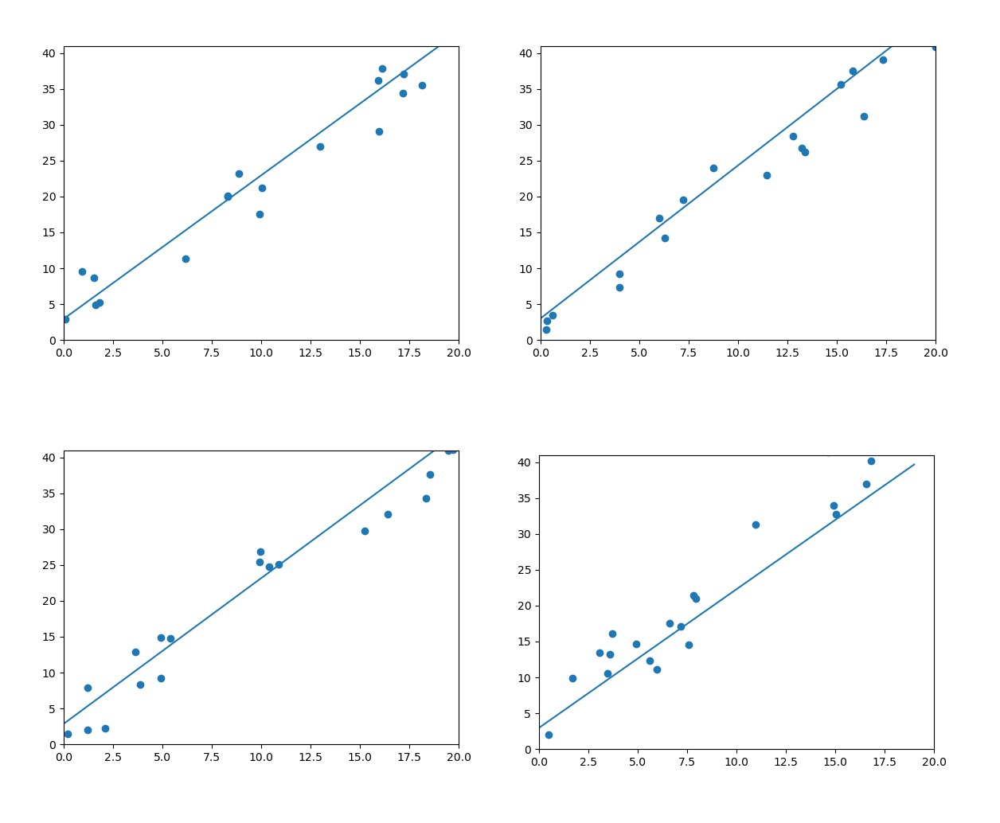
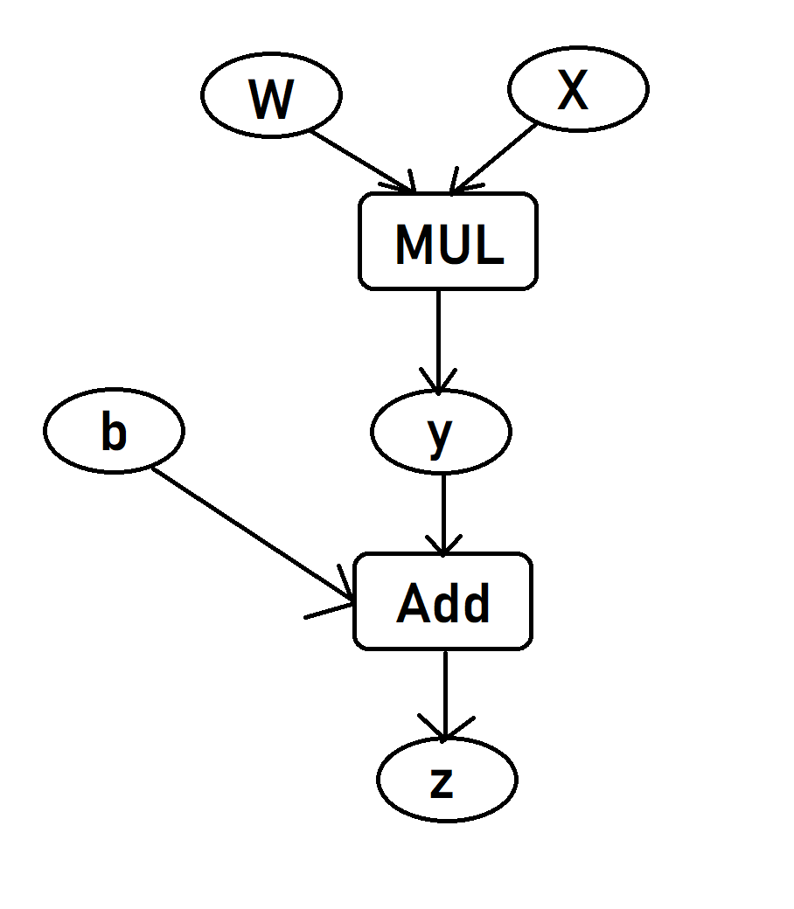
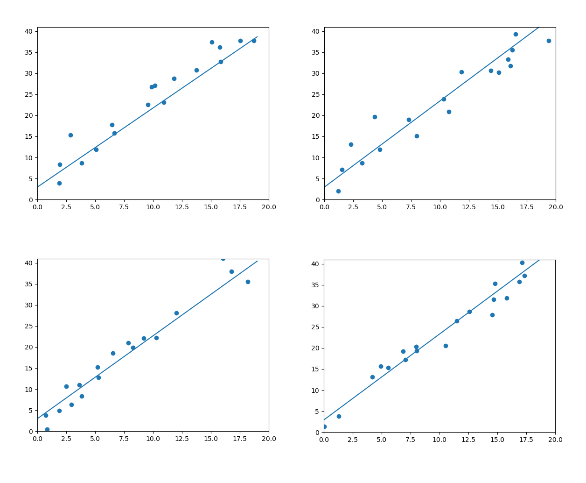

# Tensor&autograd

## 目录

- 张量系统 `Tensor`
    - 基操
        - 分类
        - 创建Tensor
        - 常用Tensor操作
        - 索引操作
        - 高级索引
        - Tensor类型
        - 逐元素操作
        - 归并
        - 比较
        - 线性代数
    - tensor & numpy
    - 内部结构
    - tensor相关话题
    - 牛刀小试：线性回归
- 自动微分系统 `autograd` 
    - Variable
    - 计算图
    - 扩展autograd
    - 牛刀小试：用Variable实现线性回归

---

## 1.Tensor

### 1.1.基操

https://pytorch.org/docs/stable/torch.html

#### (1) 分类

从接口角度讲，对 tensor 的操作分为两类

- torch.function, eg: torch.save
- tensor.function, eg: tensor.view

torch.sum(a, b) <=> a.sum(b)

从存储角度讲，对 tensor 的操作分为两类

- 不会修改自身，eg: a.add(b)
- 会修改自身，eg: a.add_(b)

#### (2) 创建Tensor

函数|功能
-|-
Tensor(*sizes)|基础构造函数
ones(*sizes)|全1Tensor
zeros(*sizes)|全0Tensor
eye(*sizes)|对角全1，其余为0（单位矩阵，不要求行列一致）
arange(s,e,step)|从s到e，步长为step
linspace(s,e,steps)|从s到e，均匀切分成steps份
rand/randn(*sizes)|[0,1]均匀分布/从标准正态分布（均值为0，方差为1，即高斯白噪声）中抽取的一组随机数
normal(mean,std)/uniform(from,to)|正态分布/均匀分布
randperm(m)|长度m随机排列

eg:
```py
t.Tensor(2, 3)                    # 创建一个2*3的tensor
t.Tensor((2, 3))                  # 创建一个只有元素2,3的tensor

b = t.Tensor([[1,2,3],[4,5,6]])   # list -> tensor
c = b..tolist()                   # tensor -> list

b.size()
# <=>
b.shape
```

#### (3) 常用Tensor操作

```py
tensor.view           # 前后大小一样。某一维度-1，这一维度自动计算
tensor.resize         # 新>旧，新分配内存；新<旧，之前数据依然会保留
tensor.squeeze        # ()把所有维度为'1'的压缩
tensor.unsqueeze      # 1在第1维（下标从0开始）加'1'；-2倒数第二维
```

#### (4) 索引操作

类似于numpy

eg
```py
import torch as t
a = t.randn(3,4)
a[0]
a[:,0]
a[0][2]
a[0, 2]
...
a[a>1] # <=> a.masked_select(a>1), 输出1,0，选择结果与原tensor不共享内存
a[t.LongTensor([0, 1])] # 第0,1行
```

常用选择函数

函数|功能
-|-
index_select(input, dim, index)|在指定维度dim上选取，例如某些行、列
masked_select(input, mask)|使用 ByteTensor 进行选取
non_zero(input)|非0元素的下标
gather(input, dim, index)|根据index，在dim维度上选取数据，输出的size与index一样
scatter(input1, dim, index, input2)|根据index，在dim维度上将inputs2数据放到inputs1

eg

```py
# Get diagonal/inverse diagonal elements of the matrix
import torch as t

# ATTENTION: arrange generate dtype is int, translate to float, or run error
a = t.arange(0, 16).float().view(4, 4)
print(a)

# 0: according to column
index = t.LongTensor([[0, 1, 2, 3]])
b = a.gather(0, index)
print(b)

# 1: according to row
index = t.LongTensor([[0, 1, 2, 3]]).t()
b = a.gather(1, index)
print(b)

index = t.LongTensor([[3, 2, 1, 0]])
b = a.gather(0, index)
print(b)

index = t.LongTensor([[3, 2, 1, 0]]).t()
b = a.gather(1, index)
print(b)

index1 = t.LongTensor([[0, 1, 2, 3], [3, 2, 1, 0]])
b1 = a.gather(0, index1)
print(b1)

index2 = t.LongTensor([[0, 1, 2, 3], [3, 2, 1, 0]]).t()
b2 = a.gather(1, index2)
print(b2)

c = t.zeros(4, 4)
d1 = c.scatter(0, index1, b1)
print(d1)
d2 = c.scatter(1, index2, b2)
print(d2)
```

OUTPUT

```bash
tensor([[ 0.,  1.,  2.,  3.],
        [ 4.,  5.,  6.,  7.],
        [ 8.,  9., 10., 11.],
        [12., 13., 14., 15.]])
tensor([[ 0.,  5., 10., 15.]])
tensor([[ 0.],
        [ 5.],
        [10.],
        [15.]])
tensor([[12.,  9.,  6.,  3.]])
tensor([[ 3.],
        [ 6.],
        [ 9.],
        [12.]])
tensor([[ 0.,  5., 10., 15.],
        [12.,  9.,  6.,  3.]])
tensor([[ 0.,  3.],
        [ 5.,  6.],
        [10.,  9.],
        [15., 12.]])
tensor([[ 0.,  0.,  0.,  3.],
        [ 0.,  5.,  6.,  0.],
        [ 0.,  9., 10.,  0.],
        [12.,  0.,  0., 15.]])
tensor([[ 0.,  0.,  0.,  3.],
        [ 0.,  5.,  6.,  0.],
        [ 0.,  9., 10.,  0.],
        [12.,  0.,  0., 15.]])
```

#### (5) 高级索引

```py
import torch as t

x = t.arange(0, 27).view(3, 3, 3)
print(x)

# <=>x[1,1,2],x[2,2,0]
print(x[[1, 2], [1, 2], [2, 0]])
# <=>x[2,0,1],x[1,0,1],x[0,0,1]
print(x[[2, 1, 0], [0], [1]])
# <=>x[0],x[2]
print(x[[0, 2], ...])
# <=>x[:,0,:],x[:,2,:]
print(x[:, [0, 2], :])
# <=>x[:,:,0],x[:,:,2]
print(x[..., [0, 2]])
print(x[..., [0, 2], ...])
```

OUTPUT

```bash
tensor([[[ 0,  1,  2],  
         [ 3,  4,  5],  
         [ 6,  7,  8]], 

        [[ 9, 10, 11],  
         [12, 13, 14],  
         [15, 16, 17]],

        [[18, 19, 20],
         [21, 22, 23],
         [24, 25, 26]]])
tensor([14, 24])
tensor([19, 10,  1])
tensor([[[ 0,  1,  2],
         [ 3,  4,  5],
         [ 6,  7,  8]],

        [[18, 19, 20],
         [21, 22, 23],
         [24, 25, 26]]])
tensor([[[ 0,  1,  2],
         [ 6,  7,  8]],

        [[ 9, 10, 11],
         [15, 16, 17]],

        [[18, 19, 20],
         [24, 25, 26]]])
tensor([[[ 0,  2],
         [ 3,  5],
         [ 6,  8]],

        [[ 9, 11],
         [12, 14],
         [15, 17]],

        [[18, 20],
         [21, 23],
         [24, 26]]])
tensor([[[ 0,  2],
         [ 3,  5],
         [ 6,  8]],

        [[ 9, 11],
         [12, 14],
         [15, 17]],

        [[18, 20],
         [21, 23],
         [24, 26]]])
```

#### (6) Tensor类型

数据类型|CPU Tensor|GPUTensor
-|-|-
32bit 浮点|torch.FloatTensor|torch.cuda.FloatTensor
64bit 浮点|torch.DoubleTensor|torch.cuda.DoubleTensor
16bit 半精度浮点|N/A|torch.cuda.HalfTensor
8bit 无符号整型(0~255)|torch.ByteTensor|torch.cuda.ByteTensor
8bit 有符号整型(-128~127)|torch.CharTensor|torch.cuda.CharTensor
16bit 有符号整型|torch.ShortTensor|torch.cuda.ShortTensor
32bit 有符号整型|torch.IntTensor|torch.cuda.IntTensor
64bit 有符号整型|torch.LongTensor|torch.cuda.LongTensor

```py
import torch as t
# t.set_default_tensor_type('tensor.IntTensor')
# TypeError: only floating-point types are supported as the default type
# So we set DoubleTensor
t.set_default_tensor_type('torch.DoubleTensor')
a = t.Tensor(2, 3)
b = a.float()
c = a.type_as(b)
d = a.new(2, 3)
t.set_default_tensor_type('torch.FloatTensor')
print(a, '\n', b, '\n', c, '\n', d, '\n', a.dtype,
      '\n', b.dtype, '\n', c.dtype, '\n', d.dtype)
```

OUTPUT

```bash
tensor([[0., 0., 0.],
        [0., 0., 0.]], dtype=torch.float64)
 tensor([[0., 0., 0.],
        [0., 0., 0.]])
 tensor([[0., 0., 0.],
        [0., 0., 0.]])
 tensor([[0., 0., 0.],
        [0., 0., 0.]], dtype=torch.float64)
 torch.float64
 torch.float32
 torch.float32
 torch.float64
 ```

#### (7) 逐元素操作

该部分操作会对 tensor 的每个元素（point-wise，又名 element-wise）进行操作，输入输出形状一致。

<center>常用的逐元素操作函数</center>

函数|功能
-|-
abs/sqrt/div/exp/fmod/log/pow...|绝对值/平方根/除法/指数/求余/求幂...
cos/sin/asin/atan2/cosh|三角函数
ceil/round/floor/trunc|上取整/四舍五入/下取整/只保留整数部分
clamp(input, min, max)|超过 min 和 max 的部分截断
sigmoid/tanh|激活函数

a ** 2 <=> t.pow(a, 2)

a % 3 <=> t.fmod(a, 3)

...

#### (8) 归并

<center>常用的归并操作函数</center>

函数|功能
-|-
mean/sum/median/mode|均值/和/中位数/众数
norm/dist|范数/距离
std/var|标准差/方差
cumsum/cumprod|累加/累乘

以上函数大多有个参数 dim <=> Numpy 的 axis：

Input|dim|keepdim|Output
-|-|-|-
(m,n,k)|dim=0|keepdim=True|(1,n,k)
(m,n,k)|dim=0|keepdim=False|(n,k)
(m,n,k)|dim=1|keepdim=True|(m,1,k)
(m,n,k)|dim=1|keepdim=False|(m,k)
(m,n,k)|dim=2|keepdim=True|(m,n,1)
(m,n,k)|dim=2|keepdim=False|(m,n)

```py
import torch as t
# special case: size is still 2*3
a = t.arange(0, 6).view(2, 3)
print(a)
print(a.cumsum(dim=1))
```

OUTPUT

```bash
tensor([[0, 1, 2],
        [3, 4, 5]])
tensor([[ 0,  1,  3],
        [ 3,  7, 12]])
```

#### (9) 比较

<center>常用的比较操作函数</center>

函数|功能
-|-
gt/lt/ge/le/eq/ne|大于/小于/大于等于/小于等于/等于/不等
topk|最大的k个数
sort|排序
max/min|比较两个 tensor 的最大值/最小值

说明：

第一行已实现函数重载，返回结果是一个 ByteTensor

max/min较特殊，有如下三种情况：

- `t.max(tensor)`: 返回tensor中最大的一个元素
- `t.max(tensor, dim)`: 指定维数上的最大数，返回 tensor 和下标
- `t.max(tensor1, tensor2)`: 比较，返回各个位置两者较大的元素

#### (10) 线性代数

<center>常用的线性代数函数</center>

函数|功能
-|-
trace|对角元素之和（矩阵的迹）
diag|对角线元素
triu/tril|矩阵的上三角/下三角，可指定偏移量
mm/bmm|矩阵乘法，batch的矩阵乘法
addmm/addbmm/addmv|β×mat+α(mat1@mat2)<br>β×mat+α(∑_(i=0)^(b−1)batch1_i@batch2_i)<br>β×mat+α(mat@vec)
t|转置
dot/cross|内积/外积
inverse|矩阵求逆
svd|奇异值分解

### 1.2.Tensor&Numpy

Numpy 的广播 (Broadcast) 法则如下：

- 所有数组向最长的shape看齐，不足的在前面补1
- 两个数组在某一维度长度一致，或者一个为1，否则不能计算
- 当某个数组在某维度长度为1，计算时，沿该维度复制扩充为一样的形状

PyTorch手动实现广播：

- unsqueeze 或者 view：为数据某一维度的形状补1，实现法则1
- expand 或者 expend_as：重复数组，实现法则3；该操作不会复制数组不额外占内存

eg

```py
import torch as t

a = t.ones(3, 2)
b = t.zeros(2, 3, 1)

# 3 kinds of methods are equivalent
print(a + b)
print(a.view(1, 3, 2).expand(2, 3, 2) + b.expand(2, 3, 2))
print(a.unsqueeze(0).expand(2, 3, 2) + b.expand(2, 3, 2))
```

OUTPUT

```bash
tensor([[[1., 1.],
         [1., 1.],
         [1., 1.]],

        [[1., 1.],
         [1., 1.],
         [1., 1.]]])
tensor([[[1., 1.],
         [1., 1.],
         [1., 1.]],

        [[1., 1.],
         [1., 1.],
         [1., 1.]]])
tensor([[[1., 1.],
         [1., 1.],
         [1., 1.]],

        [[1., 1.],
         [1., 1.],
         [1., 1.]]])
```

### 1.3.内部结构

tensor 分为头信息区 (Tensor) 和存储区 (Storage)，信息区主要保存着 tensor 的形状 (size)、步长 (stride)、数据类型 (type) 等信息，占内存小；而真正的数据则保存成连续数组，占内存大。


tensor.storage()返回存储区

tensor.data_ptr()返回tensor首元素内存地址，示例代码相差8，float32是32位bit，4字节Byte，2个偏移就是2×4Byte=8Byte

tensor.storage_offset()返回首元素在storage的偏移

tensor.stride()返回在指定维度dim中从一个元素跳到下一个元素所必需的步长。当没有参数传入时，返回所有步长的元组。否则，将返回一个整数值作为特定维度dim中的步长。

示例代码中，(3, 1) (6, 2)。3指的是第0个维度中的一个元素[0, 1, 2]到下一个元素[3, 9, 5]所需要的步长为3，也可以理解从第一个的第一个索引到下一个元素第一个索引跨度是3。而1指的是第1个维度[0, 1, 2]中的一个元素0到下一个元素1所需要的步长为1。6指6666到下一个6666跨6，2指6666到2跨2。

```py
import torch as t

a = t.arange(0, 6).float()
print(a.storage())

b = a.view(2, 3)
print(b.storage())
print(id(b.storage()) == id(a.storage()))

a[1] = 100
print(b)

c = a[2:]
print(c)
print(c.storage())
print(c.data_ptr())
print(a.data_ptr())

d = t.Tensor(c.storage())
print(d)

d[0] = 6666
print(b)

print(id(a.storage()) == id(b.storage()) == id(c.storage()) == id(d.storage()))

print(a.storage_offset(), c.storage_offset(), d.storage_offset())

print(b)
e = b[::2, ::2]
print(e)
print(id(e.storage()) == id(b.storage()))
print(b.stride(), e.stride())
print(e.is_contiguous())
```

OUTPUT

```bash
 0.0
 1.0
 2.0
 3.0
 4.0
 5.0
[torch.FloatStorage of size 6]
 0.0
 1.0
 2.0
 3.0
 4.0
 5.0
[torch.FloatStorage of size 6]
True
tensor([[  0., 100.,   2.],
        [  3.,   4.,   5.]])
tensor([2., 3., 4., 5.])
 0.0
 100.0
 2.0
 3.0
 4.0
 5.0
[torch.FloatStorage of size 6]
3085254101128
3085254101120
tensor([  0., 100.,   2.,   3.,   4.,   5.])
tensor([[6.6660e+03, 1.0000e+02, 2.0000e+00],
        [3.0000e+00, 4.0000e+00, 5.0000e+00]])
True
0 2 0
tensor([[6.6660e+03, 1.0000e+02, 2.0000e+00],
        [3.0000e+00, 4.0000e+00, 5.0000e+00]])
tensor([[6.6660e+03, 2.0000e+00]])
True
(3, 1) (6, 2)
False
```
### 1.4.其他 tensor 相关话题

load， save， 向量化减少时间，多线程等

### 1.5.牛刀小试：线性回归

我们假设使用均方误差作为loss，书上写的式子如下，但代码中实际上用的是后者

$loss = \frac{1}{2} \sum_{i}^N (y_i-(wx_i+b))^2$，
$loss = \frac{1}{2} \sum_{i}^N ((wx_i+b)-y_i)^2$

```py
import torch as t
import matplotlib.pyplot as plt


t.manual_seed(1000)


def get_fake_data(batch_size=8):
    '''generate random data with noise: y=2x+3, x∈[0,20]'''
    x = t.rand(batch_size, 1) * 20
    y = x * 2 + (1 + t.randn(batch_size, 1)) * 3
    return x, y


# initialization
w = t.rand(1, 1)
b = t.zeros(1, 1)
lr = 0.001
for ii in range(20000):
    x, y = get_fake_data()

    # forward: calculate loss
    y_pred = x.mm(w) + b.expand_as(y)
    loss = 0.5 * (y_pred - y) ** 2
    loss = loss.sum()

    # backward: calculate gradient, manual implementation
    dloss = 1
    dy_pred = dloss * (y_pred - y)
    dw = x.t().mm(dy_pred)
    db = dy_pred.sum()

    # update parameters
    w.sub_(lr * dw)
    b.sub_(lr * db)

    if (ii+1) % 5000 == 0:
        # plot figures: predicted line & true data
        plt.figure()
        x = t.arange(0, 20).float().view(-1, 1)
        y = x.mm(w) + b.expand_as(x)
        plt.plot(x.numpy(), y.numpy())
        xt, yt = get_fake_data(batch_size=20)
        plt.scatter(xt.numpy(), yt.numpy())

        plt.xlim(0, 20)
        plt.ylim(0, 41)
        plt.show()
        print('y = ', w.squeeze().item(), ' x + ', b.squeeze().item())

print('Finally\ny = ', w.squeeze().item(), ' x + ', b.squeeze().item())
```

OUTPUT

```bash
y =  1.999983787536621  x +  2.9472413063049316
y =  2.1316089630126953  x +  3.0234603881835938
y =  2.0291495323181152  x +  2.872422218322754
y =  1.931614637374878  x +  2.9698801040649414
Finally
y =  1.931614637374878  x +  2.9698801040649414
```



w,b基本接近2,3

---

## 2.autograd

`torch.autograd` 能够根据 **输入** 和 **前向传播过程** 自动构建计算图，并执行反向传播。

### 2.1.Variable

Variablle 封装了 tensor，并记录对 tensor 的操作记录用来构建计算图。Variable 主要包含三个属性：

- data：保存 Variable 所包含的 tensor。
- grad：保存 data 对应的梯度，grad 也是 Variable，而非 tensor，它与 data 形状一致。
- grad_fn：指向一个 Function，记录 Variable 的操作历史，即它是什么操作的输出，用来构建计算图。如果某一个变量是用户创建的，则它为叶子节点，对应的 grad_fn 等于 None。

Variable 的构造函数需要传入 tensor，同时有两个可选参数：

- requires_grad(bool)：是否需要对该 Variable 求导。
- volatile(bool)：意为“挥发”，设置为True，构建在该 Variable 之上的图都不会求导，专门为推理阶段设计。

若想要计算各个 Variable 的梯度，只需调用根节点 variable 的 backward 方法，autogra 会自动沿着计算图反向传播，计算每一个叶子节点的梯度。

`variable.backward(grad_variables=None, retain_graph=None, create_graph=None)` 主要有如下参数：

- `grad_variables` ：形状与 variable 一致，对于 y.backward()， grad_variables 相当于链式法则 $\frac{\partial z}{\partial x} = \frac{\partial z}{\partial y} × \frac{\partial y}{\partial x}$ 中的 $\frac{\partial z}{\partial y}$ 。grad_variables 也可以是 tensor 或者序列。
- `retain_graph` ：反向传播需要缓存一些中间结果，反向传播后，这些缓存就被清空，可通过制定这个参数不清空缓存，用来多次反向传播。
- `create_graph` ：对反向传播过程再次构建计算图，可通过 backward of backward 实现求高阶导数。

eg. 自动求导与手动求到的对比

$$
y = x^2e^{x}
$$
$$
\frac{\partial y}{\partial x} = 2xe^{x} + x^2e^{x}
$$

```py
import torch as t
from torch.autograd import Variable as V


def f(x):
    y = x ** 2 * t.exp(x)
    return y


def gradf(x):
    dx = 2 * x * t.exp(x) + x ** 2 * t.exp(x)
    return dx


x = V(t.randn(3, 4), requires_grad=True)
y = f(x)
print(x, '\n', y)
y.backward(t.ones(y.size()))
print(x.grad)
print(gradf(x))
```

OUTPUT

```bash
tensor([[-0.9896, -1.8309, -1.7555,  0.5094],
        [ 0.6992, -0.9861, -0.6529,  0.1136],
        [ 2.2123,  2.1677, -0.7240,  0.5284]], requires_grad=True)
tensor([[3.6403e-01, 5.3725e-01, 5.3259e-01, 4.3180e-01],
        [9.8378e-01, 3.6274e-01, 2.2191e-01, 1.4446e-02],
        [4.4716e+01, 4.1059e+01, 2.5410e-01, 4.7366e-01]],
       grad_fn=<MulBackward0>)
tensor([[-3.7169e-01, -4.9625e-02, -7.4184e-02,  2.1272e+00],
        [ 3.7977e+00, -3.7294e-01, -4.5782e-01,  2.6888e-01],
        [ 8.5141e+01,  7.8942e+01, -4.4789e-01,  2.2664e+00]])
tensor([[-3.7169e-01, -4.9625e-02, -7.4184e-02,  2.1272e+00],
        [ 3.7977e+00, -3.7294e-01, -4.5782e-01,  2.6888e-01],
        [ 8.5141e+01,  7.8942e+01, -4.4789e-01,  2.2664e+00]],
       grad_fn=<AddBackward0>)
```
### 2.2.计算图

eg: z = wx + b 可以分解为 y = wx 和 z = y + b



在 `PyTorch` 中计算图的特点可总结如下：

- `autograd` 根据用户对 `variable` 的操作构建计算图。对 `variable` 的操作抽象为 `Function` 。
- 有用户创建的节点叫做叶子节点，叶子节点的 `grad_fn` 为 `None` 。叶子节点中需要求导的 `variable` ，具有 `AccumulateGrad` 标识，因其梯度是累加的。
- `variable` 的 `requires_grad` 属性默认为 `False` ，即默认是不需要求导的。若其改为 `True` ，则所有依赖它的节点的 `requires_grad` 都为 `True` 。
- `variable` 的 `volatile` 属性默认为 `False` ，若其改为 `True` ，则所有依赖它的节点的 `volatile` 都为 `True` `。volatile` 为 `True` 的节点不会求导， `volatile` 优先级高于 `requires_grad` 。
- 多次反向传播时，梯度是累加的。反向传播的中间缓存会被清空，为进行多次反向传播，需指定 `retain_graph=True` 来保存这些缓存。
- 非叶子节点的梯度计算完后即被清空，可以使用 `autogra.grad` 或 `hook` 技术获取非叶子节点的梯度。
- `variable` 的 `grad` 与 `data` 形状一致，应该避免直接修改 `variable.data` ，因为对 `data` 的直接操作无法利用 `autograd` 进行反向传播。
- 反向传播函数 `backward` 的参数 `grad_variables` 可以看成链式求导的中间结果，如果是标量可以省略，默认为1。
- `PyTorch` 采用动态图设计，可以很方便地查看中间层的输出，动态地设计计算图结构。

### 2.3.扩展autograd

若个别函数不支持自动反向传播求导，可以自己写一个 Function ，实现 forward 和 backward 。

eg1. MultiplyAdd

```py
import torch as t
from torch.autograd import Variable as V
from torch.autograd import Function


class MultiplyAdd(Function):

    @staticmethod
    def forward(ctx, w, x, b):
        print('Type in forward: ', type(x), '\n', ctx, w, x, b)
        ctx.save_for_backward(w, x)
        output = w * x + b
        return output

    @staticmethod
    def backward(ctx, grad_output):
        w, x = ctx.saved_variables
        print('Type in backward: ', type(x), '\n', ctx, grad_output, w, x)
        grad_w = grad_output * x
        grad_x = grad_output * w
        grad_b = grad_output * 1
        return grad_w, grad_x, grad_b


x = V(t.ones(1))
w = V(t.rand(1), requires_grad=True)
b = V(t.rand(1), requires_grad=True)
print('Begin forwarding')
z = MultiplyAdd.apply(w, x, b)
print('Begin backwarding')
# 1.use their own backward 
# z.backward()
# 2.use MultiplyAdd.backward
w.grad, x.grad,  b.grad = z.grad_fn.apply(V(t.ones(1)))
print(w.grad, x.grad,  b.grad)
```

```bash
# 1.use their own backward OUTPUT
Begin forwarding
Type in forward:  <class 'torch.Tensor'>
 <torch.autograd.function.MultiplyAddBackward object at 0x0000017E429F7E48> tensor([0.9567], requires_grad=True) tensor([1.]) tensor([0.4327], requires_grad=True)
Begin backwarding
Type in backward:  <class 'torch.Tensor'>
 <torch.autograd.function.MultiplyAddBackward object at 0x0000017E429F7E48> tensor([1.]) tensor([0.9567], requires_grad=True) tensor([1.])
tensor([1.]) None tensor([1.])
```

```bash
# 2.use MultiplyAdd.backward OUTPUT
Begin forwarding
Type in forward:  <class 'torch.Tensor'>
 <torch.autograd.function.MultiplyAddBackward object at 0x000001F87CCF8F28> tensor([0.8940], requires_grad=True) tensor([1.]) tensor([0.6308], requires_grad=True)
Begin backwarding
Type in backward:  <class 'torch.Tensor'>
 <torch.autograd.function.MultiplyAddBackward object at 0x000001F87CCF8F28> tensor([1.]) tensor([0.8940], requires_grad=True) tensor([1.])
tensor([1.]) tensor([0.8940], grad_fn=<MulBackward0>) tensor([1.])
```

用 `t.autograd.gradcheck` 验证梯度计算公式对否；

对比 `Sigmoid` 类，手写 `forward` ，调用库函数 三者的时间。

eg1. Sigmoid

```py
import torch as t
from torch.autograd import Variable as V
from torch.autograd import Function


class Sigmoid(Function):

    @staticmethod
    def forward(ctx, x):
        output = 1 / (1 + t.exp(-x))
        ctx.save_for_backward(output)
        return output

    @staticmethod
    def backward(ctx, grad_output):
        output,  = ctx.saved_variables
        grad_x = output * (1 - output) * grad_output
        return grad_x


test_input = V(t.randn(3, 4), requires_grad=True)
print(test_input.dtype)
print(t.autograd.gradcheck(Sigmoid.apply, (test_input,), eps=1e-3))

def f_sigmoid(x):
    y = Sigmoid.apply(x)
    y.backward(t.ones(x.size()))

def f_native(x):
    y = 1 / (1 + t.exp(-x))
    y.backward(t.ones(x.size()))

def f_th(x):
    y = t.sigmoid(x)
    y.backward(t.ones(x.size()))

x = V(t.randn(100, 100), requires_grad=True)
%timeit -n 100 f_sigmoid(x)
%timeit -n 100 f_native(x)
%timeit -n 100 f_th(x)
```

OUTPUT

```bash
torch.float32
True
250 µs ± 45 µs per loop (mean ± std. dev. of 7 runs, 100 loops each)
294 µs ± 87.2 µs per loop (mean ± std. dev. of 7 runs, 100 loops each)
180 µs ± 17.3 µs per loop (mean ± std. dev. of 7 runs, 100 loops each)
```

### 2.4.牛刀小试：用Variable实现线性回归

```py
import torch as t
from torch.autograd import Variable as V
import matplotlib.pyplot as plt


t.manual_seed(1000)


def get_fake_data(batch_size=8):
    '''generate random data with noise: y=2x+3, x∈[0,20]'''
    x = t.rand(batch_size, 1) * 20
    y = x * 2 + (1 + t.randn(batch_size, 1)) * 3
    return x, y


# initialization
w = V(t.rand(1, 1), requires_grad=True)
b = V(t.zeros(1, 1), requires_grad=True)
lr = 0.001
for ii in range(8000):
    x, y = get_fake_data()
    x, y = V(x), V(y)

    # forward: calculate loss
    y_pred = x.mm(w) + b.expand_as(y)
    loss = 0.5 * (y_pred - y) ** 2
    loss = loss.sum()

    # backward: calculate gradient automatically
    loss.backward()

    # update parameters
    w.data.sub_(lr * w.grad.data)
    b.data.sub_(lr * b.grad.data)

    # reset gradient
    w.grad.data.zero_()
    b.grad.data.zero_()

    if (ii+1) % 2000 == 0:
        # plot figures: predicted line & true data
        plt.figure()
        x = t.arange(0, 20).float().view(-1, 1)
        y = x.mm(w.data) + b.data.expand_as(x)
        plt.plot(x.numpy(), y.numpy())
        xt, yt = get_fake_data(batch_size=20)
        plt.scatter(xt.numpy(), yt.numpy())

        plt.xlim(0, 20)
        plt.ylim(0, 41)
        plt.show()
        print('y = ', w.squeeze().item(), ' x + ', b.squeeze().item())

print('Finally\ny = ', w.squeeze().item(), ' x + ', b.squeeze().item())
```

OUTPUT

```bash
y =  1.87896728515625  x +  2.956167221069336
y =  2.04797625541687  x +  2.941265821456909
y =  1.96884024143219  x +  2.979398488998413
y =  2.039947271347046  x +  2.9036929607391357
Finally
y =  2.039947271347046  x +  2.9036929607391357
```

