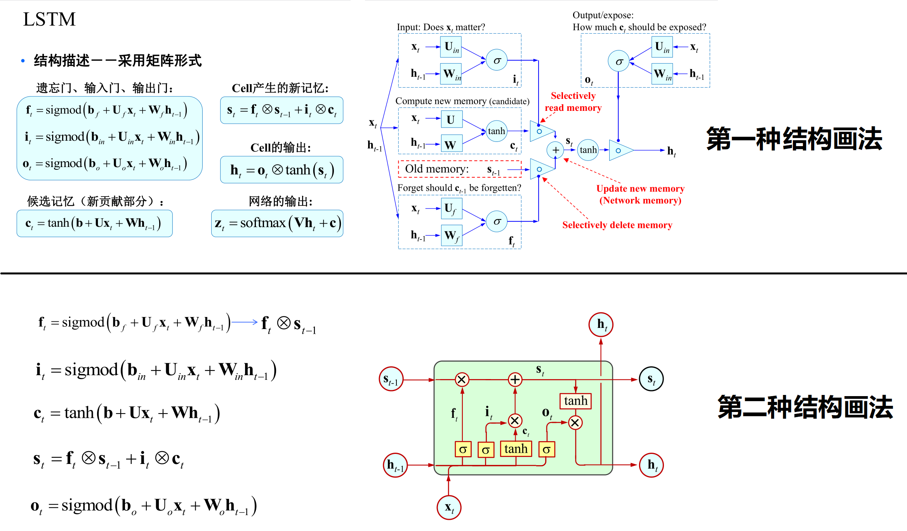
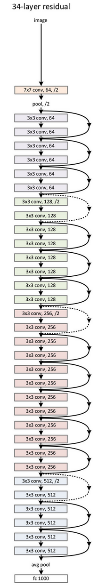
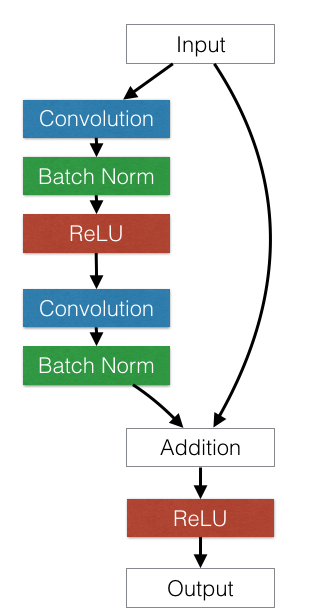

# 神经网络工具箱nn

## 目录

- `nn.Module`
- 常用的神经网络层
    - 图像相关层
    - 激活函数
    - 循环神经网络层(RNN)
    - 损失函数
- 优化器
- `nn.functional`
- 初始化策略
- `nn.Module` 深入分析
- `nn` 和 `autograd` 的关系
- 牛刀小试：用50行代码搭建 `ResNet`

---

## 1.`nn.Module`

eg1.`nn.Module` 实现全连接层（又名仿射层）：

```py
import torch as t
import torch.nn as nn
from torch.autograd import Variable as V


# 1.Define Linear
class Linear(nn.Module):
    def __init__(self, in_features, out_features):
        # <=> `nn.Module.__init__(self)`
        super(Linear, self).__init__()
        self.w = nn.Parameter(t.randn(in_features, out_features))
        self.b = nn.Parameter(t.randn(out_features))

    def forward(self, x):
        x = x.mm(self.w)
        return x + self.b.expand_as(x)


# 2.consider layer as a function
layer = Linear(4, 3)
inputs = V(t.randn(2, 4))
outputs = layer(inputs)
print(outputs)

for name, parameter in layer.named_parameters():
    print(name, ':', parameter)

```

OUTPUT

```bash
tensor([[-0.2981,  4.1216,  0.0133],
        [ 0.9677,  2.8166,  0.8363]], grad_fn=<AddBackward0>)
w : Parameter containing:
tensor([[-0.1615,  1.3237,  0.4084],
        [-0.6224,  0.4305, -1.3326],
        [ 0.4222, -1.0069,  0.1309],
        [-1.2747, -0.5487,  0.3967]], requires_grad=True)
b : Parameter containing:
tensor([0.9006, 1.1781, 0.7581], requires_grad=True)
```

注意事项：

- 自定义层 `Linear` 必须继承 `nn.Module` ，并且在其构造函数中需调用 `nn.Module` 的构造函数，即 `super(Linear,self).__init__()` 或者 `nn.Modlue.__init__(self)`
- 构造函数中必须定义可学习的参数，并封装成 Parameter ， 是一种特殊的 Variable ，默认需要求导(`requires_grad=True`)
- `forward` 函数实现前向传播，输入是1个或者多个 `variable` ，对x的任何操作也必须是 `variable` 支持的操作。
- 无需定义 `backward` 函数，因其前向传播都是对 `variable` 进行操作， `nn.Module` 能够利用 `autigrad` 自动实现反向传播，这一点比 `Function` 简单许多。
- 使用时，直观上可以将 `layer` 看作是数学概念中的函数，调用 `layer(inputs)` 得到 `inputs` 对应的结果。它等价于 `layer.__call__(inputs)` ，在 `__call__` 函数中，主要调用的是 `layer.forward(x)` ，另外还对钩子做了一些处理。所以应尽量使用 `layer(x)` ，而非 `layer.forward(x)` 。
- `Module` 中可学习的参数可通过 `named_parameters()` 或者 `parametera()` 返回迭代器。

eg2.多层感知机(sigmoid做激活函数)

```py
import torch as t
import torch.nn as nn
from torch.autograd import Variable as V


# 1.Define Linear
class Linear(nn.Module):
    def __init__(self, in_features, out_features):
        # <=> `nn.Module.__init__(self)`
        super(Linear, self).__init__()
        self.w = nn.Parameter(t.randn(in_features, out_features))
        self.b = nn.Parameter(t.randn(out_features))

    def forward(self, x):
        x = x.mm(self.w)
        return x + self.b.expand_as(x)


# 2.Define Perceptron
class Perceptron(nn.Module):
    def __init__(self, in_features, hidden_features, out_features):
        nn.Module.__init__(self)
        self.layer1 = Linear(in_features, hidden_features)
        self.layer2 = Linear(hidden_features, out_features)

    def forward(self, x):
        x = self.layer1(x)
        x = t.sigmoid(x)
        return self.layer2(x)


# 3.use Perceptron
perceptron = Perceptron(3, 4, 1)
for name, parameter in perceptron.named_parameters():
    print(name, ':', parameter.size())
inputs = V(t.randn(2, 3))
outputs = perceptron(inputs)
print(outputs)
for name, parameter in perceptron.named_parameters():
    print(name, ':', parameter)
```

OUTPUT

```bash
layer1.w : torch.Size([3, 4])
layer1.b : torch.Size([4])
layer2.w : torch.Size([4, 1])
layer2.b : torch.Size([1])
tensor([[0.7152],
        [1.9099]], grad_fn=<AddBackward0>)
layer1.w : Parameter containing:
tensor([[-0.7143, -0.4733,  0.2695, -0.7086],
        [ 1.8753, -2.3544,  0.4277, -1.8408],
        [-0.4008, -0.6199,  1.7145, -0.1753]], requires_grad=True)
layer1.b : Parameter containing:
tensor([ 0.2386, -0.7290,  0.4999, -0.1165], requires_grad=True)
layer2.w : Parameter containing:
tensor([[ 1.9920],
        [-0.5151],
        [ 0.4294],
        [ 0.3469]], requires_grad=True)
layer2.b : Parameter containing:
tensor([0.5491], requires_grad=True)
```

注意事项：

- 构造函数 __init__ 中，可以利用之前定义的 `Linear` 层（`module`）作为当前 `module` 对象的一个子 `module` ，它的可学习参数，也会成为当前 `module` 的可学习参数。
- 输出变量我们都改为 `x` ，`Python` 可回收一些中间层，节省内存。但是 `BP` 时用到的参数不会回收。
- `Parameter` 直接命名； `submodule` 的 `parameter` 命名为 `submodule.parameter`

---

## 2.常用的神经网络层

### 2.1.图像相关层

- 卷积层 (`Conv`)，逆卷积(`TransposeConv`)
- 池化层 (`Pool`)：平均池化(`AvgPool`)，最大值池化(`MaxPool`)，自适应池化(`AdaptiveAvgPool`)
- 全连接层 (`Linear`)
- 批规范化层 (`BatchNorm`)，风格迁移使用  层
- `dropout` 层 (`Dropout`)：用来防止过拟合

以上都有 1D、2D和3D。

示例略

### 2.2.激活函数

PyTorch 实现了常见的激活函数，接口信息见官网 https://pytorch.org/docs/stable/nn.html#non-linear-activations-weighted-sum-nonlinearity ，这里简单介绍 ReLU 。

$$ReLU=\max(0,x)$$

eg

```py
import torch as t
from torch.autograd import Variable as V
import torch.nn as nn

relu = nn.ReLU(inplace=True)
input = V(t.randn(2, 3))
print(input)
output = relu(input)
print(output)
```

OUTPUT

```bash
tensor([[ 0.1160, -0.0255,  0.4931],
        [-0.7278,  0.5322, -0.4173]])
tensor([[0.1160, 0.0000, 0.4931],
        [0.0000, 0.5322, 0.0000]])
```

一般不要使用 replace ，否则覆盖之前的输入，后面反向传播计算梯度时可能出错。

每一层的输出作为下一层的输入，这种网络叫做前馈网络(`Feedforward Neural Network`)。对于此类网络，每次都写复杂的 forward 函数会有些麻烦，在此就有两种简化方式， `ModuleList` 和 `Sequential` 。其中， 

- `Sequential` 是一个特殊的 `Module` ，它包含几个子 `module` ，前向传播时会将输入一层接一层地传递下去。 
- `ModuleList` 也是一个特殊的 `Module` ，可以包含几个子 `module` ，可以像用 `list` 一样使用它，但不能直接把输入传给 `ModuleList` 。

下面举例说明。

eg1. `Sequential` 的三种写法 & 取出子 `module` & vs `ModuleList`

```py
import torch as t
from torch.autograd import Variable as V
import torch.nn as nn
from collections import OrderedDict

# 3 kinds of Sequential
net1 = nn.Sequential()
net1.add_module('conv', nn.Conv2d(3, 3, 3))
net1.add_module('batchnorm', nn.BatchNorm2d(3))
net1.add_module('activation_layer', nn.ReLU())

net2 = nn.Sequential(
    nn.Conv2d(3, 3, 3),
    nn.BatchNorm2d(3),
    nn.ReLU()
)

net3 = nn.Sequential(OrderedDict([
    ('conv1', nn.Conv2d(3, 3, 3)),
    ('bn1', nn.BatchNorm2d(3)),
    ('relu1', nn.ReLU())
]))

print('net1: ', net1)
print('net2: ', net2)
print('net3: ', net3)

# get sub-module
print(net1.conv, net2[0], net3.conv1)

# Sequential vs ModuleList
input = V(t.rand(1, 3, 4, 4))
output = net1(input)
print(output)
output = net2(input)
print(output)
output = net3(input)
print(output)
output = net3.relu1(net1.batchnorm(net1.conv(input)))
print(output)

modellist = nn.ModuleList([nn.Linear(3, 4), nn.ReLU(), nn.Linear(4, 2)])
input = V(t.randn(1, 3))
for model in modellist:
    input = model(input)
# ERROR!!!
output = modellist(input)
```

OTPUT

```bash
net1:  Sequential(
  (conv): Conv2d(3, 3, kernel_size=(3, 3), stride=(1, 1))
  (batchnorm): BatchNorm2d(3, eps=1e-05, momentum=0.1, affine=True, track_running_stats=True)
  (activation_layer): ReLU()
)
net2:  Sequential(
  (0): Conv2d(3, 3, kernel_size=(3, 3), stride=(1, 1))
  (1): BatchNorm2d(3, eps=1e-05, momentum=0.1, affine=True, track_running_stats=True)
  (2): ReLU()
)
net3:  Sequential(
  (conv1): Conv2d(3, 3, kernel_size=(3, 3), stride=(1, 1))
  (bn1): BatchNorm2d(3, eps=1e-05, momentum=0.1, affine=True, track_running_stats=True)
  (relu1): ReLU()
)
Conv2d(3, 3, kernel_size=(3, 3), stride=(1, 1)) Conv2d(3, 3, kernel_size=(3, 3), stride=(1, 1)) Conv2d(3, 3, kernel_size=(3, 3), stride=(1, 1))
tensor([[[[0.6093, 0.0000],
          [1.1397, 0.0000]],

         [[0.6373, 0.7300],
          [0.0000, 0.3461]],

         [[0.0000, 1.4740],
          [0.3280, 0.0000]]]], grad_fn=<ReluBackward0>)
tensor([[[[0.0000, 0.1099],
          [0.0000, 1.5727]],

         [[1.6034, 0.0000],
          [0.0000, 0.0000]],

         [[0.0000, 0.8653],
          [1.0613, 0.0000]]]], grad_fn=<ReluBackward0>)
tensor([[[[0.1791, 0.2704],
          [1.1520, 0.0000]],

         [[0.9197, 0.0000],
          [0.9168, 0.0000]],

         [[0.0000, 1.5318],
          [0.1495, 0.0000]]]], grad_fn=<ReluBackward0>)
tensor([[[[0.6093, 0.0000],
          [1.1397, 0.0000]],

         [[0.6373, 0.7300],
          [0.0000, 0.3461]],

         [[0.0000, 1.4740],
          [0.3280, 0.0000]]]], grad_fn=<ReluBackward0>)
Traceback (most recent call last):
  File "d:/1puyao/engineer/double_moon/test.py", line 46, in <module>
    output = modellist(input)
  File "E:\Program Files\Python\Python36\lib\site-packages\torch\nn\modules\module.py", line 727, in _call_impl
    result = self.forward(*input, **kwargs)
TypeError: forward() takes 1 positional argument but 2 were given
```

eg2. `ModuleList` vs `list` 

`ModuleList` 中的子 `module` 能被主 `module` 识别；而 `list` 中的子 `module` 不能被主 `module` 识别。这意味着如果用 `list` 存子 `module` ，将无法调整其参数，因为其未加入主 `module` 中。

```py
import torch.nn as nn


class MyModule(nn.Module):
    def __init__(self):
        super(MyModule, self).__init__()
        self.list = [nn.Linear(3, 4), nn.ReLU()]
        self.module_list = nn.ModuleList([nn.Conv2d(3, 3, 3), nn.ReLU()])

    def forward(self):
        pass


module = MyModule()
# ModuleList
print(module)

# list
for name, param in module.named_parameters():
    print(name, param.size())
```

OTPUT

```bash
MyModule(
  (module_list): ModuleList(
    (0): Conv2d(3, 3, kernel_size=(3, 3), stride=(1, 1))
    (1): ReLU()
  )
)
module_list.0.weight torch.Size([3, 3, 3, 3])
module_list.0.bias torch.Size([3])
```

### 2.3.循环神经网络层(RNN)



`PyTorch` 中实现了常见的三种 `RNN` ： `RNN(vanilla RNN)`, `LSTM` 和 `GRU` 。此外还有对应的三种 `RNNCell` 。 `RNN` 和 `RNNCell` 层的区别在于前者能够处理整个序列，后者一次只能处理序列中的一个时间点的数据。前者易用，后者灵活。 `RNN` 可通过组合调用 `RNNCell` 来实现。示例如下代码：

eg

```py
import torch as t
from torch.autograd import Variable as V
import torch.nn as nn

# input: length_of_sequence=2, batch_size=3, dim=4
# lstm input: dim=4, hidden_cell=3, layer=1
# init: layer=1, batch_size=3, hidden_cell=3
t.manual_seed(1000)
input = V(t.randn(2, 3, 4))
lstm = nn.LSTM(4, 3, 1)
h0 = V(t.randn(1, 3, 3))
c0 = V(t.randn(1, 3, 3))
out, hn = lstm(input, (h0, c0))
print(out)


# An LSTMCell's layer can only correspond to ONE layer
t.manual_seed(1000)
input = V(t.randn(2, 3, 4))
lstm = nn.LSTMCell(4, 3)
hx = V(t.randn(3, 3))
cx = V(t.randn(3, 3))
out = []
for i_ in input:
    hx, cx = lstm(i_, (hx, cx))
    out.append(hx)
t.stack(out)
print(out)
```

OUTPUT

```bash
tensor([[[-0.3610, -0.1643,  0.1631],
         [-0.0613, -0.4937, -0.1642],
         [ 0.5080, -0.4175,  0.2502]],

        [[-0.0703, -0.0393, -0.0429],
         [ 0.2085, -0.3005, -0.2686],
         [ 0.1482, -0.4728,  0.1425]]], grad_fn=<StackBackward>)
[tensor([[-0.3610, -0.1643,  0.1631],
        [-0.0613, -0.4937, -0.1642],
        [ 0.5080, -0.4175,  0.2502]], grad_fn=<MulBackward0>), 
        tensor([[-0.0703, -0.0393, -0.0429],
        [ 0.2085, -0.3005, -0.2686],
        [ 0.1482, -0.4728,  0.1425]], grad_fn=<MulBackward0>)]
```

`PyTorch` 还为词向量提供了 `Embedding` 层。

### 2.4.损失函数

损失函数 `Loss Function` 可以看作是特殊的 `layer` 。 `PyTorch` 也将这些损失函数实现为 `nn.Module` 的子类。详见官方文档：https://pytorch.org/docs/stable/nn.functional.html#loss-functions 。下面举例交叉熵损失 (`CrossEntropyloss`)

```py
import torch as t
from torch.autograd import Variable as V
import torch.nn as nn


# batch_size=3, class=2, their_label=[1, 0, 1]
score = V(t.randn(3, 2))
label = V(t.Tensor([1, 0, 1])).long()
criterion = nn.CrossEntropyLoss()
loss = criterion(score, label)
print(loss)
```

OUTPUT

```bash
tensor(1.6507)
```

---

## 3.优化器

`PyTorch` 将深度学习中常见的优化方法全部封装在 `torch.optim` 中，所有优化方法都是继承基类 `optim.Optimizer` ，并实现了自己的优化步骤。下面以随机梯度下降(`SGD`)举例说明。

```py
import torch as t
from torch.autograd import Variable as V
import torch.nn as nn
from torch import optim


class Net(nn.Module):
    def __init__(self):
        spuer(Net, self).__init__()
        self.features = nn.Sequential(
            nn.Conv2d(3, 6, 5),
            nn.ReLU(),
            nn.MaxPool2d(2, 2),
            nn.Conv2d(6, 16, 5),
            nn.ReLU(),
            nn.MaxPool2d(2, 2)
        )
        self.classifier = nn.Sequential(
            nn.Linear(16 * 5 * 5, 120),
            nn.ReLU(),
            nn.Linear(120, 84),
            nn.ReLU(),
            nn.Linear(84, 10)
        )

    def forward(self, x):
        x = self.features(x)
        x = x.view(-1, 16 * 5 * 5)
        x = self.classifier(x)
        return x


net = Net()

optimizer = optim.SGD(params=net.parameters(), lr=1)
# Method 1 of setting different lr
optimizer = optim.SGD([
    {'params': net.features.parameters()},
    {'params': net.classifier.parameters(), 'lr': 1e-2}
], lr=1e-5)
# Method 2 of setting different lr
special_layers = nn.ModuleList([net.classifier[0], net.classifier[2]])
special_layers_params = list(map(id, special_layers.parameters()))
base_params = filter(lambda p: id(
    p) not in special_layers_params, net.parameters())
optimizer = optim.SGD([
    {'base_params': net.features.parameters()},
    {'special_layers_params': net.classifier.parameters(), 'lr': 0.01}
], lr=0.001)
# Method 3 of setting different lr
old_lr = 0.1
optimizer = optim.SGD([
    {'params': net.features.parameters()},
    {'params': net.classifier.parameters(), 'lr': old_lr*0.1}
], lr=1e-5)
# Reset grad
optimizer.zero_grad()

input = V.(t.randn(1, 3, 32, 32))
output = net(input)
output.backward(output)
optimizer.step()
```

---

## 4.`nn.functional`

`nn.functional` 中的函数和 `nn.Module` 的主要区别在于：

- 用 `nn.Module` 实现的 `layers` 是一个特殊的类，都是由 `class Layer(nn.Module)` 定义，会自动提取可学习的参数；
- 而 `nn.functional` 中的函数更像是纯函数，由 `def function(input)` 定义。

下面举例说明二者不同：

```py
import torch as t
from torch.autograd import Variable as V
import torch.nn as nn
from torch import optim

input = V(t.randn(2, 3))
model = nn.Linear(3, 4)
output1 = model(input)
output2 = nn.functional.linear(input, model.weight, model.bias)
print(output1)
print(output2)

b1 = nn.functional.relu(input)
b2 = nn.ReLU()(input)
print(b1)
print(b2)
```

OUTPUT

```bash
tensor([[ 0.7299, -0.2246, -0.7104,  0.9022],
        [ 1.5820,  0.5451, -2.2354, -0.0169]], grad_fn=<AddmmBackward>)
tensor([[ 0.7299, -0.2246, -0.7104,  0.9022],
        [ 1.5820,  0.5451, -2.2354, -0.0169]], grad_fn=<AddmmBackward>)
tensor([[0.0000, 0.0000, 0.0000],
        [0.0000, 2.0410, 2.1813]])
tensor([[0.0000, 0.0000, 0.0000],
        [0.0000, 2.0410, 2.1813]])
```

采用那种方式呢？

- 由于激活函数（`ReLU`、`sigmoid`、`tanh`）、池化（`MaxPool`）等层没有可学习的参数，可以使用 `functional` 函数代替
- 而在卷积（`Conv2d`）、全连接（`Linear`）等具有可学习参数的网络使用 `nn.Module` 较好
-  另外 `dropout` 虽然没有可学习的参数，但是训练测试两个阶段的行为有差异，建议使用 `nn.Module` ， `model.eval` 操作可以加以区分
- 有可学参数的函数也可以用 `functional` 实现，不过要手动定义参数 `parameter` ，例如全连接层的 `weight` 和 `bias` 要单独拿出来，在构造函数中初始化为 `parameter` 

eg1:`LeNet`

```py
import torch.nn as nn
import torch.nn.functional as F


# Define LetNet
class LeNet(nn.Module):
    def __init__(self):
        super(LeNet, self).__init__()
        # Convolution layer: input-channels, output, kernel 5*5
        self.conv1 = nn.Conv2d(3, 6, 5)
        self.conv2 = nn.Conv2d(6, 16, 5)
        # Full connection layer：y = Wx + b
        self.fc1 = nn.Linear(16 * 5 * 5, 120)
        self.fc2 = nn.Linear(120, 84)
        self.fc3 = nn.Linear(84, 10)

    def forward(self, x):
        # (convolution -> activation -> pooling/subsampling) * 2
        x = F.max_pool(F.relu(self.conv1(x)), 2)
        x = F.max_pool(F.relu(self.conv2(x)), 2)
        x = x.view(-1, 16 * 5 * 5)
        # (full connection -> activation) * 2 -> full connection
        x = F.relu(self.fc1(x))
        x = F.relu(self.fc2(x))
        x = self.fc3(x)
        return x
```

eg2:`MyLinear`

```py
import torch as t
import torch.nn as nn
import torch.nn.functional as F


class MyLinear(nn.Module):
    def __init__(self):
        super(MyLinear, self).__init__()
        self.weight = nn.Parameter(t.randn(3, 4))
        self.bias = nn.Parameter(t.zeros(3))

    def forward(self):
        return F.linear(input, self.weight, self.bias)
```

---

## 5.初始化策略

`nn.init` 实现了基本的初始化优化。

eg1

```py
import torch as t
import torch.nn as nn
from torch.nn import init
import math

linear = nn.Linear(3, 4)

# use nn.init to init
t.manual_seed(1)
init.xavier_normal_(linear.weight)
print(linear.weight.data)

# init directly
t.manual_seed(1)
std = math.sqrt(2) / math.sqrt(7.)
linear.weight.data.normal_(0, std)
print(linear.weight.data)
```

OUTPUT

```bash
tensor([[ 0.3535,  0.1427,  0.0330],
        [ 0.3321, -0.2416, -0.0888],
        [-0.8140,  0.2040, -0.5493],
        [-0.3010, -0.4769, -0.0311]])
tensor([[ 0.3535,  0.1427,  0.0330],
        [ 0.3321, -0.2416, -0.0888],
        [-0.8140,  0.2040, -0.5493],
        [-0.3010, -0.4769, -0.0311]])
```

eg2.init all params

```py
for name, params in net.named_parameters():
    if name.find('linear') != -1:
        # init linear
        params[0] # weight
        params[1] # bias
    elif name.find('conv') != -1:
        pass
    elif name.find('norm') != -1:
        pass
```

---

## 6.`nn.Module` 深入分析

如果想要更深入地理解nn.Module，究其原理是很有必要的。首先来看看nn.Module基类的构造函数

```python
def __init__(self):
    self._parameters = OrderedDict()
    self._modules = OrderedDict()
    self._buffers = OrderedDict()
    self._backward_hooks = OrderedDict()
    self._forward_hooks = OrderedDict()
    self.training = True
```
其中每个属性的解释如下：

- `_parameters`：字典，保存用户直接设置的parameter，`self.param1 = nn.Parameter(t.randn(3, 3))`会被检测到，在字典中加入一个 `key` 为 `param` ， `value` 为对应 `parameter` 的 `item` 。而 `self.submodule = nn.Linear(3, 4)` 中的 `parameter` 则不会存于此。
- `_modules`：子 `module` ，通过`self.submodel = nn.Linear(3, 4)`指定的子 `module` 会保存于此。
- `_buffers`：缓存。如 `batchnorm` 使用 `momentum` 机制，每次前向传播需用到上一次前向传播的结果。
- `_backward_hooks`与`_forward_hooks`：钩子技术，用来提取中间变量，类似 `variable` 的 `hook` 。
- `training`：`BatchNorm` 与 `Dropout` 层在训练阶段和测试阶段中采取的策略不同，通过判断 `training` 值来决定前向传播策略。

上述几个属性中，`_parameters`、`_modules`和`_buffers`这三个字典中的键值，都可以通过`self.key`方式获得，效果等价于`self._parameters['key']`。

--

`nn.Module` 在实际使用中可能层层嵌套，一个 `module` 包含若干个子 `module` ，每一个子 `module` 又包含了更多的子 `module` 。为方便用户访问各个子 `module` ， `nn.Module` 实现了很多方法，如函数 `children` 可以查看直接子`module`，函数 `module` 可以查看所有的子 `module` （包括当前 `module` ）。与之相对应的还有函数 `named_childen` 和 `named_modules` ，其能够在返回 `module` 列表的同时返回它们的名字。

--

对于 `batchnorm` 、 `dropout` 、 `instancenorm` 等在训练和测试阶段行为差距巨大的层，如果在测试时不将其 `training` 值设为 `True` ，则可能会有很大影响，这在实际使用中要千万注意。虽然可通过直接设置`training`属性，来将子 `module` 设为 `train` 和 `eval` 模式，但这种方式较为繁琐，因如果一个模型具有多个 `dropout` 层，就需要为每个 `dropout` 层指定 `training` 属性。更为推荐的做法是调用 `model.train()` 函数，它会将当前 `module` 及其子 `module` 中的所有 `training` 属性都设为 `True` ，相应的， `model.eval()` 函数会把 `training` 属性都设为 `False` 。

--

`register_forward_hook` 与 `register_backward_hook` ，这两个函数的功能类似于variable函数的`register_hook`，可在module前向传播或反向传播时注册钩子。每次前向传播执行结束后会执行钩子函数（hook）。前向传播的钩子函数具有如下形式：`hook(module, input, output) -> None`，而反向传播则具有如下形式：`hook(module, grad_input, grad_output) -> Tensor or None`。钩子函数不应修改输入和输出，并且在使用后应及时删除，以避免每次都运行钩子增加运行负载。钩子函数主要用在获取某些中间结果的情景，如中间某一层的输出或某一层的梯度。这些结果本应写在forward函数中，但如果在forward函数中专门加上这些处理，可能会使处理逻辑比较复杂，这时候使用钩子技术就更合适一些。下面考虑一种场景，有一个预训练好的模型，需要提取模型的某一层（不是最后一层）的输出作为特征进行分类，但又不希望修改其原有的模型定义文件，这时就可以利用钩子函数。下面给出实现的伪代码。

```py
model = VGG()
features = t.Tensor()
def hook(module, input, output):
    '''把这层的输出拷贝到features中'''
    features.copy_(output.data)
    
handle = model.layer8.register_forward_hook(hook)
_ = model(input)
# 用完hook后删除
handle.remove()
```

--

`nn.Module`对象在构造函数中的行为看起来有些怪异，如果想要真正掌握其原理，就需要看两个魔法方法`__getattr__`和`__setattr__`。在Python中有两个常用的buildin方法`getattr`和`setattr`，`getattr(obj, 'attr1')`等价于`obj.attr`，如果`getattr`函数无法找到所需属性，Python会转而调用`obj.__getattr__('attr1')`方法，即`getattr`函数无法找到的交给`__getattr__`函数处理，没有实现`__getattr__`或者`__getattr__`也无法处理的就会raise AttributeError。`setattr(obj, 'name', value)`等价于`obj.name=value`，如果obj对象实现了`__setattr__`方法，setattr会直接调用`obj.__setattr__('name', value)`，否则调用buildin方法。总结一下：

- `result  = obj.name` 会调用buildin函数`getattr(obj, 'name')`，如果该属性找不到，会调用`obj.__getattr__('name')`
- `obj.name = value` 会调用buildin函数`setattr(obj, 'name', value)`，如果obj对象实现了`__setattr__`方法，`setattr`会直接调用`obj.__setattr__('name', value')`

nn.Module实现了自定义的`__setattr__`函数，当执行`module.name=value`时，会在`__setattr__`中判断value是否为`Parameter`或`nn.Module`对象，如果是则将这些对象加到`_parameters`和`_modules`两个字典中，而如果是其它类型的对象，如`Variable`、`list`、`dict`等，则调用默认的操作，将这个值保存在`__dict__`中。

因`_modules`和`_parameters`中的item未保存在`__dict__`中，所以默认的getattr方法无法获取它，因而`nn.Module`实现了自定义的`__getattr__`方法，如果默认的`getattr`无法处理，就调用自定义的`__getattr__`方法，尝试从`_modules`、`_parameters`和`_buffers`这三个字典中获取。

--

在PyTorch中保存模型十分简单，所有的Module对象都具有`state_dict()`函数，返回当前Module所有的状态数据。将这些状态数据保存后，下次使用模型时即可利用`model.load_state_dict()`函数将状态加载进来。优化器（optimizer）也有类似的机制，不过一般并不需要保存优化器的运行状态。

```py
# 保存模型
t.save(net.state_dict(), 'net.pth')

# 加载已保存的模型
net2 = Net()
net2.load_state_dict(t.load('net.pth'))
```

--


将Module放在GPU上运行也十分简单，只需两步：

- `model = model.cuda()`：将模型的所有参数转存到GPU
- `input.cuda()`：将输入数据也放置到GPU上

至于如何在多个GPU上并行计算，PyTorch也提供了两个函数，可实现简单高效的并行GPU计算

- `nn.parallel.data_parallel(module, inputs, device_ids=None, output_device=None, dim=0, module_kwargs=None)`
- `class torch.nn.DataParallel(module, device_ids=None, output_device=None, dim=0)`

可见二者的参数十分相似，通过`device_ids`参数可以指定在哪些GPU上进行优化，output_device指定输出到哪个GPU上。唯一的不同就在于前者直接利用多GPU并行计算得出结果，而后者则返回一个新的module，能够自动在多GPU上进行并行加速。


```py
# method 1
output = nn.parallel.data_parallel(net, input, device_ids=[0, 1])

# method 2
new_net = nn.DataParallel(new_net, device_ids=[0, 1])
output = new_net(input)
```

DataParallel并行的方式，是将输入一个batch的数据均分成多份，分别送到对应的GPU进行计算，各个GPU得到的梯度累加。与Module相关的所有数据也都会以浅复制的方式复制多份，在此需要注意，在module中属性应该是只读的。

---

## 7.`nn` 和 `autograd` 的关系

nn.Module利用的也是autograd技术，其主要工作是实现前向传播。在forward函数中，nn.Module对输入的tensor进行的各种操作，本质上都是用到了autograd技术。这里需要对比autograd.Function和nn.Module之间的区别：

- `autograd.Function` 利用了Tensor对autograd技术的扩展，为autograd实现了新的运算op，不仅要实现前向传播还要手动实现反向传播
- `nn.Module` 利用了autograd技术，对nn的功能进行扩展，实现了深度学习中更多的层。只需实现前向传播功能，autograd即会自动实现反向传播
- `nn.functional` 是一些autograd操作的集合，是经过封装的函数

作为两大类扩充PyTorch接口的方法，我们在实际使用中应该如何选择呢？如果某一个操作，在autograd中尚未支持，那么只能实现Function接口对应的前向传播和反向传播。如果某些时候利用autograd接口比较复杂，则可以利用Function将多个操作聚合，实现优化，正如第三章所实现的`Sigmoid`一样，比直接利用autograd低级别的操作要快。而如果只是想在深度学习中增加某一层，使用nn.Module进行封装则更为简单高效。

---

## 8.牛刀小试：用50行代码搭建 `ResNet`

ResNet34 网络结构，Residual block 结构图，如下：

 

考虑到Residual block和layer出现了多次，我们可以把它们实现为一个子Module或函数。这里我们将Residual block实现为一个子module，而将layer实现为一个函数。下面是实现代码，规律总结如下：

- 对于模型中的重复部分，实现为子 `module` 或用函数生成相应的 `module` : `_make_layer`
- `nn.Module` 和 `nn.Functional` 结合使用
- 尽量使用 `nn.Seqential`

```py
import torch as t
import torch.nn as nn
from torch.nn import functional as F
from torch.autograd import Variable as V
from torchvision import models


class ResidualBlock(nn.Module):
    def __init__(self, inchannel, outchannel, stride=1, shortcut=None):
        super(ResidualBlock, self).__init__()
        self.left = nn.Sequential(
            nn.Conv2d(inchannel, outchannel, 3, stride, 1, bias=False),
            nn.BatchNorm2d(outchannel),
            nn.ReLU(inplace=True),
            nn.Conv2d(outchannel, outchannel, 3, 1, 1, bias=False),
            nn.BatchNorm2d(outchannel)
        )
        self.right = shortcut

    def forward(self, x):
        out = self.left(x)
        residual = x if self.right is None else self.right(x)
        out += residual
        return F.relu(out)


class ResNet(nn.Module):
    def __init__(self, num_classes=1000):
        super(ResNet, self).__init__()
        # Pre-processing
        self.pre = nn.Sequential(
            nn.Conv2d(3, 64, 7, 2, 3, bias=False),
            nn.BatchNorm2d(64),
            nn.ReLU(inplace=True),
            nn.MaxPool2d(3, 2, 1)
        )
        # Repeat layers with 3, 4, 6, 3 residual block
        self.layer1 = self._make_layer(64, 128, 3)
        self.layer2 = self._make_layer(128, 256, 4, stride=2)
        self.layer3 = self._make_layer(256, 512, 6, stride=2)
        self.layer4 = self._make_layer(512, 512, 3, stride=2)
        # Full collection for classification
        self.fc = nn.Linear(512, num_classes)

    def _make_layer(self, inchannel, outchannel, block_num, stride=1):
        shortcut = nn.Sequential(
            nn.Conv2d(inchannel, outchannel, 1, stride, bias=False),
            nn.BatchNorm2d(outchannel)
        )
        layers = []
        layers.append(ResidualBlock(inchannel, outchannel, stride, shortcut))
        for i in range(block_num):
            layers.append(ResidualBlock(outchannel, outchannel))
        return nn.Sequential(*layers)

    def forward(self, x):
        x = self.pre(x)
        x = self.layer1(x)
        x = self.layer2(x)
        x = self.layer3(x)
        x = self.layer4(x)
        x = F.avg_pool2d(x, 7)
        x = x.view(x.size(0), -1)
        return self.fc(x)


input = V(t.randn(1, 3, 224, 224))
# Our Model
model1 = ResNet()
output1 = model1(input)
print(output1.size())
# torchvision's Model
model2 = models.resnet34()
output2 = model2(input)
print(output2.size())
```

OUTPUT

```bash
torch.Size([1, 1000])
torch.Size([1, 1000])
```