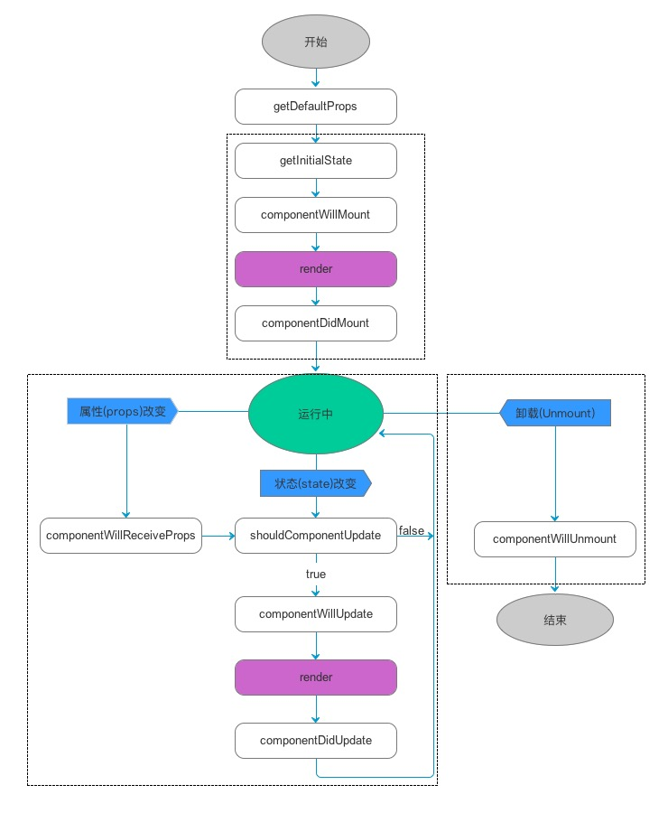
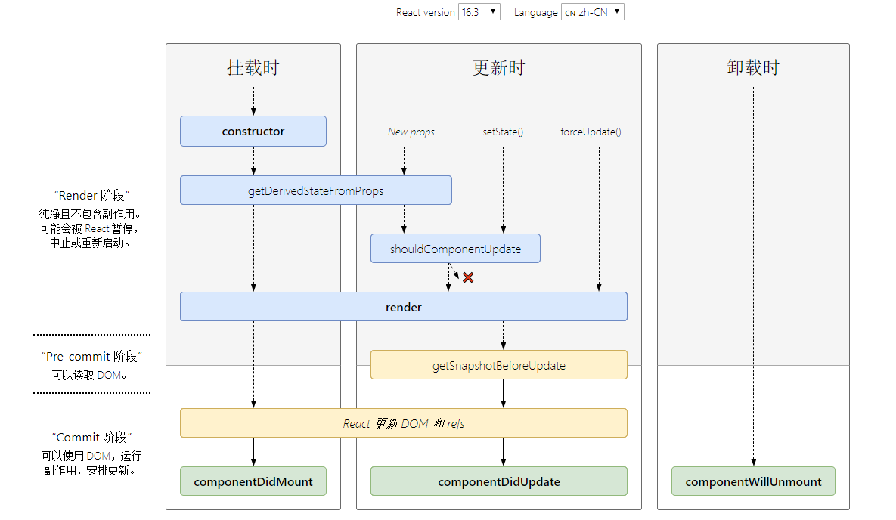
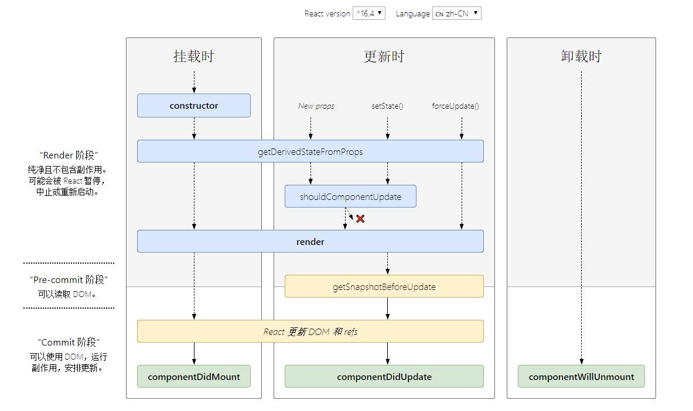

# React16基础知识总结

>学习地址：https://www.bilibili.com/video/av51455080
>
>demo地址：https://github.com/Allenem/ReactDraft/tree/master/jishupang/demo01

## CONTENT

- [运用脚手架初始化React项目](#运用脚手架初始化React项目)
- [安装时报错及解决（可略过）](#安装时报错及解决)
- [脚手架生成的项目目录介绍](#脚手架生成的项目目录介绍)
- [自己新建一个helloworld](#自己新建一个helloworld)
- [JSX简介](#JSX简介)
- [Todolist.js中的引入](#Todolistjs中的引入)
- [数据定义，使用和改变](#数据定义使用和改变)
- [数据渲染和button的click事件](#数据渲染和button的click事件)
- [点击条目删除对应item](#点击条目删除对应item)
- [React中绑定this并传参的三种方式](#React中绑定this并传参的三种方式)
- [引入css的类](#引入css的类)
- [解析HTML](#解析HTML)
- [聚焦输入框](#聚焦输入框)
- [VSCode中很不错的React插件](#VSCode中很不错的React插件)
- [Todolist.js单个组件全部代码](#Todolistjs单个组件全部代码)
- [组件的拆分&父子组件的传值](#组件的拆分父子组件的传值)
- [几个理论概念](#几个理论概念)
  - 单向数据流
  - React 与 jQuery 结合使用
  - 函数式编程
- [Chrome的React调试工具](#React调试工具)
- [propTypes 校验父组件传过来的值，defaultProps 设置默认值](#propTypes校验父组件传过来的值defaultProps设置默认值)
- [ref 的使用](#ref的使用)
- [子组件中的解构赋值](#子组件中的解构赋值)
- [React 生命周期](#React生命周期)
  - [v16.0之前](#v160之前)
  - [v16.3&v16.4](#v163v164)
  - [官网关于生命周期的说明](#官网关于生命周期的说明)
  - [用生命周期函数进行组件优化](#用生命周期函数进行组件优化)
- [axios请求，获取远端数据](#axios请求获取远端数据)
- [引入CSS详细讲解](#引入CSS详细讲解)
  - 1.简单引入
  - 2.安装并使用库 `react-transition-group`
  - 3.使用 `react-transition-group` 创建多 `dom` 动画
  - 4.使用 `styled-components` 将 `css` 化为 `js` 引入
---

## 运用脚手架初始化React项目

```bash
# install node
node -v
npm -v
npm install -g cnpm --registry=https://registry.npm.taobao.org

# install react scaffold
npm install -g create-react-app 
create-react-app -V

# new an app
create-react-app <appname>

# go to <appname> folder
cd <appname>

# start project
npm start
```

---

## 安装时报错及解决

**以下这一部分可以选择性忽略。**

报错了，那我就升级node吧，试试安装网上说的 安装 n 模块升级
```
error eslint@6.2.1: The engine "node" is incompatible with this module. Expected version "^8.10.0 || ^10.13.0 || >=11.10.1". Got "11.2.0"
error Found incompatible module.
```
```bash
# install n module
npm i -g n 
```
又报错
```
npm ERR! code EBADPLATFORM
npm ERR! notsup Unsupported platform for n@6.0.1: wanted {"os":"!win32","arch":"any"} (current: {"os":"win32","arch":"x64"})
```
那就说明 n 模块不支持windows系统，虽然下面可以强制安装n模块，然并卵。
```bash
# PS:global package direction:C:\Users\<username>\AppData\Roaming\npm
npm i -g n --force
```

```bash
# update to specific version
n version 
# such as
n 10.0.0

# update to the latest version
n latest

# update to the LTS version
n stable
```

然并卵，那我就下载安装包来安装吧 ┭┮﹏┭┮，OK，安装成功，运行`create-react-app <appname>`成功生成React新项目。

这部分可能是由于我安装了yarn，脚手架优先用yarn生成项目，yarn又对node版本有要求所致。

**以上这一部分可以选择性忽略。**

---

## 脚手架生成的项目目录介绍

```
│  .gitignore
│  package.json
│  README.md
│  yarn.lock
│
├─node_modules/
│
├─public
│      favicon.ico
│      index.html
│      logo192.png
│      logo512.png
│      manifest.json
│      robots.txt
│
└─src
        App.css
        App.js
        App.test.js
        index.css
        index.js
        logo.svg
        serviceWorker.js
```

|文件 / 文件夹|子文件|简介|
|-|-|-|
|`.gitignore` ||git忽略文件|
|`package.json` ||包管理文件|
|`README.md` ||项目介绍|
|`yarn.lock` ||安装时的版本管理文件|
|`node_modules/` ||依赖包|
|`public` ||公共资源文件夹|
| |`index.html`    |网页入口|
| |`favicon.ico`   |网页小logo|
| |`logo192.png`   |网页中logo|
| |`logo512.png`   |网页大logo|
| |`manifest.json` |logo配置文件|
| |`robots.txt`    |Web site owners use the /robots.txt file to give instructions about their site to web robots; this is called *The Robots Exclusion Protocol*.|
|`src` ||源码文件夹|
| |`index.js` |入口文件|
| |`index.css` |入口文件样式|
| |`App.js` |根组件|
| |`App.css` |根组件样式|
| |`App.test.js` |根组件测试文件|
| |`logo.svg` |旋转的logo|
| |`serviceWorker.js` |提供PWA|

---

## 自己新建一个helloworld

删除 `src` 目录所有文件，新建 `index.js` 和 `App.js` 两个文件。

&hearts;注意：组件首字母要大写。

index.js

```js
import React from 'react'
import ReactDOM from 'react-dom'
import App from './App'

ReactDOM.render(<App />,document.getElementById('root'))
```

App.js

```js
import React, {Component} from 'react'

class App extends Component{
  render(){
    return(
      <div>
        Hello world.
      </div>
    )
  }
}

export default App
```

---

## JSX简介

JSX `JavaScript` & `xml` 遇到 `<` 当做 `HTML` 来解析，遇到 `{` 当做 `JavaScript` 来解析

两种写法：原生 & JSX

```js
class App extends Component{
  render(){
    var child1 = React.createElement('li' ,null, 'aaa')
    var child2 = React.createElement( 'li' ,null,'bbb')
    var root = React.createElement( 'ul' ,{className: 'my-list'}, child1, child2)
    return root
  }
}
```

```js
class App extends Component{
  render(){
    return(
        <ul className="my-list">
          <li>aaa</li>
          <li>bbb</li>
        </ul>
    )
  }
}
```

插入一段js代码

```js
class App extends Component{
  render(){
    return(
			<ul className="my-list">
				<li>{true?'aaa':'ccc'}</li>
				<li>bbb</li>
			</ul>
    )
  }
}
```

---

## todolist 实战

## Todolist.js中的引入

```js
import React, {Component,Fragment} from 'react'
// Fragment 包裹在jsx在最外层不显示
```

---

## 数据定义，使用和改变

1. 函数绑定 `this` 在 `constructor` 中
2. 数据定义在 `constructor` 中
3. 改变数据在 `this.setState` 中，不允许直接操作，错误例子：`this.state.inputValue = e.target.value`
4. 两种在 JSX 中的注释形式
5. 原来 js 的函数名变驼峰式 比如 `onClick` `onChange`

```js
class Todolist extends Component{

  constructor(props){
    super(props)
    // 定义数据
    this.state = {
      inputValue: '复习政治',
      list:[]
    }
    // 绑定函数的this指针
    this.inputChange = this.inputChange.bind(this)
  }

  render(){
    return(
      <Fragment>
        <div>
          {/*使用数据*/}
          {
            // 改变数据
          }
          <input value={this.state.inputValue} onChange={this.inputChange} />
          <button>增加项目</button>
        </div>
        <ul>
          <li>复习数学</li>
          <li>复习英语</li>
        </ul>
      </Fragment>
    )
  }

  inputChange(e){
    // 改变数据
    this.setState({
      inputValue: e.target.value
    })
  }
}
```

---

## 数据渲染和button的click事件

1. 数据渲染，使用 `map` 绑定 `key` 值
2. 函数绑定 `this`
3. [...list,newList] 构造结构数组

```js
		<ul>
			{
				this.state.list.map((item,index) => {
					return <li key={index+item}>{item}</li>
				})
			}
		</ul>
```

```js
  // 点击button增加列表
  addList(){
    this.setState({
      list: [...this.state.list,this.state.inputValue],
      // <=>list: ['复习数学','复习英语',this.state.inputValue]
      inputValue: ''
    })
  }
```

---

## 点击条目删除对应item

对应的部分如下
```js
  render(){
    return(
      <ul>
        {
          this.state.list.map((item,index) => {
            return (
              <li 
                key = {index+item}
                onClick = { () => this.deleteItem(index)}
              >
                {item}
              </li>
            )
          })
        }
      </ul>
    )
  }
  // 点击条目删除
  deleteItem(index){
		let list = [...this.state.list]
		list.splice(index,1)
		this.setState({
			list:list
		})
	}
```

---

## React中绑定this并传参的三种方式

1. 在事件中绑定this并传参：

```js
<input type="button" value="在事件中绑定this并传参" onClick={this.handleMsg1.bind(this, '🍕', '🍟')} />

// 在事件中绑定this并传参
handleMsg1(arg1, arg2) {
		console.log(this);
		// 此时this是个null，上面的实例中指向的是 Todolist 这个类
		this.setState({
			msg: '在事件中绑定this并传参：' + arg1 + arg2
		});
}
```

2. 在构造函数中绑定this并传参:

```js
	// 修改构造函数中的代码：
	this.handleMsg2 = this.handleMsg2.bind(this, '🚗', '🚚');

	<input type="button" value="在构造函数中绑定this并传参" onClick={this.handleMsg2} />

	// 在构造函数中绑定this并传参
	handleMsg2(arg1, arg2) {
		this.setState({
			msg: '在构造函数中绑定this并传参：' + arg1 + arg2
		});
	}
```

3. 用箭头函数绑定this并传参： 

```js
<input type="button" value="用箭头函数绑定this并传参" onClick={() => { this.handleMsg3('👩', '👰') }} />

// 用箭头函数绑定this并传参
handleMsg3(arg1, arg2) {
	this.setState({
		msg: '用箭头函数绑定this并传参：' + arg1 + arg2
	});
}
```

---

## 引入css的类

样式的类名用 `className` 与 `Todolist` 这个 `class` 区别。

```js
...
import './style.css'

class Todolist extends Component{
	...
	render(){
    return(
			<input className="input">
			...
		)
	}
}

export default Todolist
```

---

## 解析HTML

标签中使用 `dangerouslySetInnerHTML={{__html:xxx}}`，删除原来标签中间的 `{xxx}`

```jsx
<li 
	key = {index+item}
	onClick = { () => this.deleteItem(index)}
	dangerouslySetInnerHTML={{__html:item}}
>
</li>
```

---

## 聚焦输入框

用 `htmlFor` 取代 `for`

原来的 `html` VS React 的 `JSX`

```html
<label for="focus">增加：</label>
<input id="focus" />
```

```jsx
<label htmlFor="focus">增加：</label>
<input id="focus" />
```

---

## VSCode中很不错的React插件

`Simple React Snippets`

快捷键Snippets

|Snippet |	Renders|
|-|-|
|imr |	Import React
|imrc	| Import React / Component
|impt	| Import PropTypes
|impc	| Import React / PureComponent
|cc	| Class Component
|ccc	| Class Component With Constructor
|sfc	| Stateless Function Component
|cdm	| componentDidMount
|cwm	| componentWillMount
|cwrp	| componentWillReceiveProps
|gds	| getDerivedStateFromProps
|scu	| shouldComponentUpdate
|cwu	| componentWillUpdate
|cdu	| componentDidUpdate
|cwu	| componentWillUpdate
|cdc	| componentDidCatch
|gsbu	| getSnapshotBeforeUpdate
|ss	| setState
|ssf	| Functional setState
|ren	| render
|rprop	| Render Prop
|hoc	| Higher Order Component

---

## Todolist.js单个组件全部代码
```js
import React, {Component,Fragment} from 'react'
import './style.css'

class Todolist extends Component{

  constructor(props){
    super(props)
    this.state = {
      inputValue: '',
      list:['复习数学','复习英语']
    }
    this.inputChange = this.inputChange.bind(this)
    this.addList = this.addList.bind(this)
    // this.deleteItem = this.deleteItem.bind(this)
  }

  render(){
    return(
      <Fragment>
				<div>
					<label htmlFor="focus">增加：</label>
          <input id="focus" className="input" value={this.state.inputValue} onChange={this.inputChange}  />
          <button onClick={this.addList}>增加项目</button>
        </div>
        <ul>
          {
            this.state.list.map((item,index) => {
              return (
                <li 
                  key = {index+item}
									onClick = { () => this.deleteItem(index)}
									dangerouslySetInnerHTML={{__html:item}}
                >
                </li>
              )
            })
          }
        </ul>
      </Fragment>
    )
  }

  // 改变input
  inputChange(e){
    // console.log(e.target.value)
    this.setState({
      inputValue: e.target.value
    })
  }

  // 点击button增加列表
  addList(){
    this.setState({
      list: [...this.state.list,this.state.inputValue],
      // <=>list: ['复习数学','复习英语',this.state.inputValue]
      inputValue: ''
    })
  }

  // 点击条目删除
  deleteItem(index){
		// console.log(index)
		let list = [...this.state.list]
		list.splice(index,1)
		this.setState({
			list:list
		})
	}
	
}

export default Todolist
```

---

## 组件的拆分&父子组件的传值

### 拆分

将 `Todolist.js` 分为 `Todolist.js` 和 `Todoitem.js` 两个组件

将父组件 `Todolist.js` 的 `<li>...</li>` 移动到 `Todoitem.js` 子组件中

### 传值
1. 父向子传值

父组件传值，传方法 `content={item}`
```jsx
{
	this.state.list.map((item,index) => {
		return (
			<Todoitem 
				commonName='复习'
				key={index+item}
				content={item}
				index={index}
				deleteItem={() => this.deleteItem(index)}
			/>
		)
	})
}
```
子组件接收值 `{this.props.content}`
```js
class Todoitem extends Component {

  constructor(props){
    super(props)
    this.handleClick = this.handleClick.bind(this)
  }

  render() { 
    return ( 
      <li onClick={this.handleClick} >
        {this.props.commonName} - {this.props.content}
      </li>
     );
  }

  handleClick(){
    // console.log(this.props.index)
    this.props.deleteItem(this.props.index)
  }

}
```

---

## 几个理论概念

1. 单向数据流

父组件箱子组件传值传方法，子组件通过父组件的方法和传值对父组件的数据才能更改，否则不能通过自己的方法进行更改。

2. React 与 jQuery 结合使用

可以在 `./public/index.html` 的其他结点用 `jQuery`

3. 函数式编程

每个函数代表一个功能，方便打代码和测试配合。

---

## React调试工具

科嗯学嗯上嗯网之后从这个网址安装 `React Developer Tools` 插件：

https://chrome.google.com/webstore/detail/react-developer-tools/fmkadmapgofadopljbjfkapdkoienihi

图标灰色：未使用react；红色：react开发环境；黑色：react产品环境

## propTypes校验父组件传过来的值defaultProps设置默认值

1. 注意检验在 `class` 外边
2. 组件名.后面的单词是驼峰式，比如 `sonComponent.propTypes` ，花括号里面的是大小大小（理论上自己起），比如 `PropTypes.string`
3. 参考网址：https://zh-hans.reactjs.org/docs/typechecking-with-proptypes.html#___gatsby

子组件

```js
import React, { Component } from 'react'
import PropTypes from 'prop-types'

class sonComponent extends Componnet {
	...
}

// 注意检验在class外边
// 组件名.后面的单词是驼峰式，里面的是大小大小（理论上自己起）
// 参考网址：https://zh-hans.reactjs.org/docs/typechecking-with-proptypes.html#___gatsby
sonComponent.propTypes = {
  commonName: PropTypes.string.isRequired,
  content: PropTypes.string,
  index: PropTypes.number,
  deleteItem: PropTypes.func
}

// 设置默认值
sonComponent.defaultProps={
  commonName: '学习'
}

export default sonComponent
```

---

## ref的使用

`ref` 用来绑定元素

`this.setState` 异步执行，可用回调函数

绑定如下
```jsx
<input 
	...
	ref = {(input) => {this.input = input}}
/>
<ul ref = {(ul)=>{this.ul=ul}}>
```

```js
  // 改变input，看着更清晰
  inputChange(e){
    // console.log(e.target.value)
    this.setState({
      // inputValue: e.target.value
      inputValue: this.input.value
    })
	}

  // 点击button增加列表，异步回调获取条目长度
  addList(){
    this.setState({
      list: [...this.state.list,this.state.inputValue],
      // <=>list: ['复习数学','复习英语',this.state.inputValue]
      inputValue: ''
    },() => {
			console.log(this.ul.querySelectorAll('li').length)
		})
  }
```

---

## 子组件中的解构赋值

```js
  render() { 
    // 解构赋值
    const { commonName,content } = this.props
    return ( 
      <li onClick={this.handleClick} >
        {commonName} - {content}
      </li>
     )
  }

  handleClick(){
    // 解构赋值
    const { deleteItem,index } = this.props
    // console.log(this.props.index)
    deleteItem(index)
	}
```

---

## React生命周期

v16.0之前




v16.3



v16.4



---

## v16.0之前

参考：https://www.jianshu.com/p/9203997f053d

通过第一张图可以看到React声明周期的四个大阶段：

- Initialization:初始化阶段。
- Mounting: 挂在阶段。
- Updation: 更新阶段。
- Unmounting: 销毁阶段


### Ⅰ.Initialization

`constructor` 不算生命周期函数。

`constructor` 我们叫构造函数，它是ES6的基本语法。虽然它和生命周期函数的性质一样，但不能认为是生命周期函数。

但是你要心里把它当成一个生命周期函数，个人可以把它看成 `React` 的 `Initialization` 阶段，定义 `属性(props)` 和 `状态(state)` 。

#### constructor()

`constructor` 在组件被 `mounted` 之前调用，我们的组件继承自 `React.Component` `，constructor` 函数中我们在其他操作前应该先调用 `super(props)` ，否则 `this.props` 将会是 `undefined` 。

`constructor` 是初始化 `state` 的好地方。如果我们不需要初始化 `state` ，也不需要 `bind` 任何方法，那么在我们的组件中不需要实现 `constructor` 函数。


### Ⅱ.Mounting

如下这些方法在组件实例被创建和被插入到 `dom` 中时被调用。

#### 1.componentWillMount()

此方法在 `mounting` 之前被立即调用，它在 `render()` 之前调用，因此在此方法中 `setState` 不会触发重新渲染。此方法是服务器渲染中调用的唯一的生命周期钩子，通常我们建议使用 `constructor()`。

#### 2.render()

`render()` 方法是react组件必须的，它检查 `this.props` 和 `this.state` 并且返回一个 `React` 元素，我们也可以返回null或false，代表我们不想有任何的渲染。

`render()` 方法应该是一个纯方法，即它不会修改组件的 `state` ，在每一次调用时返回同样的结果。它不直接和浏览器交互，如果我们想要交互，应该在 `componentDidMount()` 或者其他的生命周期函数里面。

#### 3.componentDidMount()

此方法在组件被 `mounted` 之后立即被调用，初始化DOM节点应该在此方法中，如果需要从远端健在数据，这里是实例化网络请求的好地方，此方法中 setState 会触发组件重新渲染。

#### 4.代码
```js
componentWillMount(){
    console.log('01-componentWillMount----组件将要挂载到页面的时刻')
}
render(){
    console.log('02-13-render----开始挂载渲染.......')
}
componentDidMount(){
    console.log('03-componentDidMount----组件挂载完成的时刻执行')
}
```
这时候我们查看一下控制台，会为我们打出如下提示：

```
01-componentWillMount----组件将要挂载到页面的时刻
02-13-render----开始挂载渲染.......
03-componentDidMount----组件挂载完成的时刻执行
```

这也是生命周期的顺序。

这个函数书写有顺序吗?哪个在前？哪个在后？其实是没有顺序的，你可以随便改动他们的顺序。

注意的问题

`componentWillMount` 和 `componentDidMount` 这两个生命周期函数，只在页面刷新时执行一次，而 `render` 函数是只要有 `state` 和 `props` 变化就会执行，这个初学者一定要注意。


### Ⅲ.Updating

`props` 和 `state` 的改变产生更新。在重新渲染组件时，如下的方法被调用

#### 1.componentWillReceiveProps()

一个已经 `mounted` 的组件接收一个新的 `props` 之前 `componentWillReceiveProps()` 被调用，如果我们需要更新 `state` 来响应 `prop` 的更改，我们可以在此方法中比较 `this.props` 和 `nextProps` 并使用 `this.setState` 来更改 `state`。

注意，即使 `props` 没有改变，React也可以调用这个方法，因此如果你只想处理改变，请确保比较当前值和下一个值。当父组件导致你的组件重新渲染时，可能会发生这种情况：React在组件 `mounting` 期间不会调用此方法，只有在一些组件的 `props` 可能被更新的时候才会调用。调用`this.setState` 通常不会触发 `componentWillReceiveProps` 。

#### 2.shouldComponentUpdate()

使用此方法让React 知道组件的输出是否不受当前 `state` 或 `props` 更改的影响。默认行为是在每次state更改时重新渲染组件，在大多数情况下，我们应该默认改行为。

当接收到新的 `props` 或 `state` 时，`shouldComponentUpdate()`  在渲染之前被调用。默认返回 `true` ，对于初始渲染或使用 `forceUpdate()` 时，不调用此方法。返回 `false` 不会阻止子组件的 `state` 更改时，该子组件重新渲染。

如果 `shouldComponentUpdate()` 返回 `false` ，那么 `componentWillUpdate()` ， `render()` 和 `componentDidUpdate()` 将不会被调用。

#### 3.componentWillUpdate()

当接收新的 `props` 或 `state` 时，`componentWillUpdate()` 在组件渲染之前被立即调用。使用此函数作为在更新发生之前执行准备的机会。初始渲染不会调用此方法。

注意：这里不能调用 `this.setState()`

如果调用会怎么样？试了一下，会产生死循环，一直更新。。。。如果我们需要更新 `state` 以响应 `props` 的更改，我们应该使用 `componentWillReceiveProps()`

#### 4.render()

`render()` 方法是react组件必须的，它检查 `this.props` 和 `this.state` 并且返回一个React元素，我们也可以返回 `null` 或 `false` ，代表我们不想有任何的渲染。

`render()` 方法应该是一个纯方法，即它不会修改组件的 `state` ，在每一次调用时返回同样的结果。它不直接和浏览器交互，如果我们想要交互，应该在 `componentDidMount()` 或者其他的生命周期函数里面。

#### 5.componentDidUpdate()

此函数在更新后立即被调用。初始渲染不调用此方法。当组件已经更新时，使用此操作作为DOM操作的机会。这也是一个好的地方做网络请求，只要你比较当前的 `props` 和以前的 `props` (`例如：如果props` 没有改变，可能不需要网络请求)。

#### 6.代码

父组件
```js
shouldComponentUpdate(){
    console.log('11-shouldComponentUpdate---组件发生改变前执行')
    return true
}
// 现在就可以在控制台console里看到结果了，并且结果是每次文本框发生改变时都会随着改变。如果你返回了false，这组件就不会进行更新了。 简单点说，就是返回true，就同意组件更新;返回false,就反对组件更新。

// shouldComponentUpdate返回true才会被执行。
componentWillUpdate(){
    console.log('12-componentWillUpdate---组件更新前，shouldComponentUpdate函数之后执行')
}

render(){
	console.log('02-13-render----开始挂载渲染')
}

// componentDidUpdate在组件更新之后执行，它是组件更新的最后一个环节。
componentDidUpdate(){
    console.log('15-componentDidUpdate----组件更新之后执行')
}
```
子组件
```js
componentWillReceiveProps(){
	console.log('14-child - componentWillReceiveProps')
}
/* 

顶层组件，它并没接收任何的props。可以把这个函数移动到子组件中。

凡是组件都有生命周期函数，所以子组件也是有的，并且子组件接收了props，这时候函数就可以被执行了。

这个时候再预览，就会看到componentWillReceiveProps执行了。那现在可以总结一下它的执行时间了。

子组件接收到父组件传递过来的参数，父组件render函数重新被执行，这个生命周期就会被执行。

也就是说这个组件第一次存在于Dom中，函数是不会被执行的;

如果已经存在于Dom中，函数才会被执行。

*/
```


控制台打印

```
11-shouldComponentUpdate---组件发生改变前执行
12-componentWillUpdate---组件更新前，shouldComponentUpdate函数之后执行
13-render----开始挂载渲染
14-child - componentWillReceiveProps
14-child - componentWillReceiveProps
15-componentDidUpdate----组件更新之后执行
```


### Ⅳ.Unmounting

当从dom中移除组件时，这个方法会被调用

#### componentWillUnmount()

此函数在组件被卸载和销毁之前被立即调用。在此方法中执行一些必要的清理。例如清除计时器，取消网络请求或者清理在 `componentDidMount` 中创建的任何DOM元素。

#### 代码

```js
//当组件从页面中删除的时候执行
componentWillUnmount(){
    console.log('21-child - componentWillUnmount')
}
```

写完后，可以到浏览器终端中查看结果，当我们点击服务项，服务项被删除时，这个函数就被执行了。

### Ⅴ.总的代码和输出

父组件
```js

	componentWillMount(){
		console.log('01-componentWillMount----组件将要挂载到页面的时刻')
	}

	render(){
		console.log('02-13-render----开始挂载渲染')
	}
	
	componentDidMount(){
		console.log('03-componentDidMount----组件挂载完成的时刻执行')
	}

	shouldComponentUpdate(){
		console.log('11-shouldComponentUpdate---组件发生改变前执行')
		return true
	}
	// 现在就可以在控制台console里看到结果了，并且结果是每次文本框发生改变时都会随着改变。如果你返回了false，这组件就不会进行更新了。 简单点说，就是返回true，就同意组件更新;返回false,就反对组件更新。

	// shouldComponentUpdate返回true才会被执行。
	componentWillUpdate(){
		console.log('12-componentWillUpdate---组件更新前，shouldComponentUpdate函数之后执行')
	}
	
	// componentDidUpdate在组件更新之后执行，它是组件更新的最后一个环节。
	componentDidUpdate(){
		console.log('15-componentDidUpdate----组件更新之后执行')
	}
```

子组件
```js
  // 子组件接收到父组件传递过来的参数，父组件render函数重新被执行，这个生命周期就会被执行。
  // 这个组件第一次存在于Dom中，函数是不会被执行的;
  // 如果已经存在于Dom中，函数才会被执行。
	componentWillReceiveProps(){
		console.log('14-child - componentWillReceiveProps')
	}
	
	//当组件从页面中删除的时候执行
	componentWillUnmount(){
		console.log('21-child - componentWillUnmount')
	}
```

控制台
```
// 初始挂载阶段
01-componentWillMount----组件将要挂载到页面的时刻
02-13-render----开始挂载渲染
03-componentDidMount----组件挂载完成的时刻执行

// input输入
11-shouldComponentUpdate---组件发生改变前执行
12-componentWillUpdate---组件更新前，shouldComponentUpdate函数之后执行
02-13-render----开始挂载渲染
14-child - componentWillReceiveProps
14-child - componentWillReceiveProps
15-componentDidUpdate----组件更新之后执行

// 点击提交
11-shouldComponentUpdate---组件发生改变前执行
12-componentWillUpdate---组件更新前，shouldComponentUpdate函数之后执行
02-13-render----开始挂载渲染
14-child - componentWillReceiveProps
14-child - componentWillReceiveProps
15-componentDidUpdate----组件更新之后执行

// 点击删除
11-shouldComponentUpdate---组件发生改变前执行
12-componentWillUpdate---组件更新前，shouldComponentUpdate函数之后执行
02-13-render----开始挂载渲染
14-child - componentWillReceiveProps
21-child - componentWillUnmount
21-child - componentWillUnmount
15-componentDidUpdate----组件更新之后执行
```

---

## v16.3&v16.4

参考：https://www.jianshu.com/p/514fe21b9914

### 变更缘由

原来（React v16.0前）的生命周期在 `React v16` 推出的 [Fiber](https://zhuanlan.zhihu.com/p/26027085) 之后就不合适了，因为如果要开启 `async rendering` ，在 `render` 函数之前的所有函数，都有可能被执行多次。
原来（React v16.0前）的生命周期有哪些是在 `render` 前执行的呢？

- componentWillMount
- componentWillReceiveProps
- shouldComponentUpdate
- componentWillUpdate

如果开发者开了 `async rendering` ，而且又在以上这些 `render` 前执行的生命周期方法做 `AJAX` 请求的话，那 `AJAX` 将被无谓地多次调用。。。明显不是我们期望的结果。而且在 `componentWillMount` 里发起 `AJAX` ，不管多快得到结果也赶不上首次 `render` ，而且 `componentWillMount` 在服务器端渲染也会被调用到（当然，也许这是预期的结果），这样的IO操作放在 `componentDidMount` 里更合适。

禁止不能用比劝导开发者不要这样用的效果更好，所以除了 `shouldComponentUpdate` ，其他在 `render` 函数之前的所有函数（ `componentWillMount` ， `componentWillReceiveProps` ， `componentWillUpdate` ）都被 `getDerivedStateFromProps` 替代。

也就是用一个静态函数 `getDerivedStateFromProps` 来取代被 deprecate 的几个生命周期函数，就是强制开发者在 `render` 之前只做无副作用的操作，而且能做的操作局限在根据 `props` 和 `state` 决定新的 `state`

`React v16.0` 刚推出的时候，是增加了一个 `componentDidCatch` 生命周期函数，这只是一个增量式修改，完全不影响原有生命周期函数；但是，到了 `React v16.3` ，大改动来了，引入了两个新的生命周期函数。

### 新引入了两个新的生命周期函数： 

- getDerivedStateFromProps
- getSnapshotBeforeUpdate

#### getDerivedStateFromProps

`getDerivedStateFromProps` 本来（React v16.3中）是只在创建和更新阶段（由父组件引发部分）。也就是说只能创建，或者父组件引发。如果不是由父组件引发（例如自身 `setState` 引发或者 `forceUpdate` 引发），那么 `getDerivedStateFromProps` 也不会被调用。上面那张图 `React v16.3` 一目了然，重新看一下吧。


这样的话理解起来有点乱，在 `React v16.4` 中改正了这一点，让 `getDerivedStateFromProps` 无论是 `Mounting` 还是 `Updating` ，也无论是因为什么引起的 `Updating` ，全部都会被调用，具体可看 `React v16.4` 的生命周期图。


`static getDerivedStateFromProps(props, state)` 在组件创建时和更新时的 `render` 方法之前调用，它应该返回一个对象来更新状态，或者返回 `null` 来不更新任何内容。

#### getSnapshotBeforeUpdate

`getSnapshotBeforeUpdate()` 被调用于 `render` 之后，可以读取但无法使用`DOM`的时候。它使您的组件可以在可能更改之前从`DOM`捕获一些信息（例如滚动位置）。此生命周期返回的任何值都将作为参数传递给 `componentDidUpdate()` 。

官网给的例子：
```js
class ScrollingList extends React.Component {
  constructor(props) {
    super(props);
    this.listRef = React.createRef();
  }

  getSnapshotBeforeUpdate(prevProps, prevState) {
    // 我们是否要添加新的 items 到列表?
    // 捕捉滚动位置，以便我们可以稍后调整滚动.
    if (prevProps.list.length < this.props.list.length) {
      const list = this.listRef.current;
      return list.scrollHeight - list.scrollTop;
    }
    return null;
  }

  componentDidUpdate(prevProps, prevState, snapshot) {
    // 如果我们有snapshot值, 我们已经添加了 新的items.
    // 调整滚动以至于这些新的items 不会将旧items推出视图。
    // (这边的snapshot是 getSnapshotBeforeUpdate方法的返回值)
    if (snapshot !== null) {
      const list = this.listRef.current;
      list.scrollTop = list.scrollHeight - snapshot;
    }
  }

  render() {
    return (
      <div ref={this.listRef}>{/* ...contents... */}</div>
    );
  }
}
```

---

## 官网关于生命周期的说明

中文网址：https://zh-hans.reactjs.org/docs/react-component.html
English：https://en.reactjs.org/docs/react-component.html

## 用生命周期函数进行组件优化

子组件
```js
shouldComponentUpdate(nextProps,nextState){
	return nextProps.content!==this.props.content?true:false
}
```

---

## axios请求，获取远端数据

推荐写在 `componentDidMount()` 生命周期函数里

安装 `axios`

```bash
yarn add axios
```

引入和使用 `axios`

```js
import axios from 'axios'

componentDidMount(){
	axios.post('https://web-api.juejin.im/v3/web/wbbr/bgeda')
		.then((res)=>{console.log('axios获取数据成功'+JSON.stringify(res))})
		.catch((err)=>{console.log('axios获取数据失败'+err)})
}
```

注册 easymock 账号：https://www.easy-mock.com/

创建新项目 `react-demo01` ，创建接口 `list`

接口数据如下

```json
{
  "data": ["语文", "数学", "英语", "物理", "化学", "生物"]
}
```

父组件 `list` 初始化置空，请求赋值

```js
  constructor(props){
    super(props)
    this.state = {
      inputValue: '',
      list:[]
    }
		...
  }

	componentDidMount(){
		axios.get('https://www.easy-mock.com/mock/5d9a2a338c63954ea11dd4df/react-demo01/list')
			.then((res)=>{
				console.log('axios获取数据成功'+JSON.stringify(res))
				this.setState({
					list: res.data.data
				})
			})
			.catch((err)=>{console.log('axios获取数据失败'+err)})
	}
```

---

## 引入CSS详细讲解

0. 创建 `Boss.js` 组件

```js
import React, { Component } from 'react'

class Boss extends Component {
  constructor(props) {
    super(props);
    this.state = { 
      isShow: true
    }
    this.toToggle=this.toToggle.bind(this)
  }
  render() { 
    return ( 
      <div>
        <div className={this.state.isShow?'show':'hide'}>BOSS级人物-齐天大圣</div>
        <div><button onClick={this.toToggle}>召唤boss</button></div>
      </div>
     );
  }
  toToggle(){
    this.setState({
      isShow: this.state.isShow?false:true
    })
  }
}
 
export default Boss;
```

1. 简单引入

Todolist.js
```js
import './style.css'
```

注意 `forwards` 会保持状态

style.css
```css
.show{
  /* opacity: 1; */
  animation: in 2s ease-in forwards;
}
.hide{
  /* opacity: 0; */
  animation: out 2s ease-in forwards;
}

@keyframes in {
  0%{
    opacity: 0;
    color: #ff0;
  }
  50%{
    opacity: 0.5;
    color: #0ff;
  }
  100%{
    opacity: 1;
    color: #f0f;
  }
}

@keyframes out {
  0%{
    opacity: 1;
    color: #f0f;
  }
  50%{
    opacity: 0.5;
    color: #0ff;
  }
  100%{
    opacity: 0;
    color: #ff0;
  }
}
```

2. 安装并使用库 `react-transition-group`

```bash
yarn add react-transition-group
```

有三个基本的库

- Transition
- CSSTransition
- TransitionGroup

Boss.js
```js
import { CSSTransition } from 'react-transition-group'
...
// className会自动加上下面那六个
// unmountOnExit 会在退出时删除结点
<CSSTransition
  in={this.state.isShow}
  timeout={2000}
  classNames="xxx"
  unmountOnExit
>
  <div>BOSS级人物-齐天大圣</div>
</CSSTransition>

...

```

style.css
```css
.xxx-enter{}
.xxx-enter-active{}
.xxx-enter-done{}
.xxx-exit{}
.xxx-exit-active{ }
.xxx-exit-done{}
```

3. 使用 `react-transition-group` 创建多 `dom` 动画

Todolis.js
```js
import { CSSTransition, TransitionGroup } from 'react-transition-group'
...
<TransitionGroup>
  {
    this.state.list.map((item,index) => {
      return (
        <CSSTransition
          timeout={2000}
          classNames="boss-text"
          unmountOnExit
          key={index+item}
          appear={true}
        >
          <Todoitem 
            commonName='复习'
            key={index+item}
            content={item}
            index={index}
            deleteItem={() => this.deleteItem(index)}
          />
        </CSSTransition>
      )
    })
  }
</TransitionGroup>
```

4. 使用 `styled-components` 将 `css` 化为 `js` 引入
    - createGlobalStyle
    - styled

全局样式 `style.js`
```js
import {createGlobalStyle} from 'styled-components';
 
export const GlobalStyle = createGlobalStyle`
  html, body, div, span, applet, object, iframe,
  h1, h2, h3, h4, h5, h6, p, blockquote, pre,
  a, abbr, acronym, address, big, cite, code,
  del, dfn, em, img, ins, kbd, q, s, samp,
  small, strike, strong, sub, sup, tt, var,
  b, u, i, center,
  dl, dt, dd, ol, ul, li,
  fieldset, form, label, legend,
  table, caption, tbody, tfoot, thead, tr, th, td,
  article, aside, canvas, details, embed, 
  figure, figcaption, footer, header, hgroup, 
  menu, nav, output, ruby, section, summary,
  time, mark, audio, video {
    margin: 0;
    padding: 0;
    border: 0;
    font-size: 100%;
    font: inherit;
    vertical-align: baseline;
  }
  article, aside, details, figcaption, figure, 
  footer, header, hgroup, menu, nav, section {
    display: block;
  }
  body {
    line-height: 1;
  }
  ol, ul {
    list-style: none;
  }
  blockquote, q {
    quotes: none;
  }
  blockquote:before, blockquote:after,
  q:before, q:after {
    content: '';
    content: none;
  }
  table {
    border-collapse: collapse;
    border-spacing: 0;
  }
`;
```
全局样式引入 `father.js`
```js
import {GlobalStyle} from './style.js';
...
  render() {
    return (
      <Provider store={store}>
        <GlobalStyle/>
...
```

局部样式 `style.js`
```js
import styled from 'styled-components';

export const HomeWrapper = styled.div`
  overflow: hidden;
  width: 960px;
  margin: 0 auto;
`
```
局部样式引入 `child.js`
```js
import {
  HomeWrapper,
  HomeLeft,
  HomeRight
}from './style';

...

<HomeWrapper>
  <HomeLeft>
    
    <Topic />
    <List />
  </HomeLeft>
  <HomeRight>
    <Recommend />
    <DownloadApp />
    <Writer />
  </HomeRight>
  { this.props.showScroll ? <BackTop onClick={this.handleScrollTop}>^</BackTop> : null }
</HomeWrapper>

...

```

---

\_(:з」∠)_

完结(END)
