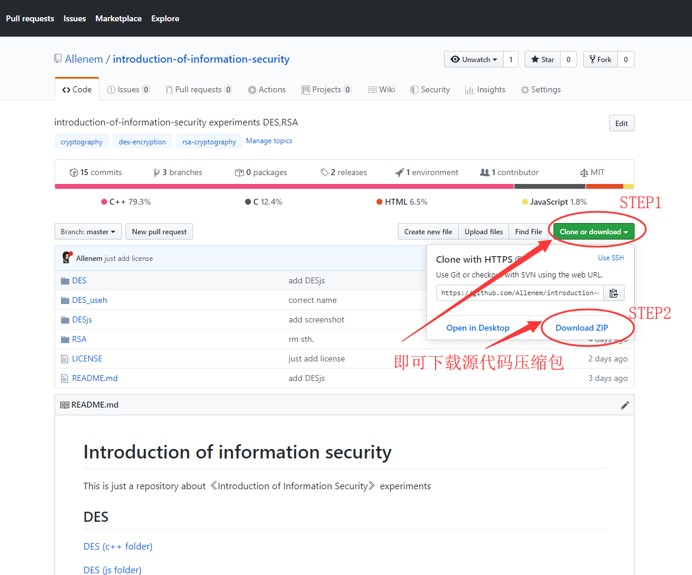

# 华南理工大学 - 电子与信息学院 - 实验及课设（仓库地址可供参考）

* * *

## 大一

### C语言课程设计-学生成绩管理系统

https://github.com/Allenem/c-course-design

### C++课程设计-学生成绩管理系统

https://github.com/JoeDragonXII/-

* * *

## 大二

### 数学实验-所有实验+人脸识别

https://github.com/Allenem/math-experiment

https://github.com/icyzeroice/simple-linear-regression-for-face-recognition

### 单片机课设-汇编语言版+其他

https://github.com/Allenem/SCM-course-design

* * *

## 大三

### DSP实验和课设-回声器&均衡器

https://github.com/Allenem/DSP-course-design

### VHDL课设

https://github.com/Allenem/VHDL-draft (交织解交织器)

https://github.com/icyzeroice/scutie2015-digimon (digimon)

### DIP实验作业

https://github.com/Allenem/DIPhomework

### 电子综合设计样例-智能家居系统

https://github.com/scutcyr/eletronic_design

### 电子综合设计-基于蓝牙的智能门锁Android部分

https://github.com/Saujyun/SmartHomeTerminal

* * * 

## 大四

### 信息安全概论

https://github.com/Allenem/introduction-of-information-security

暂时包含：
- c++实现的DES算法对称加密解密
- [js实现的DES算法对称加密解密(可在线加密解密)](https://Allenem.github.io/introduction-of-information-security/DESjs)
- c++实现的RSA算法非对称加密解密

* * *

## Contributors

感谢以下贡献者：

<!-- ALL-CONTRIBUTORS-LIST:START - Do not remove or modify this section -->
<!-- prettier-ignore-start -->
<!-- markdownlint-disable -->
<table>
  <tr>
    <td align="center"><a href="https://github.com/Allenem"> <b>蒲尧</b></a> <a href="https://github.com/Allenem/all-contributors-cli-test/commits?author=Allenem" title="Code">💻</a> <a href="https://github.com/Allenem/all-contributors-cli-test/commits?author=Allenem" title="Documentation">📖</a> <a href="#translation-Allenem" title="Translation">🌍</a></td>
    <td align="center"><a href="http://yirongchen.com/"> <b>Yirong Chen</b></a> <a href="https://github.com/Allenem/all-contributors-cli-test/commits?author=scutcyr" title="Code">💻</a></td>
    <td align="center"><a href="https://gitee.com/icyzeroice"> <b>Ice Zero</b></a> <a href="https://github.com/Allenem/all-contributors-cli-test/commits?author=icyzeroice" title="Code">💻</a></td>
    <td align="center"><a href="https://github.com/Saujyun"> <b>Saujyun</b></a> <a href="https://github.com/Allenem/all-contributors-cli-test/commits?author=Saujyun" title="Code">💻</a></td>
  </tr>
  <tr>
    <td align="center"><a href="https://github.com/Mi-Hang"> <b>George</b></a> <a href="https://github.com/Allenem/all-contributors-cli-test/commits?author=Mi-Hang" title="Code">💻</a></td>
    <td align="center"><a href="https://github.com/JoeDragonXII"> <b>龙智浩</b></a> <a href="https://github.com/Allenem/all-contributors-cli-test/commits?author=JoeDragonXII" title="Code">💻</a></td>
  </tr>
</table>

<!-- markdownlint-enable -->
<!-- prettier-ignore-end -->
<!-- ALL-CONTRIBUTORS-LIST:END -->

* * *

P.S.

有空玩了玩 [all-contributors-cli](https://allcontributors.org/) ，感觉很好玩（^ V ^ &hearts;），感兴趣的话可以参考我的介绍！

GitHub仓库地址：https://github.com/Allenem/all-contributors-cli-test

上面一部分是我自己写的代码，太low别嫌弃(\*/ω＼*)，欢迎评论添加新仓库。

GitHub仓库文件下载步骤举例说明：

